# Wepop - Complete Project Reference (WEP001)

> Generated 2026-09-02 by `team/project-reference/build.py` from `team/project-reference/data.js` and `shared/DECISIONS.md` (DEC-001 to DEC-066). Do not edit by hand: it is overwritten on every build. The interactive version is `docs/project-reference.html` (client, behind the login gate) and `team/wepop-project-reference.html` (internal).
> `shared/DECISIONS.md` is the source of truth and wins wherever anything here disagrees. Items marked **Elvis design** come from Elvis's own documents and have not landed as decisions; anything that conflicts with a landed decision is flagged, never treated as scope. Every sourced item names its file and section. No em-dashes; governance values are ALLOW / BLOCK / ESCALATE.

## Contents

1. What Wepop is  
2. Core objects  
3. Phase plan  
4. The modules (24 decided, then 7 Elvis-designed)  
5. Cross-cutting principles and invariants  
6. Data-model notes  
7. Legal, privacy and compliance  
8. Risk register  
9. Open items  
10. Governance  
11. Decision index and records  
12. Glossary

---

## 1. What Wepop is

Wepop is an **invite-first, location-based events and meetup app**: a tool for getting people together in the real world around shared activities. It is deliberately a meetup app, **not a dating app**, and much of the product design exists to hold that line (the anti-stalking visibility model, attendee-list gating, the no-paid-boost rule). Focus launch markets are **Korea and the US**. It is being **rebuilt on top of an existing Wepop codebase**, salvaged and extended with AI-assisted build (DEC-008).

- **Invite-first.** New users arrive through an invitation to a specific event or host, or wait on a waitlist that auto-promotes; both a growth model and a real safety mitigation cited in the age-gate reasoning (DEC-012, DEC-024).
- **Real-world-first.** The app pushes people toward attending, hosting and remembering real events rather than browsing people (DEC-006, DEC-020).

**Status (2026-09-02).** Phase 1 design deepening (DEC-045 to DEC-066). Private accounts pulled into phase 1; cohort is a soft ranking signal, not a hard filter; Moments now allow multiple posts per event with media capped per attendee per event; an org-membership model (one account, membership versus following) lands; categories taxonomy v2.0 adopted. Check-in is reversed to a host-run operations tool that gates nothing; Free Now and live stories are deferred. Every user gets the paid plan free as an extended launch trial. RAG: green with a watch. Three launch blockers are open on the HOTSHEET: moderation capability, Korea 위치정보법 KCC registration for the geofenced check-in mode, and the CSAM preserve-and-report runbook.

### The journey, end to end

```mermaid
flowchart LR
  subgraph ovL0["Getting in"]
    direction TB
    ov_inv(["Invited by a person, a club, or the waitlist auto-promote"])
  end
  subgraph ovL1["Identity"]
    direction TB
    ov_auth["Kakao / Apple / Google + verified phone (PASS in Korea, OTP elsewhere)"]
    ov_age["Birthdate locked, country set once, age checked per country"]
    ov_loc["Home location at neighborhood scale (precise point discarded)"]
  end
  subgraph ovL2["Discover"]
    direction TB
    ov_feed[["Home feed + Explore: cohort filter, then weighted ranking"]]
  end
  subgraph ovL3["Do"]
    direction TB
    ov_idea["Rally around an Idea, or join an Event"]
    ov_ev["Attend the event; check in (badge)"]
  end
  subgraph ovL4["Remember"]
    direction TB
    ov_fb["Rate event + host, positive tap for people"]
    ov_mom(["Post a Moment (photos, video, write-up)"])
  end
  ov_inv --> ov_auth
  ov_auth --> ov_age
  ov_age --> ov_loc
  ov_loc --> ov_feed
  ov_feed --> ov_idea
  ov_feed --> ov_ev
  ov_idea -->|"spin out an event"| ov_ev
  ov_ev --> ov_fb
  ov_fb --> ov_mom
  ov_fb -.->|"ratings feed recommendations"| ov_feed
  classDef start fill:#fef2f2,stroke:#E63946,color:#17181d;
  classDef fin fill:#e8f6ee,stroke:#1f9d55,color:#0f3d24;
  classDef decision fill:#fdf3df,stroke:#d9a441,color:#4a3a10;
  classDef system fill:#eef2fd,stroke:#7f9fe6,color:#1e3f8f;
  classDef warn fill:#fff5f5,stroke:#C42E3A,color:#7a1f28;
  classDef muted fill:#f2f2f4,stroke:#d5d6db,color:#6b6b70;
  class ov_inv start;
  class ov_feed system;
  class ov_mom fin;
```

_Sections 4.1 to 4.12 cover each stage. Discovery keeps people you follow visible even outside your cohort._

---

## 2. Core objects

Everything in the app hangs off five objects.

- **Event** - a concrete activity at a place and time, with details, a Discussion board, media and chat. Standalone, one occurrence of a recurring group, or a member of one or more Series. Has a seven-status lifecycle (handoff spec section 3) including planning, live, completed and deleted, with a 60-day expiry for a planning event that never gets a date, and becomes largely immutable once completed to protect its rating record (DEC-021, DEC-022, DEC-043). "Plan" is not a separate object: `planning` is the Event stage where the date or time is still under poll (Elvis's earlier documents call this Plan Mode).
- **Idea** - something a user wants to do but is not hosting. Others rally around it (Interested, Discussion, time/place polls) and can spin a real Event out of it. No fixed date; behaves like a subreddit for a topic, with its own lifecycle (DEC-009, DEC-040). No media upload on Ideas.
- **Event Series** - a host-created thematic hub page, not itself joinable, with events attached over time and a locked add-permission. Phase 1.5 (DEC-022).
- **User profile** - birthdate, neighborhood, gender, languages, personality and interest tags, university, followers, created events/ideas, saved items and moments. Public in phase 1 (DEC-005, DEC-015).
- **Business / Organization profile** - a multi-member account; university clubs first. Ownership transfers as officers turn over, and enforcement propagates from a user to the orgs they operate (DEC-024, DEC-044).

---

## 3. Phase plan

**Phase 1:** core objects; waitlist auto-promote; social login + phone with the Korea PASS branch; age gate + country cascade; neighborhood home location + map picker; Events and the Ideas lifecycle; event schedule; ratings + feedback (check-in as a badge); Moments with video; live stories; DMs + group chat (text); busy-time ingestion + add-to-calendar; cohorts + recommendation; Free Now; icebreakers and tips; general user blocking; change notifications; host accountability; Korean localization; A/B testing (proposed, phase unconfirmed). Payment provisions built but gated off.

**Phase 1.5:** payments go live (ticketing + fee); individual premium tier (held); full in-app calendar; recurring events; Event Series; co-hosts.

**Later:** Sunday Deck; apply-to-join; annual Wrapped; memories resurfacing; private accounts (per DEC-015; see module 4.30); learned per-user weights; look-alike host affinity; gamification / ads / marketplace / web.

---

## 4. The modules

Each module: a plain-language explainer, what it is, the user flow, the rules, build notes for Deepak, open items, the governing decisions, and Elvis's sourced design detail (tagged **Decided** when backed by a DEC, **Elvis design** when in his file but not yet a decision, **Superseded** for what an earlier draft said before a DEC changed it).

### 4.1 Waitlist and invite onboarding

**Phase 1** · Onboarding

> **In plain terms.** Wepop is invite-only at first. If someone invites you, you see who invited you and to what, and you can join straight away. If nobody has invited you yet, you join a waitlist and are let in automatically when there is room, with a limited time to accept your spot.

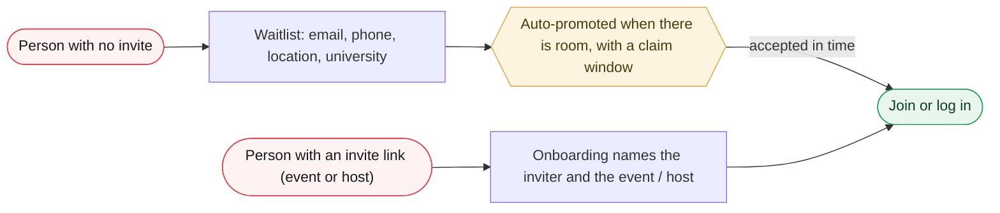

_What happens to a lapsed claim is not specified in the record._

**What it is.** Non-invited users land on a waitlist; invited users see the inviter and the event or host, then join or log in.

**User flow.**

1. Waitlist collects email, phone, location and university.
2. Users are auto-promoted off the waitlist with a claim window (a bounded time to accept). What happens to a lapsed claim is not yet specified.
3. An invited user's onboarding screen names the inviter and the event/host, setting context before signup.
4. Founder-seed invites (WePop itself as inviter, no org and no event or idea) and org-membership grants are the two scoped exceptions to the invite-first rule; individual person-to-person invites stay event- or idea-tied (DEC-050).

**Rules that govern it.**

- Invite-first is a deliberate growth and safety choice, not just a launch gate.
- Auto-promote with a claim window is phase-1 scope.

**Build notes for Deepak.**

- Claim-window timer; behaviour for a lapsed claim is unspecified in the record.
- Inviter/event attribution must survive into the new account for first-session context.
- Onboarding is one 15-step sequence from a shared Get Started screen differing only in landing destination; profile completion (optional email, optional password, description) moved out of onboarding into editable profile fields with completion-nudge reminders (DEC-052).

**Open items.**

- None on this module.

**Governing decisions.** DEC-024, DEC-050, DEC-052

**Elvis's design detail, sourced (7).**

- **[ELVIS DESIGN]** Entry is one screen, the "Get Started" screen, for all four branches (individually invited, org-invited, founder seed invite, not invited); a deep-linked invite opens the same screen with a toast layered on top naming who invited you and to what; an organic open shows no toast.  
  src: `onboarding-flow-2026-08-26.md > "Entry point, RESOLVED 2026-08-26"`
- **[ELVIS DESIGN]** Founder seed invite is a third distinct invite type (confirmed by Elvis): at launch Elvis personally invites an initial batch of users using the same non-event-tied mechanism as org invites, but with WePop itself as the inviter and no org account; the toast identifies WePop as inviter and the user lands on the home feed.  
  src: `onboarding-flow-2026-08-26.md > "Entry point" > "Founder seed invite"`
- **[ELVIS DESIGN]** Not-invited users are the app's actual front door, not a fifth branch: the Get Started screen offers log in for existing users and funnels new users to the waitlist capture (email, phone, location, university, per DEC-024).  
  src: `onboarding-flow-2026-08-26.md > "Entry point" > "Not invited"`
- **[ELVIS DESIGN]** A promoted waitlist user enters the exact same account-creation sequence as any invited user; there is no separate onboarding path for promoted waitlist users, confirmed by Elvis explicitly.  
  src: `onboarding-flow-2026-08-26.md > "Entry point" > "Not invited"`
- **[ELVIS DESIGN]** Landing destination differs by branch: invited users (individual or org) land on the specific event, idea, or org that invited them; promoted-waitlist and founder-seed users land on the home feed, cohort-filtered and ranked per DEC-020.  
  src: `onboarding-flow-2026-08-26.md > "Landing destination, RESOLVED 2026-08-26"`
- **[ELVIS DESIGN]** Deepak flag: the toast component is sourced from the invite record (inviter identity, plus event/idea or org name where relevant); the founder seed invite needs its own invite-record shape (WePop as inviter, no org reference, no event/idea reference).  
  src: `onboarding-flow-2026-08-26.md > "Flags for Deepak"`
- **[ELVIS DESIGN, open]** Exact copy/framing for the founder seed invite (what the screen says when WePop itself is the inviter) is parked for a ux-copy pass once built.  
  src: `onboarding-flow-2026-08-26.md > "Not yet decided, deliberately parked"`

### 4.2 Registration, auth and verification

**Phase 1** · Identity · korea

> **In plain terms.** You sign up with Kakao, Apple or Google, but every account must also have a verified phone number. In Korea that check happens through PASS, the standard carrier identity service; everywhere else the app texts you a code. There is no password for now: if you are locked out, a link sent to your email gets you back in, and Face ID or fingerprint handles everyday logins.

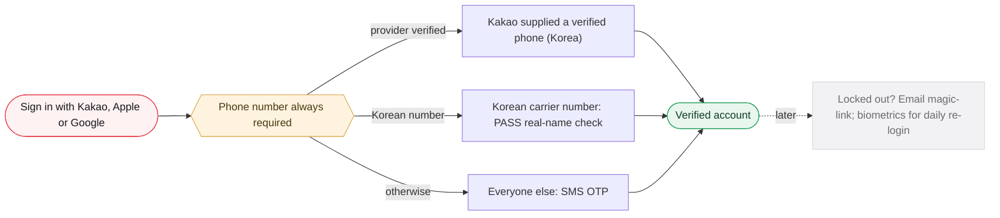

_No password in phase 1. PASS returns identity and age, which also strengthens the age gate for Korea._

**What it is.** Kakao, Apple or Google can create or sign in an account, but a phone number is always required and always verified.

**User flow.**

1. Social login via Kakao, Apple or Google.
2. If the provider supplies a verified phone (Kakao only, business-reviewed scope, Korea in practice) that satisfies verification; otherwise the app runs its own phone OTP.
3. Korean carrier numbers verify through PASS (carrier real-name auth, government-linked; returns success/fail plus identity and age). Non-Korean numbers stay on standard OTP.
4. Password is deferred; recovery is an email magic-link (email is collected from every account, so it covers 100 percent); biometrics for day-to-day re-login.
5. Returning login: any valid credential (social, phone OTP, or username-or-email plus password when set) resolves to the one account anchored on the verified phone; biometric quick-unlock gates an already-active local session and is not a server credential; the session stays active until explicit logout or app deletion (DEC-049).
6. Account linking is consent-based: a new-provider signup on an already-registered phone verifies the phone, logs into the existing account, then explicitly asks before adding the new provider (DEC-049).
7. A Korea-based user without a Korean phone number gets a redacted-ID human-review fallback (government photo ID with the ID number self-redacted, no facial recognition or biometrics), following Bumble's Korea flow; the name field is a single flexible full-name field, not a first/last split (DEC-055).

**Rules that govern it.**

- Every account ends up with a verified phone.
- A password is a weaker fallback than phone OTP, and optional post-signup passwords have near-zero adoption, so one is not built now.
- Revisit trigger: real support data showing a recovery gap, or a market where SMS is genuinely blocked.

**Build notes for Deepak.**

- One global flow with two branches (Korea PASS, everyone else OTP) plus the Kakao verified-phone skip.
- PASS brings CI/DI sensitive-identity data and PIPA / designated-agency handling.
- A freelancer may be engaged for the PASS integration; Deepak to research PASS first.
- The optional post-signup password is the held DEC-011 amendment (filed via DEC-052, not yet landed); day-to-day recovery stays the email magic-link.
- The redacted-ID path adds a human-review verification queue and tooling with its own PIPA implications (DEC-055).

**Open items.**

- Confirm PASS adoption with Elvis before build (directional today).
- PASS data-handling obligations pending counsel.

**Governing decisions.** DEC-011, DEC-026, DEC-004 (superseded), DEC-049, DEC-055

**Elvis's design detail, sourced (13).**

- **[ELVIS DESIGN, proposed revision to DEC-011, unmerged]** Optional password is additive to social-plus-phone, never a replacement; it lives in profile settings, not onboarding, with periodic reminder notifications while unset. Reverses DEC-011's "password deferred" provision; filed to proposed-decisions.md, still awaiting merger.  
  src: `onboarding-flow-2026-08-26.md > "Profile completion, moved out of onboarding" and auth-flow-2026-08-26.md > "Optional password, already resolved"`
- **[ELVIS DESIGN]** Returning-user login: phone number is the account's anchor identifier; any valid credential presented at the signed-out Get Started screen (Kakao, Apple, Google; phone OTP; or username-or-email plus password, if set) logs the user into the one account. No need to remember the signup method.  
  src: `auth-flow-2026-08-26.md > "Returning-user login, RESOLVED 2026-08-26"`
- **[ELVIS DESIGN]** Biometric quick-unlock (Face ID, Touch ID, Android equivalent) gates access to an already-active session locally via the native OS API, "the same pattern Instagram uses"; it is not a server-side credential and does not authenticate against WePop independently. Confirmed by Elvis.  
  src: `auth-flow-2026-08-26.md > "Returning-user login" > "Biometric quick-unlock"`
- **[ELVIS DESIGN]** Persistent session: once logged in the session stays active continuously, including while the app is closed or backgrounded; it ends only on explicit logout or app deletion, never on a timer. Confirmed by Elvis.  
  src: `auth-flow-2026-08-26.md > "Persistent session, RESOLVED 2026-08-26"`
- **[ELVIS DESIGN]** Deepak flag: long-lived refresh token in Keychain (iOS) / Keystore (Android); iOS Keychain data can survive deletion and reinstall, so an explicit first-launch-after-install check (for example a UserDefaults flag) must wipe any leftover Keychain session entry.  
  src: `auth-flow-2026-08-26.md > "Flags for Deepak"`
- **[ELVIS DESIGN, recommendation]** Recommend a server-side session-revocation capability kept in reserve (log out of all devices; forced logout on password change or suspicious activity), invisible to the user-facing behavior Elvis described.  
  src: `auth-flow-2026-08-26.md > "Persistent session" and "Flags for Deepak"`
- **[ELVIS DESIGN]** Account linking is consent-based, not silent auto-link (Elvis's revised call): a second-provider signup with an already-registered phone must first complete phone verification, then logs the user straight into the existing account and asks "This phone number is linked to an account signed in with Kakao. Add Google as another way to sign in?" Declining still leaves the user logged in.  
  src: `auth-flow-2026-08-26.md > "Account linking across providers, RESOLVED 2026-08-26 (revised...)"`
- **[ELVIS DESIGN, reconciled against DEC-011]** Account recovery: phone OTP is primary (universal, since phone is mandatory); email magic-link is a second option only for users who set an email in profile settings; customer service is the last resort when the phone is lost and no email is on file. Reconciliation note 2026-08-27: DEC-011's email-as-recovery assumption "no longer holds" because email moved to optional.  
  src: `auth-flow-2026-08-26.md > "Account recovery, RESOLVED 2026-08-26 (reconciled 2026-08-27 against DEC-011)"`
- **[ELVIS DESIGN]** A Korea-based user without a Korean phone number gets a redacted-ID fallback: government-issued photo ID, user self-redacts the ID number leaving name, date of birth, photo and expiry visible, reviewed by a trained human reviewer, no facial recognition or biometrics, following Bumble's actual Korea flow.  
  src: `internationalization-korea-2026-08-26.md > "Fallback for Korea-based users without a Korean phone number, RESOLVED"`
- **[ELVIS DESIGN, consistent with DEC-026]** PASS eligibility is checked against the phone number's own carrier country code, not DEC-012's blended legal-country value; a Korean number gets PASS regardless of where the user is, a non-Korean number does not.  
  src: `internationalization-korea-2026-08-26.md > "PASS eligibility, RESOLVED"`
- **[ELVIS DESIGN, open]** Whether a changed username still works for login under the old value; multi-device concurrent sessions and any device-management surface; the customer-service recovery workflow (may reuse the Admin Portal pattern from the Give Feedback table, not confirmed).  
  src: `auth-flow-2026-08-26.md > "Not yet decided, deliberately parked"`
- **[ELVIS DESIGN, open]** Whether Naver login should join Kakao as a second Korean social-login option, "not evaluated in this pass".  
  src: `internationalization-korea-2026-08-26.md > "Not yet decided, deliberately parked"`
- **[ELVIS DESIGN, open]** Review process and staffing for the redacted-ID fallback (who reviews, turnaround, tooling) is not designed; it needs its own review queue and reviewer tooling.  
  src: `internationalization-korea-2026-08-26.md > "Not yet decided" and "Flags for Deepak"`

### 4.3 Age gate and country determination

**Phase 1** · Identity · legal

> **In plain terms.** When you sign up you type your birthdate once and it is locked in. The app works out which country's rules apply to you (from your app-store region first) and checks you are old enough for that country, for example 18 in the US and 19 in Korea. It never forces you to switch on GPS to do this. The exact legal logic is still waiting on the lawyers.

```mermaid
flowchart LR
  M03_bd(["Type birthdate once; locked at signup"])
  M03_c1["App-store region"]
  M03_c2["Device location, only if already granted"]
  M03_c3["Phone-number country code"]
  M03_cty[["Country set once, never re-checked when travelling"]]
  M03_cfg{{"Per-country legal age from a config table (US 18, KR 19, DE 16)"}}
  M03_in(["Old enough: continue"])
  M03_blk[/"Under age: blocked"/]
  M03_bd --> M03_c1
  M03_c1 -->|"not available"| M03_c2
  M03_c2 -->|"not available"| M03_c3
  M03_c1 --> M03_cty
  M03_c2 --> M03_cty
  M03_c3 --> M03_cty
  M03_cty --> M03_cfg
  M03_cfg --> M03_in
  M03_cfg --> M03_blk
  classDef start fill:#fef2f2,stroke:#E63946,color:#17181d;
  classDef fin fill:#e8f6ee,stroke:#1f9d55,color:#0f3d24;
  classDef decision fill:#fdf3df,stroke:#d9a441,color:#4a3a10;
  classDef system fill:#eef2fd,stroke:#7f9fe6,color:#1e3f8f;
  classDef warn fill:#fff5f5,stroke:#C42E3A,color:#7a1f28;
  classDef muted fill:#f2f2f4,stroke:#d5d6db,color:#6b6b70;
  class M03_bd start;
  class M03_cty system;
  class M03_cfg decision;
  class M03_in fin;
  class M03_blk warn;
```

_Cascade order is app-store region first. No forced GPS prompt. Provisional until counsel (TASK-013, R1)._

**What it is.** The legal-eligibility check. Provisional pending legal counsel (TASK-013, risk R1).

**User flow.**

1. Age is a self-declared birthdate typed once and locked at signup (correctable only via support; ToS ban if falsified). No ID verification in phase 1, except Korean users get a verified age via PASS.
2. Country is set once at registration via a fallback cascade: app-store region first, then device location only if already granted, then phone-number country code. Never re-checked as the user travels.
3. Per-country legal-age thresholds (US 18, Korea 19, Germany 16) live in a config table, not in a screen.

**Rules that govern it.**

- No forced GPS prompt at registration (the most-declined onboarding step).
- Invite-first counts as a real structural mitigation.
- A config table turns a legal answer into a config change, not a redesign.

**Build notes for Deepak.**

- Store-region APIs (StoreKit, Play Billing) and signal-conflict handling (store region vs phone code) flagged to Deepak and the legal consult.
- The age-gate country is kept separate from the home-location country and the Explore current-country: three fields, three purposes, never conflated.

**Open items.**

- Exact logic (passive vs active location, travel jurisdiction) pending DLG Law; risk R1.
- PIPA under-14 guardian consent (L-8) folds into the same consult.

**Governing decisions.** DEC-012, DEC-026, DEC-002 (superseded)

**Elvis's design detail, sourced (10).**

- **[ELVIS DESIGN, research input for TASK-013, not a decision]** Flag 1: DEC-012's "US 18, Korea 19, Germany 16" mixes two legal concepts. US 18 and Korea 19 are ages of majority; Germany's 16 is "almost certainly" GDPR's digital-consent age (EU default 16, member states may lower to 13); Germany's actual age of majority is 18.  
  src: `age-gate-country-cascade-2026-08-27.md > "Flag 1"`
- **[ELVIS DESIGN, recommendation]** Where a country's age-of-majority and digital-consent figures diverge, default the config table to the stricter (higher) of the two until counsel gives a country-specific answer; "one comparison per config-table entry" and fails safe.  
  src: `age-gate-country-cascade-2026-08-27.md > "Flag 1" > "Recommendation carried forward"`
- **[ELVIS DESIGN, research]** WePop's gate governs whether someone can independently agree to meet strangers in person, which reads closer to age of majority or a locally-set social/contact minimum than to a data-processing consent threshold; the config table currently has no documented method for choosing which concept each entry uses.  
  src: `age-gate-country-cascade-2026-08-27.md > "Flag 1"`
- **[ELVIS DESIGN, research]** Flag 2: Apple's Declared Age Range API (expanded February 2026) has the OS tell the app the user's age bracket plus regulatory-regime signal, tied to the Apple Account's creation region, rather than an app-built store-region cascade. Cited laws: Brazil, Australia, Singapore requiring 18+ apps to block unverified users from February 24, 2026; Utah and Louisiana requiring age-sharing for new accounts from May and July 2026.  
  src: `age-gate-country-cascade-2026-08-27.md > "Flag 2"`
- **[ELVIS DESIGN, research]** Discord went the opposite way: global mandatory AI-based age verification (facial-age inference plus optional video selfie or ID upload, no stored biometrics). Self-declared birthdate is still called "a reasonable phase-1 baseline"; what is dated is the country-determination mechanism underneath.  
  src: `age-gate-country-cascade-2026-08-27.md > "Flag 2"`
- **[ELVIS DESIGN, open for counsel]** Three questions to put to counsel: (1) does a self-built cascade instead of a platform-native signal add compliance exposure; (2) do Korea, the US, or plausible early markets (Brazil, Australia, Singapore, Utah, Louisiana) fall under laws where self-declaration alone is insufficient; (3) should the per-country threshold be sourced from age of majority, a local social/contact minimum, or GDPR digital consent.  
  src: `age-gate-country-cascade-2026-08-27.md > "Flag 2" numbered list`
- **[ELVIS DESIGN, explicit non-change]** DEC-012 stays ACTIVE and provisional; TASK-020 (build the age gate and country cascade) stays To Do; no scope-matrix or DECISIONS.md edit accompanies the file.  
  src: `age-gate-country-cascade-2026-08-27.md > "What this does not change"`
- **[ELVIS DESIGN, research]** Bumble's Korea flow (government photo ID, self-redacted ID number, human review) is "meaningfully stronger than self-declaration", cited as evidence the DEC-012 provisional flag was right and to be folded into the TASK-013 consult, not opened as a separate question.  
  src: `internationalization-korea-2026-08-26.md > "Age verification, strengthens an already-provisional decision"`
- **[ELVIS DESIGN, research]** PIPA points for the TASK-013 consult: consent must separate essential use from optional/marketing use; remote access to Korean user data by a non-Korea-based team member counts as a cross-border transfer requiring documentation; Article 28-2 pseudonymization standards apply to the hidden keyword/embedding layer.  
  src: `internationalization-korea-2026-08-26.md > "PIPA (Personal Information Protection Act), specifics"`
- **[ELVIS DESIGN]** Age gate sits at onboarding step 3, immediately after auth, "since it is a hard gate the user must pass, not an optional preference"; country locked at this point and never re-checked.  
  src: `onboarding-flow-2026-08-26.md > "Account creation and onboarding sequence" step 3`

### 4.4 Location: home location and the map picker

**Phase 1** · Location · safety

> **In plain terms.** Placing anything on a map always uses the same picker: search for a place, tap it, see its name. Your own home location is set at sign-up at neighbourhood level, and the app deliberately throws away the exact spot you tapped. Later you can only update it by sharing your live location, which stops people faking where they live. When you allow GPS, the app uses where you actually are right now to show nearby events.

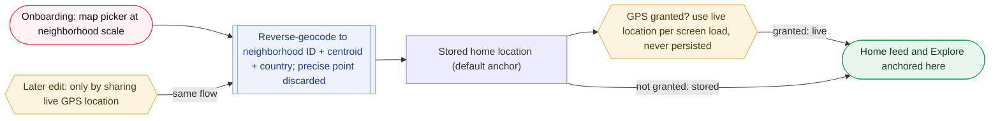

_Current-location-only edits stop a free user re-picking a foreign home to defeat the Explore country gate._

**What it is.** Two distinct concepts: the map picker used to place things, and the user's home location used to anchor discovery.

**User flow.**

1. Map picker: search plus tap a named place (not an Uber-style centre pin), with zoom, a free-text address field and an optional per-event note. Reused for events, schedule stops and home location.
2. Home location is required at onboarding, chosen with the same picker at neighborhood scale (roughly dong-level in Korea; a postal-code-sized area elsewhere).
3. The confirmed point is reverse-geocoded to a canonical neighborhood ID, centroid and country code; the precise tapped coordinate is discarded and never persisted. Fallback chain: neighborhood, then postal code, then city.
4. After onboarding, home location changes only by granting device location and selecting current location (a live GPS read through the same reverse-geocode-and-discard flow). The free picker does not reopen. No fallback for a user who never grants permission, deliberately.
5. At runtime the stored value is only the default anchor: when GPS is granted, live current location is preferred, pulled per screen load, never persisted, with a manual refresh on the home feed.
6. The one map-plus-search picker now serves three surfaces (event/idea location, a location poll where attendees vote and the host confirms the final spot, and Explore's browse map); zoom sets precision with no minimum floor, extending DEC-003 (DEC-054).

**Rules that govern it.**

- Anti-gaming: current-location-only edits stop a free user re-picking a foreign home to defeat the Explore country gate.
- Device GPS is always optional and requested contextually, never at registration.

**Build notes for Deepak.**

- Every feed or Explore retrieval needs request-time anchor resolution (live GPS if granted, else stored) plus a fallback so a load never hard-fails on a location error.
- Geocoding fallback chain for markets without a clean neighborhood tier.

**Open items.**

- Whether Explore needs its own manual refresh distinct from the home feed's.
- Whether a GPS-granted user can opt back into the coarser stored default.

**Governing decisions.** DEC-003, DEC-016, DEC-031, DEC-054

**Elvis's design detail, sourced (15).**

- **[ELVIS DESIGN]** Three surfaces share one map-plus-search component: (1) event/idea location capture at creation (full-screen map, search bar, current-location recenter icon); (2) location polls; (3) Explore's browse map. Deepak: one core map component with a picker mode and a browse mode, not three integrations.  
  src: `event-location-map-picker-2026-08-27.md > "Three surfaces, one component, RESOLVED 2026-08-27"`
- **[ELVIS DESIGN, extends DEC-003]** Zoom determines precision: zoomed in, a tap resolves to a store, building, or address; zoomed out, to a whole neighborhood. No minimum precision floor for Events or Ideas (Elvis overrode the recommendation to require Events to zoom in), because an event's top-level location is not necessarily its meeting point; the findable spot can go in the per-location comment or a schedule stop.  
  src: `event-location-map-picker-2026-08-27.md > "Zoom determines precision, RESOLVED 2026-08-27"`
- **[ELVIS DESIGN, provisional]** Zoom-to-precision thresholds are "a starting technical proposal, not yet confirmed": POI/building-level at high zoom, neighborhood/locality-level at low zoom, smooth range between, tunable and dependent on the map-provider decision.  
  src: `event-location-map-picker-2026-08-27.md > "Mechanism, technical detail"`
- **[ELVIS DESIGN]** The current-location recenter icon is a live on-demand GPS read that is not itself a location capture; only the subsequent tap or search selection is.  
  src: `event-location-map-picker-2026-08-27.md > "Mechanism, technical detail" > "Current-location recenter icon"`
- **[ELVIS DESIGN, extends DEC-003]** The optional per-location comment applies uniformly to every capture through the component: main event/idea location, each schedule stop, and each location-poll option.  
  src: `event-location-map-picker-2026-08-27.md > "Optional per-location comment, RESOLVED"`
- **[ELVIS DESIGN]** Residual gap stated plainly: a user can still misrepresent their country once, at onboarding, since that step stays unrestricted; "same category of risk DEC-012's self-declared age/country already accepts".  
  src: `city-location-registration-2026-08-27.md > "Mutability, REVISED 2026-08-27" > "Why this matters"`
- **[ELVIS DESIGN, Deepak flag]** GPS spoofing: "current location only" resists gaming only as well as GPS resists mock-location tooling (easier on Android via developer options); raise-the-bar, not airtight; worth a light fraud-review note.  
  src: `city-location-registration-2026-08-27.md > "Mutability" > "Integrity caveat" and "Flags for Deepak"`
- **[ELVIS DESIGN, recommendation not independently confirmed]** Live GPS reads for feed/Explore anchoring must stay ephemeral and never be written to the stored home-location field, including in analytics/logging pipelines; worth an explicit note in the data-retention spec.  
  src: `city-location-registration-2026-08-27.md > "Home feed / Explore anchor" > "Persistence" and "Flags for Deepak"`
- **[ELVIS DESIGN, Deepak flag]** The canonical neighborhood ID needs a bilingual/per-market display layer; DEC-020's retrieval radius anchor should be updated explicitly to the neighborhood centroid with a one-line addition to recommendation-algorithm-2026-08-25.md so the docs do not drift.  
  src: `city-location-registration-2026-08-27.md > "Flags for Deepak"`
- **[ELVIS DESIGN, retired]** A standalone manually-set "browsing city" override (city-scale, for previewing another city before a trip) was proposed in an earlier pass and retired, superseded by the unrestricted Explore map plus the country-level content gate.  
  src: `city-location-registration-2026-08-27.md > "Retired this session: the standalone 'browsing city' override"`
- **[ELVIS DESIGN, open]** Whether a current-location home update shows a confirmation ("this will update your feed, ranking, and Explore gate") or applies silently.  
  src: `city-location-registration-2026-08-27.md > "Not yet decided, deliberately parked"`
- **[ELVIS DESIGN, research, recommendation not a decision]** Map provider: Korea conditionally approved Google's map-data export on February 27, 2026 (five conditions) but implementation has stalled with no timeline; Google Maps in Korea has no turn-by-turn navigation and thin POI data; Naver Map holds roughly 73% share by one count (about 31 million monthly users vs Google's 12 million by another) with real English support. Recommended to move HOTSHEET "Watching" to an actual decision.  
  src: `event-location-map-picker-2026-08-27.md > "Map provider, RESEARCHED 2026-08-27"`
- **[ELVIS DESIGN]** Dual Google/Naver scope (Elvis's clarification): provider is locked per map session, decided once when a map screen opens using the Explore gate's current-location country signal (Naver if Korea, else Google), no live cross-border swapping, no wrapper layer for early phases; a Korea user panning to New York still sees Naver, accepted as "usable, not equivalent".  
  src: `event-location-map-picker-2026-08-27.md > "Dual Google/Naver feasibility" > "Scope, REVISED" and "Determining Korea vs elsewhere, RESOLVED"`
- **[ELVIS DESIGN, Deepak flag]** Data compatibility: Naver Maps API v3 supports WGS84 lat/long directly, so coordinates share a table; Google Place IDs and Naver POI IDs are different namespaces and Korean jibun-vs-road-name addresses do not map one-to-one, so store a provider-agnostic canonical ID, centroid, display name as primary with each provider's place ID and raw address as secondary fields. Operational cost: two SDKs doubled across iOS and Android, two billing relationships, PIPA flag on Naver as a Korean data processor.  
  src: `event-location-map-picker-2026-08-27.md > "Dual Google/Naver feasibility" > "Data compatibility" and "Operational cost"`
- **[ELVIS DESIGN, open, needs action not research]** Whether a non-Korean-registered business can sign up for Naver Cloud Platform's or Kakao's Maps API at all; neither's docs state eligibility; needs an actual account-creation attempt or developer-support contact before scoping further.  
  src: `event-location-map-picker-2026-08-27.md > "Dual Google/Naver feasibility" > "Real unresolved question"`

### 4.5 Profile and tags

**Phase 1** · Identity

> **In plain terms.** Your profile holds the basics (birthdate, neighbourhood, gender, languages, university) plus a set of personality and interest tags. Instead of picking one fixed personality type, you choose from a searchable list of tags and can add your own; those tags help the app match you with events.

**What it is.** The user's identity and interest surface; tags feed the recommendation engine.

**User flow.**

1. Onboarding captures birthdate, neighborhood, gender, languages, personality and interest tags, and university affiliation.
2. Personality is an extensible searchable tag list (MBTI values included as tags): show the top 10-20, searchable, users add their own.
3. Personality tags are three named sections: MBTI (closed, 16 values), social energy (closed, 3 values), and general vibe/self-descriptors (open, searchable, user-addable); this supersedes DEC-005's flat 10-20 tag figure (DEC-057). Zodiac and Enneagram are considered and not in the initial catalog.
4. A distinct 'languages I speak' profile field is added, separate in name and storage from the display-language field, and profile completion is editable profile fields rather than an onboarding gate (DEC-052).

**Rules that govern it.**

- A growing tag database is richer for matching than a fixed type.

**Build notes for Deepak.**

- Tags feed the tag/keyword ranking signal (DEC-020).
- Profile description field and the user/org profile screens are still owed from Elvis (todos #7, #9).

**Open items.**

- Profile screens and description field pending from Elvis.
- Whether MBTI and social energy are single-select while general vibe is multi-select, or all three allow multiple (DEC-057, to the meeting).

**Governing decisions.** DEC-005, DEC-057, DEC-052

**Elvis's design detail, sourced (14).**

- **[ELVIS DESIGN]** Full onboarding step order (Elvis's detailed sequence): 1 language, 2 auth, 3 age gate, 4 name, 5 username, 6 location, 7 profile photo, 8 gender, 9 language proficiency, 10 personality tags, 11 categories/subcategories, 12 campus affiliation, 13 cohort computation (invisible), 14 device permissions review, 15 done.  
  src: `onboarding-flow-2026-08-26.md > "Account creation and onboarding sequence, RESOLVED 2026-08-26"`
- **[ELVIS DESIGN]** Name is a single flexible full-name field, not a Western first/last split (Korean naming puts family name first with no middle name), broken out as its own step.  
  src: `onboarding-flow-2026-08-26.md step 4; internationalization-korea-2026-08-26.md > "Name field structure, RESOLVED"`
- **[ELVIS DESIGN]** Username: auto-generate offered by default plus typed-suggestion matching (taken username yields close variants, not a plain rejection). Generation logic (adjectives+nouns, handle-plus-number, etc.) not specified.  
  src: `onboarding-flow-2026-08-26.md step 5 and "Flags for Deepak"`
- **[ELVIS DESIGN]** Profile photo is optional (library or camera); if skipped the profile defaults to the user's initials on a background color, not a generic placeholder image. Gender optional.  
  src: `onboarding-flow-2026-08-26.md steps 7 and 8`
- **[ELVIS DESIGN]** Languages spoken and proficiency is a new separate optional multi-entry field, distinct in name and storage from the display-language setting (DEC-027/cascade field), confirmed by Elvis.  
  src: `onboarding-flow-2026-08-26.md step 9 and "Flags for Deepak"`
- **[ELVIS DESIGN]** Personality tags and categories/subcategories are two distinct taxonomies (confirmed by Elvis), not one shared tag table; categories are browse-only with no search and no user-submitted nodes, unlike the open, searchable general-vibe personality section.  
  src: `onboarding-flow-2026-08-26.md step 11 and "Flags for Deepak"`
- **[ELVIS DESIGN]** Personality catalog initial seed: Section 1 MBTI (closed, 16 values with nicknames, e.g. "INTJ, the Architect"); Section 2 Social energy (closed, 3 values: Extrovert, Introvert, Ambivert); Section 3 General vibe (open, extensible, seed of 18: Adventurous, Chill / laid-back, Planner, Spontaneous, Night owl, Early bird, Homebody, Big-group energy, Small-group energy, Deep talker, Curious, Creative, Analytical, Empathetic, Competitive, Easygoing, Optimist, Realist). Total 37 before user additions. Zodiac and Enneagram considered, set aside, not rejected.  
  src: `personality-tags-catalog-2026-08-27.md > Sections 1 to 3 and "Problem"`
- **[ELVIS DESIGN, open]** Whether MBTI and social energy are single-select while general vibe is multi-select, or all three multi-select; DEC-005's "top 10-20" figure versus this catalog's 37 needs confirmation; display order and whether MBTI nicknames are launch copy.  
  src: `personality-tags-catalog-2026-08-27.md > "Not yet decided, deliberately parked"`
- **[ELVIS DESIGN, Deepak flag]** MBTI must stay queryable as its own field, not just a tag among 37, because the icebreaker matching game matches on MBTI type; the data model must distinguish closed-taxonomy tags from open user-extensible ones; user-added general-vibe tags need moderation/review.  
  src: `personality-tags-catalog-2026-08-27.md > "Flags for Deepak"`
- **[ELVIS DESIGN]** Campus affiliation (step 12) is optional, verified via a code sent to a school email, or a self-declared "suggest a school" fallback if the school is not in the pre-populated list; whether a suggestion queues for review or is auto-added is not specified.  
  src: `onboarding-flow-2026-08-26.md step 12 and "Flags for Deepak"`
- **[ELVIS DESIGN]** When campus affiliation is skipped, cohort computation must degrade gracefully to city and age bucket alone rather than error; "this graceful-degradation path is not itself designed in DEC-019". (Note: DEC-030 has since made cohort student-vs-not only.)  
  src: `onboarding-flow-2026-08-26.md step 12 and "Flags for Deepak"`
- **[ELVIS DESIGN]** Device permissions review (step 14) is an optional explanatory in-app screen listing location, notifications, camera, gallery, contacts, calendar; it must not fire native OS dialogs, which stay tied to first contextual use.  
  src: `onboarding-flow-2026-08-26.md step 14`
- **[ELVIS DESIGN]** Optional email, optional password, and the profile description field all move out of onboarding into editable profile fields with periodic reminder nudges; cadence was "every so often", not a schedule, and whether reminders decay or can be snoozed is open. Nudge job routes through the existing notification pipeline and stops once a field is filled.  
  src: `onboarding-flow-2026-08-26.md > "Profile completion, moved out of onboarding" and "Not yet decided" and "Flags for Deepak"`
- **[ELVIS DESIGN]** Bilingual tag vocabulary: each DEC-005 tag carries both an English and Korean display label under one canonical tag ID so a Korean host and an English browser hit the same tag.  
  src: `internationalization-korea-2026-08-26.md > "Bilingual tag vocabulary, RESOLVED"`

### 4.6 Events

**Phase 1** · Core objects · safety

> **In plain terms.** An event is a real activity at a real place and time. Hosts create it with the map picker, can add a step-by-step itinerary (which can span several days), and can sketch the plan before the date is settled. Once an event has happened, the host can no longer edit or delete it, so ratings and history cannot be quietly erased.

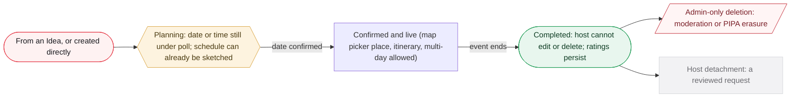

_Seven-status machine in the handoff spec; a planning event that never gets a date expires after 60 days._

**What it is.** A concrete activity at a place and time. Created via the map picker, optionally with an itinerary; once completed it protects its rating record.

**User flow.**

1. Host creates the event, places it with the picker, adds details, and optionally builds a structured schedule of ordered stops (each stop reuses the picker; visibility inherits the event). Can be created straight from an Idea.
2. Event model supports differing start and end dates (multi-day), exposed as an Airbnb-style calendar picker where a single day and a range are the same interaction.
3. A host may build a schedule before the date/time is resolved (planning status, under poll); stops carry times and bind to the date on confirmation.
4. For recurring events the itinerary is copied at generation with dates shifted per occurrence and joins the this / this-and-following propagation.
5. Once completed: the host cannot delete or edit it, or leave at will. Deletion is admin-only (moderation removal or a PIPA erasure request). Detachment is a reviewed request. Ratings persist through both.

**Rules that govern it.**

- Closes a laundering hole: a host cannot delete a completed event to erase a bad rating (protects DEC-014 reputation and the DEC-024 org track record).
- Everything is enforced server-side, not by hiding the button.
- An event's headline location need not be its exact meeting point; the host supplies the findable spot separately, so no precision floor is forced on capture (DEC-054).

**Build notes for Deepak.**

- scheduled_end ships on the Event row. Store an explicit date on every stop, even single-day, and derive the display (a live event extended past midnight becomes two-day).
- A host's rating aggregate must never be a live join on event rows; ratings carry a denormalized host reference and survive their source event (the Moment tombstone pattern).
- Enforce the completion boundary server-side for deletion, detachment and edits.

**Open items.**

- Elvis's calendar-picker design has not landed; revisit the schedule against it.
- Save-as-draft screen still to be added (todos #6).

**Governing decisions.** DEC-003, DEC-025, DEC-041, DEC-043, DEC-054

**Elvis's design detail, sourced (17).**

- **[DECIDED DEC-025]** Data shape is an ordered list of stops attached to the Event row, each with a time, a structured location and a free-text note; no new entity, and no RSVP-style semantics, nobody joins or leaves an individual stop.  
  src: `event-schedule-2026-08-25.md > "Data shape, RESOLVED 2026-08-25"`
- **[DECIDED DEC-025]** The schedule has no visibility rule of its own; it matches the event's access level exactly at whatever granularity the event model supports (not a binary public/private choice, which was the PM's first framing that Elvis corrected).  
  src: `event-schedule-2026-08-25.md > "Visibility, RESOLVED 2026-08-25"`
- **[DECIDED DEC-041]** Single-day event stops carry time only (implicitly the event's date); multi-day event stops each carry their own date and time.  
  src: `event-schedule-2026-08-25.md > "Multi-day support, RESOLVED 2026-08-25"`
- **[ELVIS DESIGN, handoff spec v0.9; scheduled_end cited in DEC-041]** Handoff §14 schema deltas ship `scheduled_end`, `ended_at` and `live_extension_count` on the Event row marked "ship now"; §3.4 states multi-day events are covered by the explicit-end-time branch of the live-grace rules, and a host may extend a Live event at any time.  
  src: `event-schedule-2026-08-25.md > "Multi-day dependency, RESOLVED 2026-08-30"`
- **[ELVIS DESIGN, recommendation not confirmed by Elvis]** Store an explicit date on every stop including single-day events and derive the display, because a live extension crossing midnight retroactively makes a single-day event two-day and would silently corrupt time-only stops. Still listed as open: explicit date always vs only on multi-day.  
  src: `event-schedule-2026-08-25.md > "Multi-day dependency, RESOLVED 2026-08-30" and "Still open"`
- **[ELVIS DESIGN, handoff spec v0.9; no DEC, intake item K asks for a scope-matrix row]** Events have a seven-status state machine (§3) with transitions, expiry nudges and a live-grace/extension model; `planning` means logistics unresolved with date, time and/or location under poll; a planning event with no date proposed expires at 60 days; cancellation (§3.2) requires a written non-empty reason delivered to all attendees; the derived "Upcoming" display tag (§3.1) is a [D] inference needing sign-off. The seven status names are not enumerated in Elvis's workspace files.  
  src: `handoff-spec-v0.9-intake-2026-08-29.md > "Item H" and "Part 5" item 4; ideas-lifecycle-2026-08-30.md > "Problem"`
- **[ELVIS DESIGN, handoff spec v0.9; intake marks "ready to file"]** Invariant I-10: Event = a plan with a committed host and a date (or date poll), someone is on the hook; Idea = no date, no host commitment, structurally nobody is on the hook.  
  src: `handoff-spec-v0.9-intake-2026-08-29.md > "Item H"`
- **[ELVIS DESIGN, handoff spec v0.9]** Discussion (§7) is the persistent surface on both Events and Ideas: threaded, readable by anyone who can see the item, writable by joiners, available before and after the event; it corrects the old Moments-brief line that conversation lived in event chat.  
  src: `handoff-spec-v0.9-intake-2026-08-29.md > "Item H"`
- **[ELVIS DESIGN, handoff spec v0.9; mechanism cited by DEC-042]** Polls (§11) are one shared primitive across creation date polls, live-event polls and idea polls; advisory only, the host resolves; resolution writes the value into the parent and posts an announcement, "It is never silent." No scope-matrix row exists yet.  
  src: `handoff-spec-v0.9-intake-2026-08-29.md > "Item H" and "Item K"; event-schedule-2026-08-25.md > "Changes to a schedule are announced"`
- **[DECIDED DEC-042]** "Moving a stop" means editing a stop after people have seen it: changing its time, changing its location, or reordering, deleting or inserting stops; a host correcting three stops in one edit fires one notification.  
  src: `event-schedule-2026-08-25.md > "Changes to a schedule are announced, RESOLVED 2026-08-30"`
- **[DECIDED DEC-042/DEC-043]** Completed events being non-editable closes the edge case of change notices posting into a chat room archived after 30 days idle.  
  src: `event-schedule-2026-08-25.md > "Changes to a schedule are announced" (Completed events are not editable)`
- **[DECIDED DEC-043]** The hole found: handoff §3.2 permits `any -> deleted` for "host or admin" without distinguishing them; the fix splits the transition by actor (host before completion only, admin-only after).  
  src: `event-schedule-2026-08-25.md > "Completed events: deletion and detachment, RESOLVED 2026-08-30"`
- **[DECIDED DEC-043]** Reviewed detachment reuses handoff §12.6 ("Host takedown is a request routed to review, never an instant delete") and is deliberately stricter than Ideas because an idea creator carries no accountability record while an event host carries ratings, attendance and a public track record.  
  src: `event-schedule-2026-08-25.md > "Completed events: deletion and detachment"`
- **[DECIDED DEC-043]** The denormalization precedent is §3.5, which copies `event_name`, `event_date` and `org_name` onto the Moment at creation; ratings get the same shape, built once for both. Elvis's stated principle: accountability matters and we do not want people to find loopholes.  
  src: `event-schedule-2026-08-25.md > "Completed events: deletion and detachment" (Ratings persist)`
- **[ELVIS DESIGN, handoff spec v0.9; intake item K]** `content_org_scopes` multi-select org visibility (§8.1) is a new schema requirement tied to DEC-024's org work with no scope-matrix row.  
  src: `handoff-spec-v0.9-intake-2026-08-29.md > "Item K"`
- **[ELVIS DESIGN, not raised with Elvis]** Open: whether an attendee sees a "current stop" indicator during a live event, noted as a cheap affordance from ordered timed stops.  
  src: `event-schedule-2026-08-25.md > "Still open"`
- **[ELVIS DESIGN, handoff spec v0.9 [D] items needing sign-off]** Anomaly clustering on check-in (§4.4) and the chat default-on rationale (§7.2) are engineering inferences, not decisions Elvis made.  
  src: `handoff-spec-v0.9-intake-2026-08-29.md > "Part 5" item 4`

### 4.7 Recurring events

**Phase 1.5** · Core objects

> **In plain terms.** A recurring event, like a weekly club meetup, is stored as a set of separate linked events. When you edit, cancel or join, you choose whether it applies to just this one or this and all following ones, the way Google Calendar works. Joining all future ones only covers the dates that exist right now; if the host adds more, you are asked again.

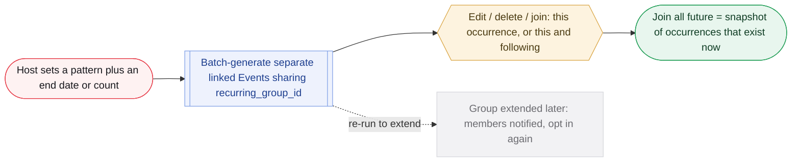

**What it is.** A repeating event (a semester-long club meetup), modeled as linked copies rather than one multi-date object.

**User flow.**

1. Separate, fully linked Event instances share a recurring_group_id.
2. Edit, delete and join/interest all use a uniform "this occurrence / this and following" choice.
3. Occurrences are batch-generated from a host-set pattern plus an end date or count; re-run to extend.
4. Joining "this and all future" is a snapshot of existing occurrences, not a subscription; members are notified and opt in when a group is extended.

**Rules that govern it.**

- Separate instances keep every per-event decision (ratings, check-in, caps, pre-join gating, track record) working unchanged, which fits the salvage approach.
- No master hub page; that is what Event Series is for.

**Build notes for Deepak.**

- Nullable recurring_group_id plus occurrence ordering; a batch-generation tool; an extend-notification hook.
- One shared this/following UI across delete, edit and join.
- Recurring-group membership is distinct from Series membership (separate keys).

**Open items.**

- None on this module.

**Governing decisions.** DEC-021, DEC-008

**Elvis's design detail, sourced (13).**

- **[DECIDED DEC-021]** The linking concept was renamed from "series" to "recurring group" on 2026-08-25 to free the word for Event Series; no design decision changed, only the name.  
  src: `recurring-events-2026-08-25.md > header rename note`
- **[DECIDED DEC-021]** Rejected alternative: one Event object holding multiple date instances. Why: RSVP, check-in and no-show tracking would need a per-instance sub-entity anyway (no complexity savings, more tangled schema) and it collides with DEC-008 since every screen would need to learn an Event can mean several things.  
  src: `recurring-events-2026-08-25.md > "Architecture, RESOLVED 2026-08-25"`
- **[DECIDED DEC-021]** From any single instance a user can see and click into the full list of other instances in the group; a host can override an individual instance's time, location or description without detaching it, and the overridden instance still appears in the group list.  
  src: `recurring-events-2026-08-25.md > "Interaction model, RESOLVED 2026-08-25"`
- **[DECIDED DEC-021]** Edit edge case: past or already-checked-into occurrences are never rewritten by a forward-looking "this and following" edit.  
  src: `recurring-events-2026-08-25.md > "Interaction model" (Edit)`
- **[DECIDED DEC-021]** Join edge case: a past occurrence is never joinable, ordinary RSVP logic, so "this and all" never becomes a real edge case.  
  src: `recurring-events-2026-08-25.md > "Interaction model" (Join / interested)`
- **[DECIDED DEC-021]** The snapshot join was an explicit override of the PM's initial standing-subscription recommendation; reasons: it respects consent on an ongoing basis and reuses the notification system already in scope.  
  src: `recurring-events-2026-08-25.md > "Join is a snapshot, not a standing subscription"`
- **[DECIDED DEC-021]** Pattern examples: weekly, biweekly or monthly plus an end date or occurrence count, "meal-prepping the group." Rejected: an open-ended recurrence-rule engine (indefinite recurrence, "first Monday of the month", iCalendar RRULE-style on-the-fly computation) because batch covers the semester-long club meetup and the feature is not blocking phase 1.  
  src: `recurring-events-2026-08-25.md > "Recurrence generation, RESOLVED 2026-08-25"`
- **[DECIDED DEC-021]** Both individual and org hosts can create recurring events; a weekly hangout between friends is a normal individual case and the mechanic must exist for orgs anyway.  
  src: `recurring-events-2026-08-25.md > "Who can create a recurring event"`
- **[DECIDED DEC-021]** Per-instance consistency list: waitlist auto-promote and claim window, QR check-in, the org 50-item media cap, DEC-006 pre-join visibility, ratings and reviews, and the public org track record, where each occurrence counts as one real event run.  
  src: `recurring-events-2026-08-25.md > "Consistency with existing decisions"`
- **[DECIDED DEC-021]** Ordering information is an occurrence index or date-within-group, needed to resolve "following" relative to the edited occurrence.  
  src: `recurring-events-2026-08-25.md > "Flags for Deepak"`
- **[DECIDED DEC-021]** The extend-notification hook targets every user who chose "join this and all future" on an earlier occurrence in that group, offering the new batch.  
  src: `recurring-events-2026-08-25.md > "Flags for Deepak"`
- **[DECIDED DEC-041]** The recurring itinerary propagation builds in phase 1.5 with recurring events; the schedule itself is phase 1.  
  src: `event-schedule-2026-08-25.md > "Recurring events, RESOLVED 2026-08-30"`
- **[ELVIS DESIGN, deliberately parked]** Exact pattern options in the host UI (weekly / biweekly / monthly at minimum; whether a day-of-week picker for biweekly) left for Deepak and Elvis at build time.  
  src: `recurring-events-2026-08-25.md > "Not yet decided, deliberately parked"`

### 4.8 Event Series and co-hosts

**Phase 1.5** · Core objects

> **In plain terms.** A series is a themed collection page a host builds, like a concert tour or a weekend of related events. You cannot join the series itself, but you can like, share and discuss it, and only the host or their co-hosts can add events to it. Planned for the phase-1.5 wave.

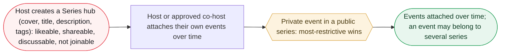

_Phase 1.5, bundled with recurring events and co-hosts._

**What it is.** Groups events that share a theme rather than a repeating template (a touring act, a multi-venue weekend).

**User flow.**

1. Host creates a Series hub page (cover, title, description, tags): likeable, shareable, discussable, not joinable.
2. Host attaches events over time. Curation is self-only: only the host or approved co-hosts attach their own events.
3. An event may belong to multiple series; a private event in a public series follows most-restrictive-wins.

**Rules that govern it.**

- Self-curation avoids a cross-host consent system.
- Co-hosts are pulled forward to ship with Series because "who can add events" needs the permission.

**Build notes for Deepak.**

- Series membership is a many-to-many join table, distinct from recurring_group_id.
- Per-viewer render-time visibility checks; distinct badges for recurring vs series membership.

**Open items.**

- Detaching (assumed to only remove the link) to be confirmed.

**Governing decisions.** DEC-022, DEC-024

**Elvis's design detail, sourced (13).**

- **[DECIDED DEC-022]** Elvis's own examples: "a host may want to create an event concert series that may be events playing different music in different locations in the city on the same weekend, or one band that is traveling the world on a tour."  
  src: `event-series-2026-08-25.md > "Problem"`
- **[DECIDED DEC-022]** Users see an Event Series card and a detail page listing every attached event; each attached event carries a label marking it as part of a series with a link back to the master page, mirroring the event-to-idea backlink.  
  src: `event-series-2026-08-25.md > "Concept, as specified by Elvis 2026-08-25"`
- **[DECIDED DEC-022]** A host can attach an already-existing event after the fact, not only create new events from inside the series flow; this retroactive attach is what raises the private-event visibility conflict.  
  src: `event-series-2026-08-25.md > "Private event retroactively attached to a public series"`
- **[DECIDED DEC-022]** Most-restrictive-wins detail: a private event never appears in the series' public event list to anyone who could not already see it through the event; the series page's own public content (cover, title, description, tags, other public events) is unaffected. Rule reused from conflict-review item 4 (moments).  
  src: `event-series-2026-08-25.md > "Private event retroactively attached to a public series"`
- **[DECIDED DEC-022]** Rejected for now: open curation (a curator pulling other hosts' public events into a collection), set aside as a future enhancement if a genuine curator use case shows up.  
  src: `event-series-2026-08-25.md > "Curation model, RESOLVED 2026-08-25"`
- **[DECIDED DEC-022]** Rejected alternative on co-hosts: shipping Series host-only first and unlocking co-host permission later; Elvis chose to pull co-hosts forward. Co-hosts had been later-phase per conflict-review item 9.  
  src: `event-series-2026-08-25.md > "Co-hosts dependency, RESOLVED 2026-08-25"`
- **[DECIDED DEC-022]** Both individual and org hosts can create a Series; orgs are expected to be the heavier users given the promoter/touring examples.  
  src: `event-series-2026-08-25.md > "Who can create a Series"`
- **[DECIDED DEC-022]** Multi-series example: the same host could run a "Tuesday Talks" series and a "Founders Series" with one event in both; Series membership is a list, not a single link.  
  src: `event-series-2026-08-25.md > "Multiple series per event"`
- **[DECIDED DEC-022]** Permission rule as stated: series-add checks only verify the actor is the event's host or an approved co-host; no cross-host consent flow is built. No further co-host permission rules appear in the source files.  
  src: `event-series-2026-08-25.md > "Flags for Deepak"`
- **[DECIDED DEC-022]** Per-viewer render-time visibility check is required because who can see a private event can change after the attach happens.  
  src: `event-series-2026-08-25.md > "Flags for Deepak"`
- **[DECIDED DEC-022]** The series label likely needs to show more than one series link per event.  
  src: `event-series-2026-08-25.md > "Flags for Deepak"`
- **[DECIDED DEC-022]** An event could belong to a recurring group, reference an idea, and belong to one or more series all at once: three distinct relationships not to be collapsed into one field.  
  src: `event-series-2026-08-25.md > "Flags for Deepak"`
- **[DECIDED DEC-040]** The Idea-vs-Series distinction is recorded explicitly so the two are not merged later: a Series has a locked add-permission, an Idea is open to anyone inspired.  
  src: `ideas-lifecycle-2026-08-30.md > "Idea as a topic hub, Elvis's framing 2026-08-30"`

### 4.9 Ideas and their lifecycle

**Phase 1** · Core objects

> **In plain terms.** An idea is something I would like to do, with no date yet. Others say they are interested, chat about it, vote on times and places, and anyone can turn it into a real event. Ideas have a life of their own: the creator can pause new joiners, an idle idea archives itself after 90 days, and it can only be deleted while nobody else has touched it.

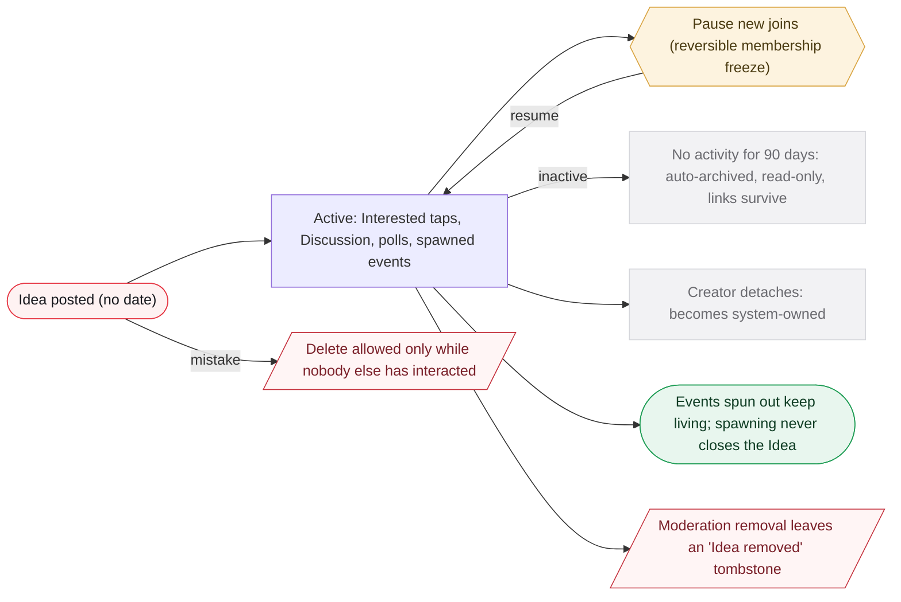

_Views do not count as activity._

**What it is.** Something a user wants to do but is not hosting; others rally and can spin an Event out of it. DEC-040 gave Ideas their first defined lifecycle.

**User flow.**

1. Post an Idea (summary, details, Discussion, time/location polls). Others tap Interested, comment, vote; anyone can spin an Event out. Spawning never closes the Idea.
2. Pause new joins: the old "close to new joiners" toggle is a reversible membership freeze, renamed, and now shipped visible in phase 1 (superseding DEC-009's do-not-expose). The existing group keeps full access.
3. Auto-archive after 90 days with no activity (Interested, comment, spawned event; views do not count): visible, read-only, links survive. DEC-060 phrased the window as roughly six months; 90 days stands until Elvis confirms the change.
4. An idea survives with no owner once its creator leaves; there is no owner-takeover mechanism in phase 1, deferred because a taker could hijack an active idea's topic (DEC-060).
5. Delete outright only while nobody else has interacted (created-by-mistake; friction-free).
6. Archiving is quiet: an archived idea is not recommended or shown in feed but stays reachable by direct link or save, and interested users are not notified when it archives (DEC-060). Moderation removal leaves inspired events standing with an "Idea removed" tombstone.

**Rules that govern it.**

- "Pause" beats "Close"/"Lock": reversibility is the semantic that separates it from archive.
- 90 days vs events' 60 because Ideas are slower-burning by design; DEC-060's roughly-six-months phrasing conflicts and is unreconciled, so 90 days is standing.
- Views excluded so a passive viewer cannot block a creator from deleting a mistyped draft.

**Build notes for Deepak.**

- One tombstone mechanism for deleted-event anchors on moments and deleted-idea backlinks.
- archived_at plus last-activity timestamp and an inert scheduled sweep.
- One shared interaction predicate for delete-eligibility and archive-activity.
- A real ownerless state for system-owned Ideas.

**Open items.**

- Whether an archived idea can be un-archived (Elvis research).
- Whether commenting on an archived idea is allowed, since it would effectively revive it (Elvis research).
- Auto-archive window: DEC-040 sets 90 days, DEC-060 says roughly six months; treat 90 days as standing until Elvis confirms.

**Governing decisions.** DEC-040, DEC-009 (superseded), DEC-022, DEC-060

**Elvis's design detail, sourced (16).**

- **[DECIDED DEC-040]** Elvis's walkthrough words for the toggle: "we have too many people in this idea now... I only want it for these people now. So they closed it, so no one can join anymore." It seals the room and keeps the idea alive.  
  src: `ideas-lifecycle-2026-08-30.md > "They are two different mechanics, RESOLVED 2026-08-30"`
- **[DECIDED DEC-040]** An Idea is a hub for multiple inspired events which may differ in date, time, location, theme and schedule.  
  src: `ideas-lifecycle-2026-08-30.md > "Idea as a topic hub"`
- **[DECIDED DEC-040]** Exact copy: host action "Pause new joins"; host-facing state "New joins paused"; outsider-facing "This idea isn't taking new people right now".  
  src: `ideas-lifecycle-2026-08-30.md > "Pause new joins, RESOLVED 2026-08-30" (copy table)`
- **[DECIDED DEC-040]** Why "Lock" and "Close" lost: on the subreddit model a locked thread means nobody comments, which is archive behavior; bare "Close" reads terminal and any surface truncating "Closed to new people" to "Closed" collides with the archived state.  
  src: `ideas-lifecycle-2026-08-30.md > "Pause new joins" (Why "pause")`
- **[DECIDED DEC-040]** The outsider line must read "not right now" rather than "you were rejected"; the idea stays visible and they can still watch it.  
  src: `ideas-lifecycle-2026-08-30.md > "Pause new joins"`
- **[ELVIS DESIGN, starting points only, needs a native pass]** Korean copy: "새 참여 잠시 중단" (action), "지금은 새로운 참여를 받지 않아요" (outsider-facing), "보관됨" (archived); the property to preserve is temporariness (지금은, 잠시).  
  src: `ideas-lifecycle-2026-08-30.md > "Pause new joins" (Korean)`
- **[DECIDED DEC-040]** Supersession reasoning for DEC-009: "An idea that gets to a real event is worth more to the joiner supply than an idea that collapses under its own discussion."  
  src: `ideas-lifecycle-2026-08-30.md > "Pause new joins" (Exposure)`
- **[DECIDED DEC-040]** The archive threshold's reason string is corrected: handoff §10's "with the reason if given" does not apply; reasons belong to Event cancellation (§3.2).  
  src: `ideas-lifecycle-2026-08-30.md > "Archive, RESOLVED 2026-08-30"`
- **[DECIDED DEC-040, flagged as an inference]** No host-initiated early archive in phase 1 is the one inference in the file, not a stated decision; cheap to add later.  
  src: `ideas-lifecycle-2026-08-30.md > "Archive, RESOLVED 2026-08-30"`
- **[DECIDED DEC-040]** Rejected: passing the creator role to another user (earliest interested, or whoever spawned the most events); an abandoned subreddit goes unmoderated until someone requests it.  
  src: `ideas-lifecycle-2026-08-30.md > "Deletion and detachment" case 2`
- **[ELVIS DESIGN, handoff spec mapping]** Moderation deletion maps onto handoff §12.4's reviewer decision set (keep, hide, remove, remove and suspend); inspired events are reviewed too and, if inappropriate, deleted with their users notified.  
  src: `ideas-lifecycle-2026-08-30.md > "Deletion and detachment" case 3`
- **[DECIDED DEC-040]** Tombstone rule from §3.5: the anchor renders a tombstone, never a 404 and never an empty frame, built from fields denormalized at creation.  
  src: `ideas-lifecycle-2026-08-30.md > "Deletion and detachment" (The tombstone)`
- **[DECIDED DEC-040]** Whether the ownerless state is a sentinel owner or an explicit flag is an implementation call.  
  src: `ideas-lifecycle-2026-08-30.md > "Flags for Deepak"`
- **[ELVIS DESIGN, handoff spec v0.9]** The Interested-tap gate on idea summaries (§10) is retained deliberately, with instrumentation (notably time-to-undo, which separates a curiosity tap from real interest) so it can be revisited on data.  
  src: `handoff-spec-v0.9-intake-2026-08-29.md > "Item H"`
- **[DECIDED DEC-042]** Whether idea changes also post into the idea's Discussion is deferred to a later phase.  
  src: `shared/DECISIONS.md > DEC-042 (Decision)`
- **[ELVIS DESIGN]** Retrieval treats ideas by a "non-expired" time window, the idea counterpart of upcoming events.  
  src: `recommendation-algorithm-2026-08-25.md > "Architecture, RESOLVED 2026-08-25" (Retrieval)`

### 4.10 Discovery: cohorts, recommendation, group dynamics

**Phase 1** · Discovery · safety

> **In plain terms.** This is how the home feed and Explore decide what to show you. First the app narrows down to relevant events (at launch, students see student-community events, and content from people you follow always gets through), then it ranks them by shared interests, distance, recency, popularity, people you know, and a boost for new hosts. Blocking someone hides you from each other everywhere, and the people you tap want-to-meet-again on nudge their events up your feed.

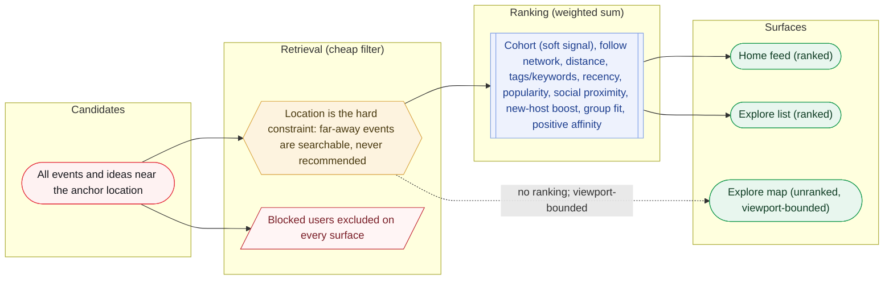

_Cohort is a soft ranking signal, not a hard retrieval gate (DEC-059): events from people you follow surface even outside your cohort. Rule-based at launch; logging from day one so a learned ranker can replace the ranking stage later._

**What it is.** The engine behind the home feed and Explore: cheap retrieval then a weighted ranking, rule-based at launch and built so a learned ranker slots in later.

**User flow.**

1. Cohorts: university-affiliated or not (affiliation via self-declared status, a school email domain, or a university-flagged Org). Now a soft ranking signal, not a hard retrieval gate (DEC-059 amends DEC-019/DEC-020): recommendations combine cohort, the user's follow network, and location/distance, and events from people in the user's network surface even when those people are outside the cohort. Location stays a hard constraint (far-away events are searchable, never recommended). No automatic density-based de-hardening in phase 1; loosening cohort emphasis is a manual decision made later.
2. Ranking: a normalized weighted sum over tag/keyword overlap, cohort, recency, geo distance, popularity, social proximity, a new-host fairness boost, and group-composition fit. Keyword extraction and a per-user interest profile feed the tag signal; a hidden admin-visible keyword layer spans all content. Logging ships day one.
3. Explore: an unranked viewport-bounded map view and a fully ranked list view; filters and search scoped to a location.
4. Group dynamics: the avoid signal is block-only (the inferred low-rating half is dropped; absence-of-positive was rejected as noise). A positive affinity signal boosts events attended by people you tapped "want to meet again" on. Look-alike host affinity parked. Personality-mix is a ranking signal only.
5. General user blocking: phase 1, earliest wave. Bidirectional and total across every surface; scope stated to the user at block time; checked at retrieval time.
6. The hidden admin-visible internal keyword layer is populated by the v2.0 categories taxonomy (eight top-level categories plus Other, 85 subcategories, EN/KO under one canonical ID; DEC-051).

**Rules that govern it.**

- No learned model at launch (no engagement history); the split and day-one logging make ML an extension, not a rebuild.
- The new-host boost counters a rich-get-richer loop.
- Block is a hard exclusion for surfaces and a heavy ranking penalty for the avoid signal: two consumers of one state.

**Build notes for Deepak.**

- Retrieval-before-ranking with one shared scoring function; logging pipeline; low-history indicator; featured flag for Sunday Deck; internal-keyword storage with an admin view; live viewport query.
- No per-user-pair negative history exists; block state and positive-tap history are the only per-pair reads.

**Open items.**

- Behavioral-inference disclosure in the privacy policy.

**Governing decisions.** DEC-019, DEC-020, DEC-023, DEC-030, DEC-036, DEC-037, DEC-059, DEC-051

**Elvis's design detail, sourced (27).**

- **[DECIDED DEC-020 for w1 to w8; w9 ELVIS DESIGN 2026-08-26, not in DEC-020's text]** Formula as written: `score = w1*tag_and_keyword_overlap + w2*cohort_match + w3*recency + w4*geo_distance + w5*popularity + w6*social_proximity + w7*new_host_boost + w8*group_composition_fit + w9*embedding_similarity`; each signal normalized to 0 to 1 before weighting.  
  src: `recommendation-algorithm-2026-08-25.md > "Current state at a glance" and "Illustrative scoring walkthrough"`
- **[ELVIS DESIGN, illustrative placeholders, not locked]** Illustrative weights: tag/keyword overlap 0.25, cohort match 0.20, recency 0.15, geo distance 0.15, popularity 0.10, social proximity 0.10, new-host boost 0.05; w8 has no illustrative weight and is not yet split into avoid-signal vs personality-mix sub-weights.  
  src: `recommendation-algorithm-2026-08-25.md > "Current state at a glance"`
- **[ELVIS DESIGN, illustrative]** Worked example: Sujin (22, Seoul student, tags hiking/coffee/photography); Event A "Sunrise hike and coffee" totals 0.65, Event B "Networking mixer" totals 0.27 once cohort softens; at launch Event B never reaches scoring unless Sujin follows its host.  
  src: `recommendation-algorithm-2026-08-25.md > "Illustrative scoring walkthrough"`
- **[DECIDED DEC-019/DEC-020]** Retrieval query shape: time window (upcoming events, non-expired ideas), exclude anything RSVPed or dismissed, a geographic bound by surface (radius for home feed, live viewport for Explore map), the cohort hard filter, then unioned with content from followed users: (own cohort) union (people they follow).  
  src: `recommendation-algorithm-2026-08-25.md > "Current state at a glance" and "Flags for Deepak"`
- **[DECIDED DEC-019/DEC-020]** Elvis's follow-graph example: a user's mother, older and not in college, should rank higher via w6, not be hidden.  
  src: `community-segmentation-2026-08-25.md > "Follow-graph exemption, RESOLVED 2026-08-26"`
- **[DECIDED DEC-020]** Per-surface weighting: home feed weights interest and cohort more heavily; Explore list view raises w4 substantially so distance dominates and other signals act as tie-breakers; one scoring implementation with different weight configs.  
  src: `recommendation-algorithm-2026-08-25.md > "Explore: map view versus list view"`
- **[ELVIS DESIGN, explicitly deferred by Elvis]** Whether the Explore map view's same-cohort-only rule loosens once a city is dense, or stays permanent.  
  src: `recommendation-algorithm-2026-08-25.md > "Explore: map view versus list view" (Deferred)`
- **[ELVIS DESIGN, assumed not confirmed]** Whether cohort softens back into ranking signal w2 after the density call, or is dropped from the algorithm entirely; assumed to soften, Elvis did not explicitly confirm.  
  src: `community-segmentation-2026-08-25.md > "Mechanism, REVISED 2026-08-25"`
- **[DECIDED DEC-019, revised by DEC-030]** Three-signal check detail: self-declared "current student at [school]" field at onboarding, school email domain verification, or membership in an Org profile flagged university-affiliated; any one qualifies; affiliation is checked first; one combined cohort regardless of school. Needs a maintained per-market school-domain list (Korea and US differ) and a boolean flag on Org profiles set at creation or verification.  
  src: `community-segmentation-2026-08-25.md > "University affiliation cohort" and "Flags for Deepak"`
- **[DECIDED DEC-019, revised by DEC-030 to one global call]** Merge trigger is a manual PM-reviewed call at launch, automated later; open: what the review looks at (active-user count, qualitative read, event supply) and who owns it (presumed Aakash, not confirmed); build only a lightweight interface, do not over-invest.  
  src: `community-segmentation-2026-08-25.md > "Merge trigger, REVISED 2026-08-25" and "Not yet decided"`
- **[DECIDED DEC-019, superseded alternatives recorded]** Three earlier same-day calls Elvis revised: pure soft ranking (to hard filter), automatic threshold merge (to manual review), inheriting the inviter's cohort (to independent per-user computation).  
  src: `community-segmentation-2026-08-25.md > "Mechanism", "Merge trigger", "Cohort assignment and the invite-first model"`
- **[DECIDED DEC-020; decay details ELVIS DESIGN]** The new-host boost decays as an item or host accrues engagement (an exploration bonus, not a permanent advantage); decay curve and magnitude are post-launch tuning; popularity is "deliberately dampened".  
  src: `recommendation-algorithm-2026-08-25.md > "New-host fairness, RESOLVED 2026-08-25"`
- **[ELVIS DESIGN, not in DEC-020's signal list]** Invite-chain proximity is listed as a launch-available signal.  
  src: `recommendation-algorithm-2026-08-25.md > "Signals available at launch"`
- **[ELVIS DESIGN 2026-08-26, pulled into launch, not in DEC-020's text]** Content pipeline: trigger on create and on any title/description edit; embed title-plus-description via a text embedding model (hosted API or small self-hosted); LLM-based tag extraction chosen over keyword/term-frequency, drawing on DEC-005 vocabulary plus new candidates; both stored; admins inspect embeddings via "most similar items", tags as strings. Needs vector-capable storage.  
  src: `recommendation-algorithm-2026-08-25.md > "Content embeddings and automated tagging, RESOLVED 2026-08-26"`
- **[ELVIS DESIGN 2026-08-26]** User embedding is seeded at onboarding (DEC-005 tags, university affiliation, profile text) and refined by a periodic batch job, not per request, from embeddings of positively engaged content weighted toward recency and engagement strength. Cost model for embedding and extraction calls flagged, not built.  
  src: `recommendation-algorithm-2026-08-25.md > "Content embeddings and automated tagging" (Pipeline for users, Cost)`
- **[ELVIS DESIGN]** The hidden keyword layer and categories-taxonomy §9 (rules engine plus AI inference) are one system, not two; point Deepak at both together.  
  src: `recommendation-algorithm-2026-08-25.md > "Hidden internal keywords and tags" (Concrete specification, added 2026-08-27)`
- **[DECIDED DEC-020 featured flag; details ELVIS DESIGN]** Editorial bridge: a host manager, or Aakash/Elvis in the earliest cities, manually features or pins a small number of events per city in Sunday Deck only, not home feed or Explore; open: who owns the flag day to day and the turn-off condition (plausibly the density threshold, not confirmed as the same number).  
  src: `recommendation-algorithm-2026-08-25.md > "Editorial bridge, RESOLVED 2026-08-25"`
- **[DECIDED DEC-020]** Day-one logging covers RSVPs, check-ins, dismiss and skip, shares and tag clicks.  
  src: `recommendation-algorithm-2026-08-25.md > "Feedback logging"`
- **[ELVIS DESIGN 2026-08-26; bucketing decided as DEC-028]** Day-1 sequencing: basic experimentation bucketing (control plus test groups, tagged sessions, outcomes by bucket) is Elvis's explicit priority; impression/position logging and deletion handling for inferred profiles are sequenced after it, with the acknowledged tradeoff that impression data cannot be reconstructed retroactively.  
  src: `recommendation-algorithm-2026-08-25.md > "Robustness roadmap and day-1 sequencing, RESOLVED 2026-08-26"`
- **[ELVIS DESIGN 2026-08-26; org traceability later decided in DEC-044]** Anti-gaming is account integrity, not a separate rate-limit/anomaly-detection system (the first-raised candidate, superseded): one personal account per phone number, ID verification "eventually" (timing unspecified), every Org traceable to a personal account; residual risk of multiple numbers flagged.  
  src: `recommendation-algorithm-2026-08-25.md > "Anti-gaming, REVISED 2026-08-26"`
- **[ELVIS DESIGN, captured not designed]** Near-term and later items: negative-feedback suppression by content type, a diversity pass on the ranked list, a "why you're seeing this" label, offline evaluation metrics; non-functional notes: a latency budget once embeddings are live and session-stable feed ordering.  
  src: `recommendation-algorithm-2026-08-25.md > "Robustness roadmap" (Near-term and later items)`
- **[DECIDED DEC-020; alternatives ELVIS DESIGN]** Per-user learned weights later via learned embeddings; two lighter alternatives surfaced and not chosen: an explicit user-set preference control, and shared cluster-level weight profiles; contextual bandits (LinUCB) noted as prior art for a lighter step.  
  src: `recommendation-algorithm-2026-08-25.md > "Beyond the launch formula" and "Research grounding"`
- **[ELVIS DESIGN, open]** Whether moments surface inside the home feed at all, or stay on profile and event pages only, is not scoped.  
  src: `recommendation-algorithm-2026-08-25.md > "Not yet decided, deliberately parked"`
- **[DECIDED DEC-023]** Personality-mix compatibility scores a user's personality tags against the aggregate composition of an event's current or likely attendees, computed at ranking time and likely cached; open whether it ever graduates to a host-facing tool.  
  src: `group-dynamics-2026-08-25.md > "Group personality-mix compatibility" and "Flags for Deepak"`
- **[DECIDED DEC-023/DEC-036]** The avoid-signal penalty magnitude for a block remains a tuning question; DEC-023 treated a block as substantially heavier than the (now dropped) inferred pattern but "not automatically a hard exclusion" for ranking.  
  src: `group-dynamics-2026-08-25.md > "Avoid signal, RESOLVED 2026-08-25"`
- **[DECIDED DEC-037; [D] item ELVIS DESIGN]** Block per handoff §12.2: bidirectional, total, across every surface, scope stated at block time, P0 wave; bidirectional block filtering in comment threads (§6.3) is a [D] inference still needing sign-off.  
  src: `handoff-spec-v0.9-intake-2026-08-29.md > "Item G" and "Part 5" item 4`
- **[ELVIS DESIGN, parked]** Exact scale threshold at which look-alike host affinity becomes computable is not addressed.  
  src: `group-dynamics-2026-08-25.md > "Not yet decided, deliberately parked"`

### 4.11 Ratings, post-event feedback and QR check-in

**Phase 1** · Post-event loop

> **In plain terms.** After an event you get an optional three-step wrap-up: rate the event, rate the host and give attendees a positive-only tap, then add your moments. Scanning the check-in QR is no longer required to take part; instead it earns you a verified badge and makes your rating count more (a checked-in rating counts fully, an unverified one at 0.4). A host's public star score only appears once they have at least three verified ratings.

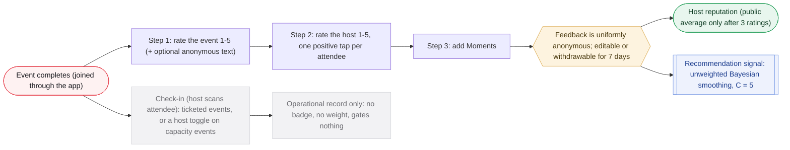

_Every step is optional. Eligibility is joined plus event completed; check-in gates nothing (DEC-045/046). Attendee self-scan (self-service mode) is deferred._

**What it is.** The loop that produces host reputation, the recommendation signal and Moments. DEC-045 to DEC-047 reshaped it: the check-in badge and scoring weight are withdrawn, check-in reverses to host-scans-attendee as an operations tool, and feedback is uniformly anonymous.

**User flow.**

1. Step 1: rate the event 1 to 5 stars (an unrated field is NULL, not 0) plus optional anonymous text; feedback is uniformly anonymous with no name-attach option (DEC-045, DEC-047).
2. Step 2: rate the host 1 to 5 plus a comment, and give other attendees a single positive-only tap; the follow button is the signed channel, on the same screen but separated from the rating controls.
3. Step 3: add Moments. Eligibility is simply joined-through-the-app plus event completed; check-in gates nothing (DEC-045).
4. A user may edit or withdraw their own feedback for 7 days from submission (matching the self-attest auto-resolve window); after that removal goes through moderation. A 'My feedback' profile entry is the only place the author-to-feedback link ever surfaces, private to that user (DEC-047).
5. Check-in reverses to host-scans-attendee (ticketing standard), producing an operational record only: no 참석 인증 badge, no scoring weight, gates nothing. Required on ticketed events; a host toggle on capacity-limited events; not available on open events in phase 1. Attendee self-scan (self-service mode) is deferred (DEC-046).
6. A public star average displays once a host has 3 ratings (not 3 verified ratings), showing event and rating counts below that; the internal signal applies unweighted Bayesian smoothing toward the global mean, R = (C·m + Σrᵢ)/(C + n) with C = 5 (DEC-045).
7. Attendance is recorded as two independent axes: observed attendance where check-in ran, and self-reported intent on every event (on my way / running late / cannot make it); declining in advance is never scored like a silent no-show (DEC-046).

**Rules that govern it.**

- The badge and scoring weight are withdrawn in full: once check-in is optional and rare they created more problems than they solved (DEC-045).
- A gate must be able to deny entry, so the host scans the attendee rather than the reverse (DEC-046).
- Anonymity does the work double-blind publication does elsewhere; optional attribution would identify the few who declined to sign (DEC-047).

**Build notes for Deepak.**

- No weight column and no badge surfaces; aggregates are recomputed from rows rather than accumulated, since a single edit or withdrawal corrupts a running sum (DEC-045, DEC-047).
- attendance(event_id, user_id, method, verified_at, approved_by) stays a first-class transactional table so weighting can be reinstated later as a config change plus a runnable backfill (DEC-045); attendance.method stays an open discriminator (host-scan now, self-service later) (DEC-046).
- Once the host scans a person in front of them a static per-attendee credential suffices; the 60-second rotating QR is no longer needed (DEC-046).
- The 'My feedback' link is private to the user, never to a host, an admin UI, or an export (DEC-047).

**Open items.**

- What "surfaces in analytics" means concretely, and how no-show and punctuality data is eventually used (DEC-046).
- Whether an edited rating shows as edited or changes silently within the 7-day window (DEC-047).
- 위치정보법 registration: DEC-046 likely defers the trigger with attendee self-scan, pending DLG confirmation (R5).

**Governing decisions.** DEC-014, DEC-034, DEC-045, DEC-046, DEC-047

**Elvis's design detail, sourced (15).**

- **[DECIDED DEC-034]** Three check-in modes count as verified (weight 1.0): QR scan, host confirm, or self-attest that the host approved. "Never joined" is not eligible at all; no feedback row exists.  
  src: `handoff-spec-v0.9-intake-2026-08-29.md > "Recommended scoring weights, for Elvis to confirm"`
- **[DECIDED DEC-034]** The internal ranking formula is written out as R = (C · m + Σ wᵢ · rᵢ) / (C + Σ wᵢ), where m is the global mean rating across all events and C ≈ 5 is read as "worth 5 average ratings of prior"; it is the standard weighted-rating form and needs no ML.  
  src: `handoff-spec-v0.9-intake-2026-08-29.md > "Two consumers, two different rules"`
- **[ELVIS DESIGN]** The 0.4 weight was chosen over 0.5 so that two and a half unverified ratings outweigh one verified one; the file says any value in the 0.3 to 0.5 band is defensible and the number is "a starting point, not data-backed".  
  src: `handoff-spec-v0.9-intake-2026-08-29.md > "Why 0.4 rather than 0.5"`
- **[DECIDED DEC-034]** Why "follow all" was removed: follow is a weighted input to DEC-020's social-proximity signal w6, and a one-tap bulk action makes that weight meaningless.  
  src: `handoff-spec-v0.9-intake-2026-08-29.md > "Item A"`
- **[DECIDED DEC-014]** On the rate-the-people step, follow buttons for the host and attendees sit on the same page but are visually separated from the rating controls, because follow is a public act and rating is not.  
  src: `conflict-review-2026-08-19.md > "Item 1 - Ratings and reviews: RESOLVED"`
- **[ELVIS DESIGN]** Proposed I-12 replacement wording (not yet adopted into CLAUDE.md): "No mechanic may create a persistent rating of an individual in their capacity as a participant, whether visible or internal, and no negative peer record is created anywhere in the system. Rating a host is explicitly out of scope and permitted." Principle: protect people from being scored for showing up, not for taking responsibility.  
  src: `handoff-spec-v0.9-intake-2026-08-29.md > "Invariant I-12 re-scoping, RESOLVED 2026-08-29"`
- **[ELVIS DESIGN]** Unsettled design note: Moments is step 3 of the feedback flow, but the Moments spec calls for one composer with three entry doors; still to confirm that the feedback flow is one door among several and that a user who skips feedback can add a moment later.  
  src: `conflict-review-2026-08-19.md > "Item 1 - Ratings and reviews: RESOLVED" (Design note not yet settled)`
- **[ELVIS DESIGN]** The handoff spec's anomaly clustering on check-in (§4.4) is tagged [D], an engineering inference that still needs an Elvis sign-off pass before build.  
  src: `handoff-spec-v0.9-intake-2026-08-29.md > "Part 5: Cross-cutting concerns" item 4`
- **[ELVIS DESIGN]** Verification badge copy in the Moments spec: "참석 인증 ✓" as quiet confidence, never "BADGE EARNED!".  
  src: `WePop_Moments_Reflections_BRD_EngSpec_v0.9.md > "9. Copy & tone"`
- **[SUPERSEDED by DEC-034]** The 2026-08-19 resolution gave other attendees a thumbs up or thumbs down (anonymous, internal signal only, never shown to anyone including the rated person).  
  src: `conflict-review-2026-08-19.md > "Item 1 - Ratings and reviews: RESOLVED"`
- **[SUPERSEDED by DEC-034]** The same resolution made eligibility "checked-in attendees only", made QR check-in required and load-bearing, and recorded "No fallback path is being built now" for a low check-in rate.  
  src: `conflict-review-2026-08-19.md > "Item 1" (Consequences accepted)`
- **[SUPERSEDED by DEC-014]** The Moments spec v0.9 excluded ratings, stars, 평점 and "would you recommend" by product identity ("Not deferred") and banned review vocabulary everywhere.  
  src: `WePop_Moments_Reflections_BRD_EngSpec_v0.9.md > "4.2 Explicitly out of scope"`
- **[SUPERSEDED by DEC-034]** The Moments spec defined eligibility as "checked in, or confirmed + marked 'Here'" and asked (OQ-1) for a fallback eligibility rule if check-in ran below ~40% of confirmed attendees.  
  src: `WePop_Moments_Reflections_BRD_EngSpec_v0.9.md > "4.3 Critical dependency - flag"`
- **[SUPERSEDED by DEC-034]** The handoff spec §5.1 proposed non-numeric sentiment, private to the host, never public and never aggregated into a public score; Elvis overrode it on 2026-08-29 and it does not ship.  
  src: `handoff-spec-v0.9-intake-2026-08-29.md > "Item A"`
- **[ELVIS DESIGN]** On the 2026-08-17 call Elvis said "once we do feedback for events, I think we'll start adding some rating system for people"; the Phase 1 Brief's Reviews screens were "others positive-only anonymous; mine positive plus improvement".  
  src: `Wepop_Walkthrough-vs-Drafts_Review-Aid_2026-08-18.md > "Ratings and reviews - DOCS DISAGREE"`

### 4.12 Moments and media

**Phase 1** · Content · financials

> **In plain terms.** A moment is your one post about an event after it is over: photos, short video and a write-up, which others can react to, comment on and share. Free accounts get up to 10 items and 15-second clips; paid accounts get more. After six months, free users' media moves to cheaper storage as a thumbnail with a download link (nothing is ever deleted), while paid accounts keep full quality forever.

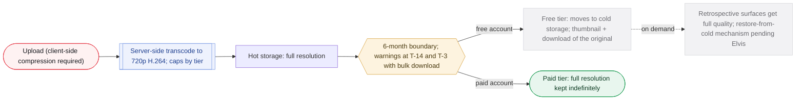

_Nothing is ever deleted. Media caps are per attendee per event: 10 / 20 / 50 items, video 15s free / 30s paid; event cover media separate (5 items). The retention downgrade is deferred while every user is on the launch free trial (DEC-063)._

**What it is.** The evergreen memory-keeping layer, with reactions, comments and share, two composing visibility gates, and video at 720p. DEC-064 and DEC-065 reshaped it: multiple Moments per event, caps per attendee per event, and visibility that composes profile privacy with the Moment's own scope.

**User flow.**

1. A user may post multiple Moments to a completed event (replacing one-post-per-user); there is no count limit on Moments, only on total media (DEC-064). Visible-beyond-owner Moments support reactions, comments and share.
2. Visibility composes two independent gates that must both pass: profile privacy (a private profile shows non-mutuals only name, username, cover and background photo, while mutual followers see the full profile including Moments) and the Moment's own visibility, which caps at its source event's audience (a public event publishes anywhere, a private or members-only org event caps at that event's attendees). Most-restrictive-wins (DEC-065, DEC-048).
3. Media caps are enforced per attendee per event, summed across that attendee's Moments rather than per Moment (50 items at org-paid events, 20 individual-paid, 10 free; most-generous-wins); video 15s free / 30s paid at 720p H.264 (DEC-064).
4. The Moment card's event anchor frame is three elements (name, date, org), not four; DEC-045 withdrew the attendance badge, so the slot is removed rather than left empty (DEC-064).
5. Comments are governed by two orthogonal controls: Moment visibility governs who can see and therefore comment; a separate comments toggle (default on for public and attendees-only Moments) governs whether comments are displayed. Off hides existing comments from everyone except the author and blocks new ones; comments are never deleted by either control, and the toggle state is stored on the Moment, not derived from visibility (DEC-065).
6. Event cover media is a separate surface: up to 5 items, any mix of photos and videos, video 15s free / 30s paid; there is no total-duration cap (DEC-038, DEC-064).
7. Org analytics never include Moment content: an admin who did not join a members-only event sees counts only (how many Moments, media items and engagement), no images, captions or author names, and receives no read elevation (DEC-065).
8. Retention is tiered and active in principle (after 6 months free-tier media moves to cheaper storage, thumbnail plus download of the original, paid keeps full-res; nothing deleted, thumbnails persist forever), but every user is on the paid plan free as an extended launch trial, so the free-tier downgrade does not bite until the trial ends (DEC-063).

**Rules that govern it.**

- A cover is a cover, not a gallery; volume belongs in the composer, keeping one uploader and one moderation queue.
- Media caps are per attendee per event, which is what makes an unlimited Moment count safe: the bound that matters is already enforced elsewhere (DEC-064).
- The recap grid renders every Moment as its own flat tile with no author grouping; a prolific poster takes proportionally more grid space, an accepted tradeoff recorded so it is not later filed as a bug (DEC-064).
- Financials: the retention window roughly halves the storage assumption behind DEC-018's pricing; re-check the org cost model before ship.

**Build notes for Deepak.**

- storage_tier and expires_at on the media row with a scheduled job; a designed loading state for cold retrieval.
- Visibility checks compose two gates evaluated at render time, since the same Moment is reachable from a profile and an event page by different viewers; the org analytics pipeline reads counts only and must not join to Moment content or author identity (DEC-065).
- The Moment composer is the sole media intake path (one uploader, one EXIF and GPS stripping pipeline, one moderation queue); the Event Media tab and recap grid are filtered views with no upload of their own (DEC-065).
- Per-clip 50MB ceiling is an abuse guard; client-side compression is mandatory; Cloudflare R2 with self-hosted 720p transcode.

**Open items.**

- Org-paid Moment video length (DEC-018 never set it).
- The media-retention window (six versus twelve months, DEC-039) stays undecided and its effect is deferred by the launch free trial (DEC-063).
- Three DEC-039 refinements pending Elvis: restore-from-cold Wrapped path; a general retrospective-surface capability; a 1080px mid-tier for free full-screen.
- Whether org analytics distinguish Moment counts on member-only events from public events (DEC-065).

**Governing decisions.** DEC-015, DEC-018, DEC-038, DEC-039, DEC-014, DEC-064, DEC-065, DEC-063, DEC-048

**Elvis's design detail, sourced (34).**

- **[DECIDED DEC-018]** R2 storage is $0.015/GB-month against S3 Standard $0.023/GB-month; R2 charges nothing for egress while CloudFront charges $0.085/GB after a 1TB monthly allowance; for a social app egress, not storage, is normally the dominant cost.  
  src: `freemium-model-2026-08-19.md > "Media infrastructure cost model, added 2026-08-24"`
- **[ELVIS DESIGN]** Cloudflare Stream is priced $5 per 1,000 minutes stored and $1 per 1,000 minutes delivered and came out roughly 10x more expensive than R2 plus self-hosted transcode; self-hosted transcode is estimated (not sourced) at roughly $0.001 per clip on serverless compute and needs a build-time spike.  
  src: `freemium-model-2026-08-19.md > "Media infrastructure cost model, added 2026-08-24"`
- **[ELVIS DESIGN]** Cost-model assumptions, flagged as estimates: average photo 1.5MB after client-side compression; average video 20 seconds blended at 3Mbps, about 7.5MB; item mix 80% photos / 20% video.  
  src: `freemium-model-2026-08-19.md > "Assumptions, flagged as estimates, not real usage data"`
- **[DECIDED DEC-018]** Three org scenarios under 12-month retention: moderate (4 events/month, 50 attendees, 8 items each = 1,600 items/month) roughly $1.10/month; heavy (8 events, 150 attendees, 30 items = 36,000 items/month) roughly $24.60/month, with video about two-thirds of that because a video file runs roughly 5x the bytes of a photo; realistic upper (6 events, 100 attendees, 15 items = 9,000 items/month) roughly $6.15/month, the number the price carries margin over.  
  src: `freemium-model-2026-08-19.md > "Moderate-usage org" / "Heavy-usage org" / "A more realistic upper bound, added 2026-08-24"`
- **[ELVIS DESIGN]** The cost model was run against the 100-item cap in effect when the analysis was run; the cap was lowered to 50 the same day and the dollar figures were left as run, since no scenario modeled usage near 50 items.  
  src: `freemium-model-2026-08-19.md > "Media infrastructure cost model, added 2026-08-24" (note)`
- **[SUPERSEDED by DEC-018]** The org-paid attendee cap was originally 100 items per attendee per event (2026-08-19), lowered to 50 on 2026-08-24 alongside locking the org price.  
  src: `freemium-model-2026-08-19.md > "Media caps, RESOLVED 2026-08-19"`
- **[DECIDED DEC-018]** The 50-item cap is per user, not a shared pool, so no "whoever posts after the cap fills gets blocked" dynamic; named as a strength because ordinary members feel the org's subscription at events, creating grassroots pressure to subscribe.  
  src: `freemium-model-2026-08-19.md > "Media caps, RESOLVED 2026-08-19"`
- **[DECIDED DEC-018]** A paying user's worst-case moment (20 items at 30 seconds) runs to roughly 4x the storage of a free user's worst case; still "a small fraction of a cent per user in object storage".  
  src: `freemium-model-2026-08-19.md > "Individual tier: feature detail, RESOLVED 2026-08-19" item 2`
- **[SUPERSEDED by DEC-038]** The freemium draft gave the event listing's own promotional gallery 5 photos free / 20 for org paid; DEC-038 set event cover media at 5 items total for everyone ("a cover is a cover, not a gallery").  
  src: `freemium-model-2026-08-19.md > "Media caps, RESOLVED 2026-08-19" (Event listing's own media)`
- **[ELVIS DESIGN]** Clip sizes at 720p H.264 ~3 Mbps: 5s 1.9 MB, 10s 3.8 MB, 15s 5.6 MB, 20s 7.5 MB, 30s 11.3 MB. Holding a full free-tier Moment of video (10 clips at 15s, 56MB) for 6 months on R2 costs about half a cent; a 50-item org-paid Moment entirely of 30s video about five cents.  
  src: `handoff-spec-v0.9-intake-2026-08-29.md > "Video length: should free drop to 5-10s and paid to 20s?"`
- **[DECIDED DEC-038]** The proposed app-wide cut to 5-10s free / 20s paid was rejected: 15 seconds is the established floor for social video, "5s free is closer to a disabled feature with a demo attached", and it edges against the handoff spec's I-16 (a paid feature may not gate the social core). Cost levers in order: retention window, item count, transcode compute; clip length is not where the money is.  
  src: `handoff-spec-v0.9-intake-2026-08-29.md > "Video length: should free drop to 5-10s and paid to 20s?"`
- **[ELVIS DESIGN]** Worst-case video per Moment if every item is a max-length clip: free 2.5 minutes, individual paid 10 minutes, org-paid 25 minutes; 25 minutes is a moderation problem before a storage problem.  
  src: `handoff-spec-v0.9-intake-2026-08-29.md > "Where the real exposure is, and it is not the free tier"`
- **[ELVIS DESIGN]** A user-facing "pin this to keep it full quality" control was considered and not recommended (a permanent cost leak plus a concept users must learn); a 1080px derivative is roughly a tenth of a full-resolution original.  
  src: `handoff-spec-v0.9-intake-2026-08-29.md > "Refinement 1" / "Refinement 3"`
- **[ELVIS DESIGN]** Tension named, not a blocker: degrading memories at 6 months sits against the memory-keeping identity ("12 months reads as generous where 6 reads as aggressive"), softened because nothing is deleted and the original stays downloadable.  
  src: `handoff-spec-v0.9-intake-2026-08-29.md > "One tension worth naming, not a blocker"`
- **[SUPERSEDED by DEC-039]** DEC-018's 12-month retention was chosen because it "matches a full academic year"; the archive mechanism (delete vs cold storage vs export prompt) was left to Deepak. The handoff spec §6.4 instead had retention OFF at launch with a later hot 0-90 days / cold 90+ days policy.  
  src: `freemium-model-2026-08-19.md > "Retention window, RESOLVED 2026-08-24"; handoff-spec-v0.9-intake-2026-08-29.md > "Item D"`
- **[ELVIS DESIGN]** Moments spec composer: three doors (D1 post-event, opening after the feedback sheet completes, never inside it, with a "≤15-second feedback contract"; D2 the + action in the profile Moments tab, event picker mandatory; D3 the "내 모먼트 남기기" CTA on a recap page). Steps: media 1-10 photos reorderable; reflection text with rotating placeholder prompts ("가장 기억에 남는 순간은?", "누구를 새로 만났나요?", "다음에 또 하고 싶은 것?"); visibility; publish with a modest delight beat.  
  src: `WePop_Moments_Reflections_BRD_EngSpec_v0.9.md > "8.1 Creation - one composer, three doors" and "9. Copy & tone"`
- **[SUPERSEDED by DEC-015]** The Moments spec defaulted each moment to Private with a publish-up option, allowed multiple attendee posts per user per event (rate-limited, OQ-3), put comments out of scope ("do not reserve layout space for a comment affordance") and video in Phase 2. DEC-015 set inherit-the-event as default, one post per user per event, and comments plus video in.  
  src: `WePop_Moments_Reflections_BRD_EngSpec_v0.9.md > "4.2 Explicitly out of scope", "7. Content model" (Cardinality), "8.2 Visibility - floor-and-cap"`
- **[ELVIS DESIGN]** Moments spec content model: three kinds in one table, system_recap (auto-generated: event name, group size, "새로 만난 사람 N명", date; exactly one per completed event; P0), host_photos (at most one set per event, attached to the recap) and attendee_post; validity rule body IS NOT NULL OR media_count > 0, with text-only as a first-class quote-tile case.  
  src: `WePop_Moments_Reflections_BRD_EngSpec_v0.9.md > "7. Content model"`
- **[ELVIS DESIGN]** Moments spec media pipeline [D]: presigned PUT direct to object storage; MIME validated by magic bytes; EXIF/GPS stripped server-side as a hard gate (LC-3); derivatives thumb 400w, feed 1080w, full 2048w (WebP with JPEG fallback); blurhash; client downscale to 2048px long edge (~4MB to ~600KB); 10MB/file, 40MB/moment; purge originals after 30 days is OQ-5 with a recommendation to archive instead; storage-growth alert at 80% of the budgeted cost line.  
  src: `WePop_Moments_Reflections_BRD_EngSpec_v0.9.md > "11.3 Media pipeline" and "11.4 Cost controls (BO-7)"`
- **[ELVIS DESIGN]** Moments spec rate limits [D]: publish 5/user/hour and 20/user/day; media sign 60/user/hour; tag request 20/user/day; report 10/user/day; reaction 300/user/hour. NFR targets [D]: feed p95 < 400ms, detail p95 < 300ms, publish ack p95 < 800ms, media time-to-ready p95 < 20s, zero EXIF-strip failures; abandoned drafts removed after a 30-day TTL.  
  src: `WePop_Moments_Reflections_BRD_EngSpec_v0.9.md > "11.5 Abuse & rate limits", "13. Observability & analytics", "11.2 Lifecycle state machine"`
- **[ELVIS DESIGN]** Moments spec visibility engineering: "most restrictive" must be a conjunction of audience predicates, not min() over an enum, because followers and org_members are overlapping sets; fast lane via is_public_cached, slow lane against a per-request viewer context cached in Redis for 60s.  
  src: `WePop_Moments_Reflections_BRD_EngSpec_v0.9.md > "10.3 Visibility resolution - conjunction of predicates"`
- **[ELVIS DESIGN]** Moments spec feed rule: moments are tier-2, never above a same-org joinable event; TIER2_FLOOR default 5; max 1 moment per 4 items, max 2 moments per org per session; OQ-2 asks whether "새 연결 N" is global or per-viewer (per-viewer makes the recap card non-cacheable and non-shareable).  
  src: `WePop_Moments_Reflections_BRD_EngSpec_v0.9.md > "12. Feed integration" and "10.4 Co-attendance ledger"`
- **[ELVIS DESIGN]** Higher-resolution media export/download is "still fully parked", no free-vs-paid decision either way.  
  src: `freemium-model-2026-08-19.md > "Explicitly considered and cut"`
- **[ELVIS DESIGN]** Handoff [D] items still needing sign-off: server-side transcode and poster-frame generation (§6.2), comments hidden on private Moments (§6.3), comment visibility inheritance and bidirectional block filtering in threads (§6.3). The share mechanism (in-app reshare vs external share sheet) is Deepak's implementation call. Public moment comments (identity-attached) and anonymous host-rating comments should read visually distinct, not merged.  
  src: `handoff-spec-v0.9-intake-2026-08-29.md > "Part 5" item 4; conflict-review-2026-08-19.md > "Item 4 - Comments on moments: RESOLVED"`
- **[DECIDED DEC-064]** A user may post multiple Moments to a completed event, replacing one-post-per-user; a long event may warrant the afternoon and the evening as separate posts. There is no count limit on Moments.  
  src: `moments-2026-09-02.md > "Multiple Moments per event, RESOLVED 2026-09-02"`
- **[DECIDED DEC-064]** DEC-018's media caps are enforced per attendee per event, summed across that attendee's Moments; the freemium file states them as '50 media items per attendee, per event', per-user rather than a shared total so every attendee independently gets their allowance regardless of how many others posted.  
  src: `moments-2026-09-02.md > "The media cap does not change, and this is a clarification rather than a decision"`
- **[DECIDED DEC-064]** The Moment card's event anchor frame drops to three elements (name, date, org); DEC-045 withdrew the attendance badge, so the component is redesigned rather than shipped with an empty slot. The denormalized event_name, event_date and org_name are unaffected and copied at creation.  
  src: `moments-2026-09-02.md > "The DEC-045 consequence nobody traced, RESOLVED 2026-09-02"`
- **[DECIDED DEC-064]** Video is 15 seconds free / 30 seconds paid at 720p H.264 on both Moments and event cover media, correcting DEC-015's stale flat 15-second and flat 10-item text written while the paid tier was deferred.  
  src: `moments-2026-09-02.md > "Video length: DEC-015's text is stale, RESOLVED 2026-09-02"`
- **[DECIDED DEC-064]** The recap grid renders every Moment as its own tile with no grouping by author; a prolific poster occupies proportionally more grid space, an accepted tradeoff recorded so it is not later filed as a bug.  
  src: `moments-2026-09-02.md > "Recap grid: every Moment is its own tile, RESOLVED 2026-09-02"`
- **[DECIDED DEC-065]** Moment visibility caps at its source event's audience: a public event lets the author publish anywhere, a private or members-only org event caps at that event's attendees. One rule with three instances, closing handoff open item O-4.  
  src: `moments-2026-09-02.md > "Org-scoped Moments follow the event's scope, RESOLVED 2026-09-02"`
- **[DECIDED DEC-065]** Profile privacy and item visibility are two independent gates that both must pass: a private profile shows non-mutuals only name, username, cover and background photo, while mutual followers see the full profile including Moments. Most-restrictive-wins.  
  src: `moments-2026-09-02.md > "Private profiles compose with item visibility, RESOLVED 2026-09-02"`
- **[DECIDED DEC-065]** Comments have two orthogonal controls: visibility governs who can see and therefore comment; a separate comments toggle (default on for public and attendees-only Moments) governs whether comments are displayed. Off hides existing comments from all but the author and blocks new ones; comments are never deleted, and the toggle is a stored field, not derived from visibility.  
  src: `moments-2026-09-02.md > "The toggle"`
- **[DECIDED DEC-065]** Org analytics never include Moment content: an admin who did not join a members-only event sees counts only (how many Moments, how many media items, how much engagement), no images, captions or author names, and receives no read elevation.  
  src: `moments-2026-09-02.md > "Org analytics never include Moment content, RESOLVED 2026-09-02"`
- **[DECIDED DEC-065]** The Moment composer is the sole media intake path (one uploader, one EXIF and GPS stripping pipeline, one moderation queue); the Event Media tab and recap grid are filtered views with no upload of their own.  
  src: `moments-2026-09-02.md > "In the handoff spec, never filed as decisions"`

### 4.13 Live stories

**Later** · Content

> **In plain terms.** Live stories are quick, 24-hour posts you can share from the moment you have RSVP'd, even on the way to the event. You choose who sees each one, from mutual follows only up to public, and the safest option is the default.

**What it is.** In-the-moment, ephemeral content kept deliberately separate from evergreen Moments; not phase 1 (DEC-062).

**User flow.**

1. A live story is an ephemeral 24-hour post (Instagram-story style, in the moment, not live streaming), archived after 24 hours and then visible only to its owner (DEC-062).
2. RSVP (not check-in) to post; the poster chooses the audience from four tiers, defaulting to most restrictive.
3. Live stories do not count against the organization 50-item media cap and are not capped in number for now (DEC-062).

**Rules that govern it.**

- Separate from moments because moments are memories and stories are ephemeral.

**Build notes for Deepak.**

- Distinct content type with its own expiry job.

**Open items.**

- None on this module.

**Governing decisions.** DEC-025, DEC-062

**Elvis's design detail, sourced (8).**

- **[DECIDED DEC-025]** The four audience tiers are: 1 Mutuals only (both directions follow, the default), 2 Followers (one-directional), 3 Event attendees only (anyone RSVP'd, regardless of follow), 4 Public.  
  src: `live-stories-2026-08-25.md > "Visibility, RESOLVED 2026-08-25: poster-chosen per post, not inherited from the event"`
- **[DECIDED DEC-025]** Why poster-chosen: the same event can have a private individual wanting protection and a promoter, celebrity or influencer wanting maximum reach; one inherited rule cannot serve both. Elvis corrected an earlier proposal of a single fixed rule (inherit the event, or global mutual-follow).  
  src: `live-stories-2026-08-25.md > "Visibility, RESOLVED 2026-08-25"`
- **[DECIDED DEC-025]** Why RSVP not check-in: a user should be able to post their journey or excitement on the way to the event; live stories never feed analytics, ratings or track record, so they do not need the authenticity bar Moments and ratings do.  
  src: `live-stories-2026-08-25.md > "Who can post, RESOLVED 2026-08-25"`
- **[ELVIS DESIGN]** Potentially many stories per event (or none), posted during or even before the event, unlike the single post-event Moment.  
  src: `live-stories-2026-08-25.md > "A separate content type from Moments, RESOLVED 2026-08-25"`
- **[ELVIS DESIGN]** Open, not asked: a duration cap on live video clips; "reasonable to assume something in the same range as Moments' existing 15/30-second caps, but not confirmed".  
  src: `live-stories-2026-08-25.md > "Not yet decided, flagged"`
- **[ELVIS DESIGN]** Open: reactions, replies or view counts on a story, "likely a DM-reply pattern similar to Instagram given DM is already being pulled into phase 1".  
  src: `live-stories-2026-08-25.md > "Not yet decided, flagged"`
- **[ELVIS DESIGN]** The org 50-item cap and its cost model were built around 12-month persistent Moments; counting 24-hour stories against it "would be wrong without redoing the cost math"; a separate, more generous allowance is "the more likely right answer". A later note says no cap at all has been decided for stories for anyone, and the 10/20/50-shaped pattern is the obvious reuse.  
  src: `live-stories-2026-08-25.md > "Not yet decided, flagged"; paid-tier-features-2026-08-27.md > "Two clarified, not yet decided" (Live stories)`
- **[ELVIS DESIGN]** Deepak flags: the audience selector must be a visible choice at post time, probably remembering the last choice but shown plainly before each post so nobody broadcasts publicly by accident; the "event attendees" tier checks RSVP status, not check-in; the 24-hour expiry needs a cleanup job so content is not queryable or storage-billed past expiry.  
  src: `live-stories-2026-08-25.md > "Flags for Deepak, implementation, not decided here"`

### 4.14 Free Now

**Later** · Real-time · safety

> **In plain terms.** Free Now is for spontaneous meetups: mark yourself as free, see who else nearby is free too, and converge in a location-based room. Because it involves real-time location it is the most carefully guarded feature: locations are rounded, you see counts before identities, and only accounts in good standing can create rooms.

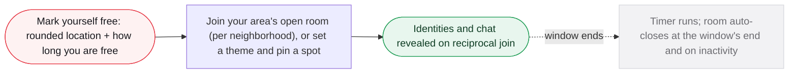

_Individuals only, free, no account-standing gate to create a room (DEC-061). Deferred; build later. Moderation is a required baseline._

**What it is.** Spontaneous meetups: signal you are free, converge in nearby rooms, with heavy safety baselines. Not phase 1; DEC-061 records the direction.

**User flow.**

1. Individuals only, not organizations; a free feature with no account-standing gate to create a room (DEC-061).
2. The creator sets how long they are free when creating the room; a timer runs and the room auto-closes at the end of that window and also on inactivity (DEC-061).
3. Rooms are per-area chat rooms keyed to a location tier (a sub-city neighborhood, since a whole city is too large to meet across); marking yourself free with no theme joins your area's open room, or you can set a theme and pin a meeting location (DEC-061).
4. Location is rounded (never precise); the view is aggregate-first with identities revealed only on reciprocal join. Moderation is a required baseline.

**Rules that govern it.**

- Priority precisely because of its safety profile, grounded in documented failures of comparable real-time location products.

**Build notes for Deepak.**

- Concrete location-rounding method; reciprocal join enforced server-side.
- Deferred feature; build later, possibly built-but-not-enabled (DEC-061).

**Open items.**

- The concrete location-rounding method.

**Governing decisions.** DEC-025, DEC-061

**Elvis's design detail, sourced (10).**

- **[DECIDED DEC-025]** Mechanics: a user marks themselves free with a location and a duration; there is one always-on public room per city created by WePop, and users can create their own rooms pinned to a more specific location.  
  src: `free-now-2026-08-25.md > "Problem"`
- **[DECIDED DEC-025]** Free Now is a third top-level concept, not an Idea or an Event: real-time presence plus location-tied chat, no commitment, no schedule, expires on its own; stated so it is not folded into either model during build.  
  src: `free-now-2026-08-25.md > "A new, third top-level concept, not an Idea or an Event"`
- **[ELVIS DESIGN]** Precedents cited: Snap Map drew real stalking concerns and ships heavy location obfuscation by default; Yik Yak collapsed under harassment it could not moderate; dating-app proximity features now round or grid-snap location to prevent triangulation.  
  src: `free-now-2026-08-25.md > "Why this needed more care than anything else in the batch"`
- **[DECIDED DEC-025]** Two visibility levels: browsing the list of rooms (which exist, roughly how many free in each) is open to any user without marking themselves free; seeing identities inside a room or joining its chat requires marking yourself free in that room. Location snapping matches DEC-003's coarse profile-location precedent.  
  src: `free-now-2026-08-25.md > "Room visibility, RESOLVED 2026-08-25" and "Location precision, RESOLVED 2026-08-25"`
- **[ELVIS DESIGN]** Avatar status badge (marked RESOLVED 2026-08-25 in Elvis's file, not named in DEC-025): a binary "currently free" indicator on the profile avatar like Instagram's active status, with no location or room name attached, visible only to followers and mutuals.  
  src: `free-now-2026-08-25.md > "Avatar status badge, RESOLVED 2026-08-25"`
- **[DECIDED DEC-025]** Marking yourself free inside an existing room needs only standard phone verification; creating a pinned room is "closer to standing up an open public chatroom tied to a real physical location" and needs more standing. Suggested starting point, not final: a minimum account age plus at least one verified real-world action such as having checked into an event.  
  src: `free-now-2026-08-25.md > "Room creation, RESOLVED 2026-08-25"`
- **[ELVIS DESIGN]** Duration cap recommendation, not confirmed: "a few hours maximum", so it stays an expiring signal rather than a stale "here's where to find me" broadcast.  
  src: `free-now-2026-08-25.md > "Not yet decided, flagged"`
- **[ELVIS DESIGN]** Auto-archival recommendation, not confirmed: a user-created room drops off the list after a period with no actively-free members; the WePop citywide room never expires.  
  src: `free-now-2026-08-25.md > "Not yet decided, flagged"`
- **[ELVIS DESIGN]** Not asked: whether an Organization account (a venue, a bar) can create a pinned room as a promotional draw. Parked: spinning a Free Now conversation into a real Idea or Event.  
  src: `free-now-2026-08-25.md > "Not yet decided, flagged"`
- **[ELVIS DESIGN]** Deepak flags: moderation tooling means report, block and rate limiting; rounding needs a concrete method (grid-snapping to a fixed-size area or a minimum display radius); DEC-002's age gate applies unchanged with no separate logic.  
  src: `free-now-2026-08-25.md > "Flags for Deepak, implementation, not decided here"`

### 4.15 Chat and calendar

**Phase 1** · Messaging

> **In plain terms.** Every event and group has a text chat, and you can also message people directly or create your own group chats (no voice or video). For your calendar, the app reads only your busy times to help with recommendations and lets you add an event to your phone's calendar with one tap; a full in-app calendar comes in phase 1.5.

**What it is.** Chat was the largest scope addition of the conflict-review set; calendar was split to get value without an in-app UI.

**User flow.**

1. Event chat, group chat, DMs and user-created group chats: all phase 1, text only (no audio/video).
2. Event chat is announcement-only by default until 24h before the event, which is the mode system change-notices use.
3. Calendar phase 1: read-only device busy-time ingestion (start/end only, everything else discarded) plus a manual per-event add-to-calendar. Full month/list view is phase 1.5.

**Rules that govern it.**

- Chat is core to the product experience, not a build-difficulty call.
- Calendar permission is contextual, not at onboarding; extract only times (data minimization).

**Build notes for Deepak.**

- Live messaging is real infrastructure: delivery, presence, push.
- Chat is a third moderation surface.

**Open items.**

- None on this module.

**Governing decisions.** DEC-013, DEC-009 (superseded)

**Elvis's design detail, sourced (9).**

- **[DECIDED DEC-013]** The manual per-event write uses a native calendar intent or .ics, with no ongoing sync and no calendar-read permission needed for that half.  
  src: `conflict-review-2026-08-19.md > "Item 6 - DMs, group chats, calendar phase markers: RESOLVED"`
- **[DECIDED DEC-013]** Why only start/end times are kept: neither iOS nor Android exposes a busy-only permission tier; granting calendar read gives full access to titles, locations and attendees, so the app must extract times and discard the rest.  
  src: `conflict-review-2026-08-19.md > "Item 6" (Calendar, phase 1)`
- **[ELVIS DESIGN]** "Phase 1.5" is not an integer phase under CONVENTIONS.md naming; whether it becomes a real contract phase with its own SOW and folder is Aakash's call, flagged not decided.  
  src: `conflict-review-2026-08-19.md > "Item 6" (Resolution)`
- **[ELVIS DESIGN]** The handoff spec never mentions standalone DM or user-created group chat; its vocabulary defines Chat as "real-time messaging for the crew of a single event". Needs explicit confirmation that DEC-013 still stands and is undesigned there rather than dropped.  
  src: `handoff-spec-v0.9-intake-2026-08-29.md > "Item I - DM and user-created group chats (DEC-013) are not mentioned"`
- **[ELVIS DESIGN]** Discussion (handoff §7) is threaded and persistent on both Events and Ideas, readable by anyone who can see the item and writable by joiners, before and after the event; it corrects the Moments-brief line that conversation lived in event chat and is the "photos go in the discussion board" surface DEC-009 gestured at. Not yet a DEC.  
  src: `handoff-spec-v0.9-intake-2026-08-29.md > "Item H"`
- **[ELVIS DESIGN]** The handoff spec's chat default-on rationale (§7.2) is tagged [D] and needs sign-off.  
  src: `handoff-spec-v0.9-intake-2026-08-29.md > "Part 5" item 4`
- **[DECIDED DEC-018]** Chat is a bucket-1 marketplace action and is never gated behind a tier.  
  src: `freemium-model-2026-08-19.md > "Governing principle"`
- **[SUPERSEDED by DEC-013]** Walkthrough position: DMs and user-created group chats later, "and only if they cannot be done one-shot with AI"; the brief's text said "no DMs in P0" yet shipped Direct message (1:1) and Create chatroom screens, and calendar month/list screens carried no phase marker.  
  src: `Wepop_Walkthrough-vs-Drafts_Review-Aid_2026-08-18.md > "DMs and user-made group chats - CHANGED" and "Calendar - CHANGED"`
- **[SUPERSEDED by DEC-015]** Moments spec: "Conversation lives in event chat" was the stated reason for no comments on moments.  
  src: `WePop_Moments_Reflections_BRD_EngSpec_v0.9.md > "4.2 Explicitly out of scope"`

### 4.16 Notifications and change notifications

**Phase 1** · Messaging

> **In plain terms.** Whenever a host changes anything about an event or idea, everyone affected is told, and event changes are also posted into the event chat. Changes are bundled so one edit means one notification. People who have joined, are waitlisted or have applied get notified; casual followers do not.

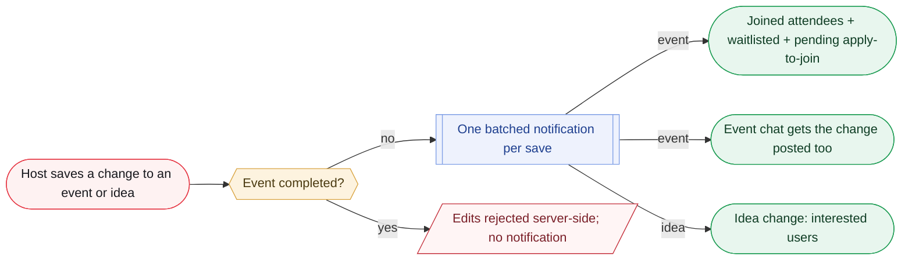

_Followers and passive viewers are not notified._

**What it is.** Base notifications (invites, follows, activity) plus DEC-042's general rule that consequential changes are never silent.

**User flow.**

1. All changes to an event or idea generate a notification; event changes also post into the event chat.
2. Notifications batch per save: one save, one notification, however many fields changed.
3. Event audience: joined attendees, waitlisted users, and pending apply-to-join applicants. Followers and passive viewers are not notified. Idea changes notify interested users.
4. Completed events are not editable, so no change notices after completion; admin removal still notifies.

**Rules that govern it.**

- The failure mode is someone standing at the old meeting point.
- Per-save batching answers the risk that volume drives users to disable push.

**Build notes for Deepak.**

- Batch at the save boundary; the audience query unions three membership sets; a completed event rejects edits server-side.
- Interacts with the notification-grouping requirement (group by event, collapse by surface).

**Open items.**

- Whether pausing/archiving an Idea counts as a change for notification purposes.

**Governing decisions.** DEC-042, DEC-024, DEC-033

**Elvis's design detail, sourced (5).**

- **[ELVIS DESIGN]** The handoff spec's "third-prompt-is-nagging" call (§5.3) is tagged [D], an inference needing Elvis's sign-off rather than a settled rule.  
  src: `handoff-spec-v0.9-intake-2026-08-29.md > "Part 5" item 4`
- **[ELVIS DESIGN]** Later-phase icebreaker mechanics (tag matching, scavenger game) may push content actively "a badge, a notification" rather than sitting behind a tap, so an opt-out has to be revisited then.  
  src: `icebreakers-2026-08-25.md > "Not yet decided, deliberately parked"`
- **[DECIDED DEC-018]** Org analytics reports and billing invoices are delivered both ways: always in-app in a receipts/reports section and also emailed automatically when the org has an email on file; a scheduled monthly email summary is phase 1.5, held on build priority.  
  src: `freemium-model-2026-08-19.md > "Paid, v1, ships at launch" (Export) and "Reimbursement support"`
- **[ELVIS DESIGN]** Moments spec: skipping the post-event composer offer leaves only "a quiet 'add later from the event page' hint"; the offer is skippable forever.  
  src: `WePop_Moments_Reflections_BRD_EngSpec_v0.9.md > "8.1 Creation - one composer, three doors"`
- **[ELVIS DESIGN]** Free Now's avatar badge is a passive indicator visible to followers/mutuals, not a broadcast; finding out where still requires the room.  
  src: `free-now-2026-08-25.md > "Avatar status badge, RESOLVED 2026-08-25"`

### 4.17 Icebreakers and tips/guides

**Phase 1** · Engagement

> **In plain terms.** Hosts can add up to three icebreaker questions that attendees read on their phones and answer in person. Small, situation-based tips (like advice for a first-time host) sit behind an info icon for when you need them.

**What it is.** Two contained phase-1 engagement features from the 12-item scoping batch.

**User flow.**

1. Icebreakers: a host-authored, up-to-3-question, read-only game, opt-in. Tag-matching and a scavenger game are later.
2. Tips/guides: a contextual info icon plus a static guide, targeted by situation/status, not personality. Copy written later.

**Rules that govern it.**

- Icebreakers were originally check-in gated; with check-in no longer a hard gate elsewhere (DEC-034), revisit for consistency.

**Build notes for Deepak.**

- Static guide content keyed by situation/status.

**Open items.**

- Check-in gating of icebreakers vs DEC-034.

**Governing decisions.** DEC-025

**Elvis's design detail, sourced (9).**

- **[DECIDED DEC-025]** Guiding principle in Elvis's words: help attendees get comfortable, break the ice, meet people, or have an excuse to approach and talk; icebreakers "should not take over the whole event experience".  
  src: `icebreakers-2026-08-25.md > "Problem"`
- **[DECIDED DEC-025]** Read-only means nothing is typed or submitted through the app: the attendee reads a question on their phone and answers in person with whoever they are standing near.  
  src: `icebreakers-2026-08-25.md > "Phase 1: host question game, RESOLVED 2026-08-25"`
- **[DECIDED DEC-025]** Surfaced via a button on the event page visible to checked-in attendees; opt-in by construction, so no separate opt-out mechanism is needed in phase 1.  
  src: `icebreakers-2026-08-25.md > "Phase 1: host question game"`
- **[DECIDED DEC-018]** Icebreakers were first proposed as a paid bucket-2 perk, then moved to free; the test recorded: "does gating this shrink the marketplace or event quality for people other than the payer", not "does this touch content the user made".  
  src: `freemium-model-2026-08-19.md > "Bucket 1 refined, 2026-08-19"`
- **[ELVIS DESIGN]** Scavenger game (later): each attendee gets a virtual card or matches on an attribute like MBTI; the one locked detail is that match confirmation happens in-app by tap or scan like the check-in QR pattern, not honor-system; card assignment and any reward are undesigned.  
  src: `icebreakers-2026-08-25.md > "Later phase, not designed yet: card / attribute matching, scavenger-style"`
- **[ELVIS DESIGN]** Aggregate-tag matching (later) open question: reveal exactly who shares the tag, or only alert that someone here does and let people find each other; the latter "reads truer" but is not locked. Also not raised: whether it needs the minimum-sample pattern so a "match" is not one identifiable person at a small event.  
  src: `icebreakers-2026-08-25.md > "Later phase, not designed yet: aggregate-tag matching" and "Not yet decided, deliberately parked"`
- **[ELVIS DESIGN]** The flat 3-question cap could become 3 free / a higher paid number by reusing the apply-to-join quota-by-tier component; explicitly not proposed, only flagged as a low-effort candidate.  
  src: `paid-tier-features-2026-08-27.md > "Two clarified, not yet decided" (Icebreakers)`
- **[DECIDED DEC-025]** Tips framing in Elvis's words: people are losing social skills, there are plenty of shy or introverted attendees and inexperienced hosts. Targeting by situation not personality because "an app deciding someone is shy and saying so risks landing as presumptuous".  
  src: `tips-guides-2026-08-25.md > "Problem" and "Targeting, RESOLVED 2026-08-25"`
- **[ELVIS DESIGN]** Deepak flags for tips: a lightweight content model with entries tagged by trigger situations (examples first_time_host, before_first_checkin, creating_event); icon placement decided at build; no gamification or points tie-in; copy to be drafted later with the design:ux-copy skill.  
  src: `tips-guides-2026-08-25.md > "Flags for Deepak" and "Content, deliberately not written yet"`

### 4.18 Moderation and safety

**Phase 1** · Safety · safety, legal

> **In plain terms.** Everything users can post (ratings, comments, chats, Free Now rooms, discussions) needs someone who can review reports and remove content from day one. Formal response-time promises wait until there are staff, but the basics (a review queue, urgent alerts, a written guideline, and a runbook for the worst material) must exist before launch, because Korean law requires action regardless of team size.

```mermaid
flowchart LR
  M18_rep(["Report from any surface: ratings, comments, chat, Free Now, Discussion"])
  M18_q[["One generic report model, one queue; repeat reports idempotent"]]
  M18_auto{{"5+ distinct reporters AND 10% of viewers?"}}
  M18_hide[/"Auto-hidden before a human looks"/]
  M18_rev["Reviewer decides using the one-page guideline"]
  M18_act(["Remove or keep; appeals (overturns tracked)"])
  M18_csam[/"CSAM: preserve, restrict access, report. Never delete."/]
  M18_rep --> M18_q
  M18_q --> M18_auto
  M18_auto -->|"yes"| M18_hide
  M18_auto -->|"no"| M18_rev
  M18_hide -->|"queued for review"| M18_rev
  M18_rev --> M18_act
  M18_q -->|"urgent lane: auto-hidden on report"| M18_csam
  classDef start fill:#fef2f2,stroke:#E63946,color:#17181d;
  classDef fin fill:#e8f6ee,stroke:#1f9d55,color:#0f3d24;
  classDef decision fill:#fdf3df,stroke:#d9a441,color:#4a3a10;
  classDef system fill:#eef2fd,stroke:#7f9fe6,color:#1e3f8f;
  classDef warn fill:#fff5f5,stroke:#C42E3A,color:#7a1f28;
  classDef muted fill:#f2f2f4,stroke:#d5d6db,color:#6b6b70;
  class M18_rep start;
  class M18_q system;
  class M18_auto decision;
  class M18_hide warn;
  class M18_act fin;
  class M18_csam warn;
```

_A brigade_suspected flag exists (trigger not specified). SLAs deferred until hiring; capability cannot be._

**What it is.** The cross-cutting safety layer. Reframed 2026-08-31: response speed is deferred until hiring, but response capability cannot be.

**User flow.**

1. Surfaces: anonymous host-rating comments, public moment comments, DM and group chat, Free Now rooms, and Discussion on every event and idea.
2. Three pre-launch artifacts, none of which exist yet: a basic internal admin queue, urgent-report push alerts to whoever is on call, and a one-page written guideline.
3. SLAs (urgent under 4h, 24h weekday, 48h weekend, 72h appeals) are recorded for reuse, not committed, until there are employees. Rota is one reviewer plus "Reviewer B (to be hired)".
4. Load reducers: one generic report model feeding a single queue; idempotent repeat reports; auto-hide on a double condition (5+ distinct reporters AND 10 percent of distinct viewers); a brigade_suspected flag.
5. Day-one metrics (reports per 1,000 moments, median time-to-decision, backlog depth, appeal overturn rate) become the hiring trigger.

**Rules that govern it.**

- Statutory duties do not wait for hiring: 정보통신망법 takedown and 임시조치, and 불법촬영물 under 전기통신사업법, attach from the day the service has users.
- CSAM must never simply be deleted: preserve, restrict access, report. A written runbook is required before launch.

**Build notes for Deepak.**

- One generic report model (target type, target id, reason code, reporter, note) feeding a single queue, per the handoff spec section 12 via Elvis's 2026-08-30 proposal; auto-hide thresholds must not be loosened without revisiting R4.

**Open items.**

- Admin queue, urgent alerts and guideline (TASK-034).
- CSAM runbook, DLG-reviewed (TASK-039).
- Confirm with DLG whether statutory windows impose a deadline a single reviewer can meet.

**Governing decisions.** DEC-013, DEC-014, DEC-015, DEC-025

**Elvis's design detail, sourced (14).**

- **[DECIDED DEC-037]** General user blocking is fully designed in handoff §12.2 and placed in the P0 wave: bidirectional, total, across every surface, with the scope stated to the user at the moment of blocking; this answered the scope matrix's own "later / proposed, likely a phase-1 safety baseline, confirm" row.  
  src: `handoff-spec-v0.9-intake-2026-08-29.md > "Item G - General user blocking"`
- **[DECIDED DEC-014]** Origin of the launch blocker: anonymous free text that is public by default means someone must be able to remove a comment on day one; the Moments spec's OQ-9 (who staffs moderation and the SLA) "needs a name against it before launch".  
  src: `conflict-review-2026-08-19.md > "Item 1" (Consequences accepted)`
- **[ELVIS DESIGN]** The handoff spec §12.5 sizes the moderation lane at two people alternating on-call; a 25-minute video queue item breaks that staffing model regardless of storage cost.  
  src: `handoff-spec-v0.9-intake-2026-08-29.md > "Where the real exposure is, and it is not the free tier"`
- **[ELVIS DESIGN]** Moments spec safety target BO-6 [D, proposed]: report rate under 5 per 1,000 published moments and median time-to-resolution under 24h.  
  src: `WePop_Moments_Reflections_BRD_EngSpec_v0.9.md > "3. Business objectives & success metrics"`
- **[ELVIS DESIGN]** Moments spec governance: any viewer can report with a moment-specific reason "행사와 무관한 내용"; host takedown is a request routed to review, never an instant delete, with copy "검토 후 처리됩니다"; hosts cannot directly delete attendee posts and the design must not imply they can; under-review content is hidden from public with a neutral owner-facing status, "no shame framing".  
  src: `WePop_Moments_Reflections_BRD_EngSpec_v0.9.md > "8.5 Governance" and "6. Compliance & legal requirements" (LC-4)`
- **[ELVIS DESIGN]** Moments spec case model (earlier draft shape, before the page's single generic report model): moment_moderation_cases with case_type viewer_report or host_takedown, reason_code, detail, status open / reviewing / upheld / dismissed, resolved_by and resolved_at.  
  src: `WePop_Moments_Reflections_BRD_EngSpec_v0.9.md > "10.1 Core tables"`
- **[ELVIS DESIGN]** LC-8: hidden and removed media retained 90 days before hard deletion via a scheduled purge job, DLG to confirm.  
  src: `WePop_Moments_Reflections_BRD_EngSpec_v0.9.md > "6. Compliance & legal requirements" and "11.2 Lifecycle state machine"`
- **[ELVIS DESIGN]** Moments spec: E9 (reports, takedown queue, admin review tool) must land before public launch of P1.1, and the P1.1 release gate is "E9 complete and staffed (OQ-9)" plus zero EXIF-strip failures over a 7-day soak; EXIF-strip failure count must be zero, "page on any non-zero".  
  src: `WePop_Moments_Reflections_BRD_EngSpec_v0.9.md > "16. Delivery sequencing" and "13. Observability & analytics"`
- **[ELVIS DESIGN]** Moments spec: UI-enforced face privacy is out of scope; untagged faces are governed by community guidelines plus takedown, not detection or blurring; an automated moderation scan is a Phase 2 hook in the media pipeline.  
  src: `WePop_Moments_Reflections_BRD_EngSpec_v0.9.md > "4.2 Explicitly out of scope" and "11.3 Media pipeline"`
- **[ELVIS DESIGN]** Report rate limit in the Moments spec [D]: 10 reports per user per day.  
  src: `WePop_Moments_Reflections_BRD_EngSpec_v0.9.md > "11.5 Abuse & rate limits"`
- **[DECIDED DEC-018]** Moderation tools on an org's own events and moments are free for everyone, not part of the paid tier (same reasoning as icebreakers).  
  src: `freemium-model-2026-08-19.md > "Adjacent to this tier, both settled 2026-08-19"`
- **[ELVIS DESIGN]** Moments spec open questions for DLG: OQ-7 what happens to a deleted user's published moments on other people's events under a PIPA erasure request; OQ-8 minor handling if the age gate shifts or under-18 people appear in photos.  
  src: `WePop_Moments_Reflections_BRD_EngSpec_v0.9.md > "14. Open questions"`
- **[ELVIS DESIGN]** The draft named "Joy Jeong (ops / legal)" as OQ-9's co-owner and DLG Law as counsel; these names plus a roughly $100K budget line were escalated to Aakash as commercial/legal content rather than resolved in design.  
  src: `conflict-review-2026-08-19.md > "Item 10 - Names, budget and legal in the Moments doc: ESCALATED"`
- **[DECIDED DEC-013]** Moderation surfaces were added in order: anonymous host-rating comments (item 1), public moment comments (item 4), then live chat as the third (item 6), each time widening OQ-9.  
  src: `conflict-review-2026-08-19.md > "Item 6" (Consequences accepted)`

### 4.19 Host accountability and enforcement

**Phase 1** · Safety · safety, legal, korea

> **In plain terms.** Ratings are about a person and are deleted when they delete their account; bans and suspensions are about keeping the platform safe and survive account deletion, so you cannot escape a ban by re-registering. If someone is suspended, the clubs they run are suspended too, though a suspended officer can hand the club to a trusted long-standing member.

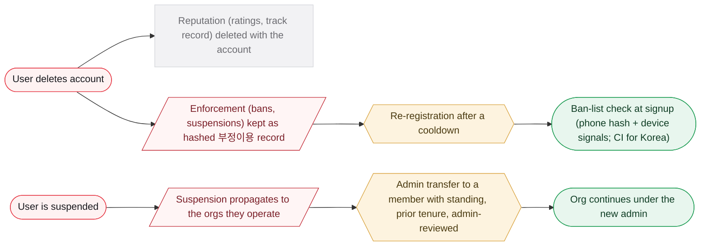

_Danggeun model: 매너온도 dies with the account, suspensions carry over. Org creation is gated on standing, not rating._

**What it is.** Keeps ratings and bans meaningful and closes gaming loopholes, following the Danggeun model.

**User flow.**

1. Reputation (ratings, track record) is personal data and is deleted with the account. Enforcement (bans, suspensions) is fraud-prevention data and survives deletion under a disclosed 부정이용 방지 privacy item.
2. Re-registration is allowed after a cooldown and a ban-list check at signup. The ban list is a hashed identifier (phone hash plus device/environment signals), with CI from PASS as the strong key for Korean users.
3. Enforcement propagates: suspending an individual suspends the orgs they operate; admins see every org a user operates.
4. Org creation is gated on standing (no active suspensions plus a minimum account age), not on a rating.
5. A suspended admin may transfer their role to a member who has standing, was a member before the suspension with minimum tenure, and via an admin-reviewed transfer. A suspended individual loses org access entirely.

**Rules that govern it.**

- Danggeun's Karrot Score is not adopted; DEC-014's star ratings stand (now 1 to 5, DEC-045).
- A cap on orgs per user and public display of connected profiles were rejected (deanonymization surface).
- Enforcement under the org-membership model: a conduct sanction (spam, no-shows, rudeness, low-grade policy violations) removes the member from the org and they keep using WePop, while a safety ban on a short closed list (violence or credible threats, sexual misconduct, CSAM, fraud, stalking or doxxing) suspends the account, with DEC-044's propagation carrying it to any org that person operates (DEC-066).

**Build notes for Deepak.**

- Ban list is a hashed lookup, not a roster. Propagation walks the existing org-to-user link. Suspension-triggered transfer is distinct from routine ownership transfer.
- Deletion path distinguishes account deletion (ratings deleted) from event deletion (ratings survive).

**Open items.**

- Re-registration cooldown (Danggeun uses 7 days).
- Ban-list retention period.
- Minimum account age for org creation; member tenure for transfer.
- Whether propagation is automatic or reviewer-gated.
- DLG review of retaining a ban list against an erasure request.

**Governing decisions.** DEC-044, DEC-043, DEC-024, DEC-026, DEC-066

**Elvis's design detail, sourced (16).**

- **[DECIDED DEC-044]** Danggeun's rule quoted verbatim: 동일한 환경에서 탈퇴 후 재가입한 경우 기존 이용정지 내용이 새 계정에도 적용될 수 있다 (existing suspensions may carry over to a new account created in the same environment). 매너온도 is attached to the account and disappears on withdrawal.  
  src: `host-accountability-2026-08-30.md > "The load-bearing split: reputation is not enforcement"`
- **[DECIDED DEC-044]** The split table: reputation is personal data about the host with no retention basis needed (it is deleted); enforcement is a fraud-prevention record retained under privacy-policy disclosure, purpose-limited.  
  src: `host-accountability-2026-08-30.md > "The load-bearing split"`
- **[ELVIS DESIGN]** Danggeun is moving off 매너온도 toward a Karrot Score partly because scores below 50 made new users look untrustworthy; cited as independent validation of the 3-verified-ratings minimum plus Bayesian smoothing.  
  src: `host-accountability-2026-08-30.md > "Worth knowing, on the score design itself"`
- **[DECIDED DEC-044]** The ban list retains only the ban reason and date alongside the hashed identifier ("minimum necessary"); device and environment signals cover users without a Korean number, which is Danggeun's own fallback.  
  src: `host-accountability-2026-08-30.md > "The ban list, mechanism"`
- **[DECIDED DEC-044]** Legal basis: PIPA Article 36(1)'s deletion right has a narrow proviso (where another law specifies the data as a collection target) that does not reach "we want to keep it for accountability"; the basis Korean platforms use is a disclosed 부정이용 방지 item under 회사 내부 방침.  
  src: `host-accountability-2026-08-30.md > "The legal basis, and why it is not the obvious one"`
- **[ELVIS DESIGN]** Precedent, not authority: JobKorea's privacy policy states 회사 내부 방침에 의해 부정이용 등에 관한 기록은 5년간 보관합니다 (abuse records kept five years); the GDPR analogue cited is the "establishment, exercise or defence of legal claims" exemption.  
  src: `host-accountability-2026-08-30.md > "The legal basis" and "Escalations for DLG"`
- **[DECIDED DEC-044]** The org-loophole reframe: recommendation-algorithm-2026-08-25.md already requires org accounts to be traceable to a specific user; the traceability exists and no consequence flowed down it.  
  src: `host-accountability-2026-08-30.md > "The organization loophole, RESOLVED 2026-08-30"`
- **[DECIDED DEC-044]** Why standing and not rating: a rating threshold would block brand-new users, "precisely the launch market: university club officers with no history yet".  
  src: `host-accountability-2026-08-30.md > "Adopted" item 3`
- **[DECIDED DEC-044]** Transfer reasoning: "a 40-member club should not die because one officer misbehaved"; the evasion is planting an accomplice, and the prior-membership-with-tenure qualification "is the one that actually closes it". A single-member org has nobody to transfer to and stays suspended, "correct outcome, worth stating so it is not treated as a bug".  
  src: `host-accountability-2026-08-30.md > "The evasion that addition opens, and how to close it"`
- **[DECIDED DEC-044]** Rejected cap on orgs per user: people legitimately run several clubs, "a cap of N just means a bad actor uses N".  
  src: `host-accountability-2026-08-30.md > "Rejected, with reasons recorded"`
- **[DECIDED DEC-044]** Rejected public display of connected profiles, with the concrete example that someone running an org for an LGBTQ+ student group and another for a church group could be outed by the linkage; if ever revisited it should be opt-in as a credibility signal, never forced.  
  src: `host-accountability-2026-08-30.md > "Rejected, with reasons recorded"`
- **[DECIDED DEC-044]** Additional open item: whether an org suspended by propagation is restored automatically when a valid transfer completes or needs separate reinstatement; automatic propagation is the working assumption but a reviewer may want to spare an org whose suspended admin was a minor contributor.  
  src: `host-accountability-2026-08-30.md > "Not decided here"`
- **[DECIDED DEC-044]** DLG escalations beyond the ban-list question: whether retaining a hashed identifier changes the analysis versus the raw value; CI (연계정보) handling obligations if CI becomes the key; interacts with legal register L-1 and L-10.  
  src: `host-accountability-2026-08-30.md > "Escalations for DLG, via the legal-register consult"`
- **[DECIDED DEC-043]** Three escape routes closed on 2026-08-30 before this file: deleting a completed event, detaching from one, and deleting an event to launder its ratings; three more (statutory erasure, delete-and-re-register, disposable orgs) are what this file resolves.  
  src: `host-accountability-2026-08-30.md > "Problem"`
- **[DECIDED DEC-066]** Enforcement under the org model: a conduct sanction (spam, no-shows, rudeness, low-grade policy violations) removes the member from the org and they keep using WePop; a safety ban on a short closed list (violence or credible threats, sexual misconduct, CSAM, fraud, stalking or doxxing) suspends the account, with DEC-044's propagation carrying it to any org that person operates.  
  src: `org-membership-2026-09-02.md > "Conduct sanction versus safety ban, RESOLVED 2026-09-02"`
- **[DECIDED DEC-066]** A creator leaving the org triggers no host takeover: the event was always theirs, past events keep the org flag so analytics history does not rewrite itself, and upcoming ones may be detached.  
  src: `org-membership-2026-09-02.md > "When the creator leaves the org, RESOLVED 2026-09-02"`

### 4.20 Anti-stalking pre-join visibility

**Phase 1** · Safety · safety

> **In plain terms.** Before you join an event you cannot see the full guest list, only friends you both follow plus general signals like the age range. Attendees never see anyone's gender before joining, and you only see someone's photo if you follow each other. This is what keeps Wepop a meetup app rather than a way to find out where a specific person will be.

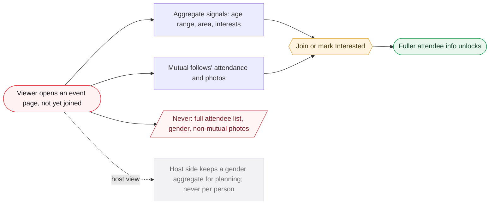

_A one-way follow never unlocks photos; follow-state is checked in both directions server-side._

**What it is.** The rule set that keeps Wepop from becoming a way to find where a specific person will be.

**User flow.**

1. Pre-join: only mutual friends' attendance plus aggregate signals (age, area, interests), never the full attendee list. Fuller info unlocks on join or Interested.
2. Gender is not shown to attendees pre-join in any form (even the aggregate, which is re-identifiable on a small event); hosts keep a host-facing aggregate.
3. Gender never appears on a per-person row in any accept/decline or selection UI (invariant I-13). A host with a real balance need declares it at creation and it is enforced at join eligibility.
4. Individual photos pre-join only between two users who mutually follow each other; a one-way follow never unlocks them.
5. A private account (DEC-048) restricts the whole profile to approved followers and composes with pre-join visibility: a non-mutual sees only name, username, cover and background photo, a mutual sees the full profile including Moments (DEC-065). The account stays findable by name and username, not suppressed from search.

**Rules that govern it.**

- A one-way follow would be a trivial surveillance vector; a mutual follow is reciprocal by construction.
- Gender on a selection row becomes a discriminatory mechanism at the moment of a yes/no on a specific person.

**Build notes for Deepak.**

- Check follow-state bidirectionally server-side.
- The pre-join aggregate payload drops gender for attendee-facing requests but keeps it host-facing (a per-audience response shape).
- Gender stays optional and purpose-limited to host planning (PIPA stated purpose).

**Open items.**

- The private-account approval-queue UX, and whether declining a follow request notifies the requester (DEC-048).

**Governing decisions.** DEC-006, DEC-017, DEC-035, DEC-048, DEC-065

**Elvis's design detail, sourced (8).**

- **[SUPERSEDED by DEC-035]** DEC-017's original gender rule: an aggregate ratio only pre-join, "for example 'roughly 60% women, 40% men,' no individual attribution".  
  src: `conflict-review-2026-08-19.md > "Item 8 - Gender and photos pre-join: RESOLVED"`
- **[DECIDED DEC-017]** The photo rule governs the pre-join event attendee list, not general profile-photo visibility; since accounts are public in phase 1 a stranger could already find a profile photo by search. The protected risk is the correlation identity plus location plus time, not the photo by itself.  
  src: `conflict-review-2026-08-19.md > "Item 8" (Distinction worth recording precisely)`
- **[DECIDED DEC-006]** Walkthrough wording: before joining, show only mutual friends plus aggregate signals "people near your age, area, interests"; the drafts' details-before-join showed summary and aggregate only with a followers-only visibility chip.  
  src: `Wepop_Walkthrough-vs-Drafts_Review-Aid_2026-08-18.md > "Anti-stalking visibility before joining - MATCH"`
- **[ELVIS DESIGN]** "See who viewed your profile" was raised as an insight-gated premium feature and set aside by Elvis: viewer-visibility features are a common vector for the unwanted attention DEC-006 and DEC-017 prevent; not ruled out permanently.  
  src: `paid-tier-features-2026-08-27.md > "Dropped, may revisit later"`
- **[ELVIS DESIGN]** Gender as an analytics breakdown dimension assumes gender is collected as profile data; the pre-join question is about display, not collection, "so should not conflict, but flagged since it is the same underlying data".  
  src: `freemium-model-2026-08-19.md > "Individual tier: feature detail" item 3`
- **[ELVIS DESIGN]** Moments spec hard rules: anti-attraction I-9 means no appearance-forward layouts and no gender framing of attendee aggregates; upcoming attendance is hidden by default on profiles; attended defaults to followers; per-section caps public / followers / private.  
  src: `WePop_Moments_Reflections_BRD_EngSpec_v0.9.md > "15. Hard rules" and "8.3 Profile restructure - three tabs"`
- **[ELVIS DESIGN]** Moments spec LC-1 and LC-2: tagging is opt-in only (tag request then accept, only accepted tags render); moments never display a private venue's exact address, precision capped at the event's disclosed granularity.  
  src: `WePop_Moments_Reflections_BRD_EngSpec_v0.9.md > "6. Compliance & legal requirements"`
- **[ELVIS DESIGN]** Handoff intake judged I-13 "new and correct as written" (alongside I-12, which needs re-scoping before adoption).  
  src: `handoff-spec-v0.9-intake-2026-08-29.md > "Part 5" item 1`

### 4.21 Monetization

**Phase 1** · Commercial · financials

> **In plain terms.** Paying never buys visibility in Wepop. The core of the app stays free; a paid organisation tier ($19.99 a month) unlocks deeper analytics for clubs, and a paid individual tier ($3.99 a month) is designed but on hold until real usage data exists. Ticketing and payments are built in but switched off until phase 1.5.

**What it is.** Financials-owner territory. Payments go live at phase 1.5; the freemium structure is set by DEC-018 and extended since.

**User flow.**

1. Ticketing with a platform fee and gated premium features are architected into phase 1 as toggle-able provisions, live at 1.5. Programination's existing Stripe account is used.
2. Individual tier at $3.99/month or $36/year (30s video, 20 media items, own-content analytics); ship timing HELD until phase-1 usage data.
3. Organization tier at $19.99/month or $199/year (per-org billing, 7-day trial), proceeding now: per-event numbers free, rollups/trends/export paid.
4. Extensions: the Explore cross-country gate (individual lift), the apply-to-join quota (3 free / 10 paid), and tiered media retention.

**Rules that govern it.**

- Three-bucket rule: never gate marketplace actions; quota-gate personal expression; insight-gate analytics.
- A paid ranking or discovery boost is explicitly locked out.
- Retention, not sticker price, is the real cost lever.
- At launch every user is given the paid plan free as an extended trial (likely around six months, exact length set later); paid-tier limits, including the media-retention downgrade, do not apply during the trial (DEC-063).
- Apply-to-join (host screening questions on join) is placed in phase 1.5, completing the DEC-033 screening-quota dependency (DEC-056).

**Build notes for Deepak.**

- Korea: Stripe's support for Korea payouts, KRW and local methods (KakaoPay, Naver Pay, virtual account) is unconfirmed; evaluate Toss Payments, NHN KCP, PortOne. App-store IAP (15-30 percent) is in play.
- Attendee contact export is deliberately excluded from the org tier.

**Open items.**

- The commercial-structure proposal channel and PROJECT_STRATEGY rewrite (TASK-037).
- Ticketing/payments build scope and whether it is phase 1 (TASK-036).
- The Korea payment path.
- Grandfathering.
- The extended free-trial exact length (DEC-063).

**Governing decisions.** DEC-010, DEC-018, DEC-032, DEC-033, DEC-039, DEC-063, DEC-056

**Elvis's design detail, sourced (20).**

- **[DECIDED DEC-018]** Individual annual math: $36/year is a $3/month equivalent, about 25% off the $47.88 monthly-equivalent cost; anchored slightly above Discord Nitro Basic because of the added analytics perk.  
  src: `freemium-model-2026-08-19.md > "Individual tier: feature detail, RESOLVED 2026-08-19"`
- **[DECIDED DEC-018]** Org annual math: $199/year is $16.58/month, about 17% off $239.88, a smaller discount because the org margin is thinner in absolute dollars and an annual option clears one funding approval cycle (club funding is typically approved once per semester).  
  src: `freemium-model-2026-08-19.md > "Price, RESOLVED 2026-08-24"`
- **[DECIDED DEC-018]** Margin: at the monthly rate the org tier nets roughly $10.99/month after the 15% commission at realistic-upper usage (about 55% margin); at the annual-equivalent rate roughly $7.94/month (about 48%), before infra/support overhead; compared with Meetup Pro's $30 to $42/month.  
  src: `freemium-model-2026-08-19.md > "Price, RESOLVED 2026-08-24"`
- **[DECIDED DEC-018]** Store fees: Apple takes 30% in a subscriber's first 12 months then 15%, or a flat 15% under the App Store Small Business Program (under $1M/year in that store); Google Play is a flat 15%; planning assumption 15% off the top.  
  src: `freemium-model-2026-08-19.md > "Cost context for margin modeling"`
- **[DECIDED DEC-018]** Individual perk 3: engagement analytics on the user's own events, ideas and moments, aggregate by country, gender, age and time of engagement, never named or individually identifiable.  
  src: `freemium-model-2026-08-19.md > "Individual tier: feature detail" item 3`
- **[DECIDED DEC-018]** Considered and cut from the individual tier: profile background color customization (cut); profile banner customization (made free for everyone); personal activity recap and new-connections count (not included, "a restated fact, not insight").  
  src: `freemium-model-2026-08-19.md > "Explicitly considered and cut"`
- **[DECIDED DEC-018]** Free per-event/per-idea numbers: views, joins, join rate, waitlist size; check-in rate and no-show rate from QR; interested count; number of events made from an idea; average event rating and average host rating.  
  src: `freemium-model-2026-08-19.md > "Free for everyone, no subscription needed"`
- **[DECIDED DEC-018]** Paid v1: aggregate rollup across the org's full history; attendee composition on the shared dimensions plus interest tags and a new-versus-repeat split; org member activity aggregate only, never tied to a named member (ideas/events/moments created, last login, session duration) because a named breakdown "turns the tool into internal surveillance"; export PDF primary and CSV secondary in two shapes (single event, rolled-up period such as "this semester").  
  src: `freemium-model-2026-08-19.md > "Paid, v1, ships at launch"`
- **[DECIDED DEC-018]** Paid phase 1.5: retention share, growth trend charts, segment and category performance gated at a minimum of 3 events per tag and 5 attendees per demographic bucket, unlocking progressively per tag and segment with the report stating the gap ("Outdoor activities: 1 more event needed for reliable data"); benchmarking against own history and anonymized similar orgs; scheduled recurring reports held on build priority.  
  src: `freemium-model-2026-08-19.md > "Paid, phase 1.5"`
- **[DECIDED DEC-018]** One shared analytics engine: one pipeline, one dimension set, two scopes of query, rather than two bespoke systems.  
  src: `freemium-model-2026-08-19.md > "Shared analytics engine with the individual tier"`
- **[DECIDED DEC-018]** Per-org billing reasoning: matches Slack workspaces, GitHub orgs, Notion Team; closes an arbitrage hole where one person managing several orgs covers them on one subscription; the subscription stays with the org through ownership transfer; creating org accounts stays free regardless of how many one person creates.  
  src: `freemium-model-2026-08-19.md > "Billing unit: per-organization, RESOLVED 2026-08-19"`
- **[DECIDED DEC-018]** The 7-day trial gives full analytics access so a treasurer can bring real data to a funding request. Invoice fields for university reimbursement: WePop's legal business name and address as issuer, the org's name as billed party, a unique sequential invoice number, date of charge and billing period, plan name and description, amount and currency.  
  src: `freemium-model-2026-08-19.md > "Org tier mechanics: RESOLVED 2026-08-19"`
- **[DECIDED DEC-018]** The org tier is one price for now, not split by club vs promotional/business account.  
  src: `freemium-model-2026-08-19.md > "Tier structure: RESOLVED"`
- **[ELVIS DESIGN]** Watch item: whether early org adoption skews monthly because of semester funding, and revisit a semester option if so.  
  src: `freemium-model-2026-08-19.md > "Billing cadence, RESOLVED 2026-08-24"`
- **[DECIDED DEC-018]** Safety valve: no automated usage-based overage billing (metering, an overage flow, a warning notification); usage crossing a threshold surfaces as a flag for a manual conversation with that org. Threshold not yet set.  
  src: `freemium-model-2026-08-19.md > "Tail handling, RESOLVED 2026-08-24"`
- **[ELVIS DESIGN]** Deferred threads in Elvis's words: a transaction-fee discount for individual subscribers on ticket sales (cannot be priced until ticketing exists); ads, "we can discuss about ads later"; gamification points, "this will be introduced when we do gamification at a much later phase".  
  src: `freemium-model-2026-08-19.md > "Deferred to future dedicated conversations, not designed here"`
- **[ELVIS DESIGN]** Ticketing scope as flagged: a payment-splitting provider (something like Stripe Connect), host identity verification before payout, refund and chargeback handling, tax reporting for hosts; "likely the single largest piece of technical scope raised anywhere in this project so far, bigger than pulling chat and calendar into phase 1".  
  src: `freemium-model-2026-08-19.md > "Deferred to future dedicated conversations"`
- **[ELVIS DESIGN]** Promoted listings (paying to boost an event, idea or org in discovery) were logged in the 2026-08-25 backlog as a lighter idea related to ads; note DEC-018 locks out paid ranking/discovery boost, so this sits as a recorded idea, not scope.  
  src: `feature-backlog-2026-08-25.md > "10. Other business models"`
- **[ELVIS DESIGN]** Handoff O-5 says the Subscription spec documents a single Pro tier; the intake reads this as a stale document to update to DEC-018, not an open product question, flagged to Aakash.  
  src: `handoff-spec-v0.9-intake-2026-08-29.md > "Item L"`
- **[ELVIS DESIGN]** The handoff spec introduces invariant I-16: a paid feature may not gate the social core.  
  src: `handoff-spec-v0.9-intake-2026-08-29.md > "Video length" (product argument)`

### 4.22 Explore country gate

**Phase 1** · Commercial · financials

> **In plain terms.** Anyone can pan the map and search anywhere in the world. On a free account, events in a country other than the one you are currently in show only as a count, not the details; a paid individual account unlocks them, which is handy for planning a trip.

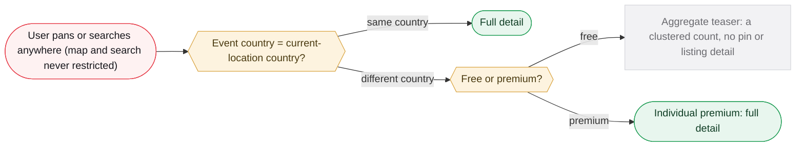

_Compares against current location (live GPS if granted, else stored home). Enforced server-side._

**What it is.** A monetization gate layered onto Explore that reuses the "aggregate visible, detail gated" pattern.

**User flow.**

1. Explore's map and search stay fully unrestricted for everyone.
2. For a free user, events in a country other than their current-location country render as an aggregate teaser (a clustered count, no pin-level detail); same-country events render in full.
3. Individual-tier premium lifts the gate. Use case: browsing another country's events before a trip.

**Rules that govern it.**

- Compares against current location, so a user physically abroad sees it in full; a travelling free user losing home-country detail unless they disable GPS is a deliberate, examined consequence.
- Cleared by the financials owner against the paid-boost lockout: it never touches ranking within a user's own market.
- Standard Explore filters are free functionality, not a paid tier, applying DEC-018's rule that marketplace and discovery actions are never gated (DEC-058).

**Build notes for Deepak.**

- A country field distinct from the legal-compliance country. Server-side enforcement is the gate; the client map is never the authority.
- Depends on DEC-031's current-location-only home edits to prevent gaming.

**Open items.**

- Teaser markers at country and world zoom.
- Whether the ranked list view gets the same treatment or excludes those results.

**Governing decisions.** DEC-032, DEC-018, DEC-031, DEC-058

**Elvis's design detail, sourced (5).**

- **[ELVIS DESIGN]** Explore filters corrected by Elvis 2026-08-27 from premium candidates to standard free functionality: multi-category combination filtering across the taxonomy's 9 categories and 85 subcategories (for example hiking_trekking plus photography); a host-quality filter (minimum rating or track record, leaving DEC-020's new-host boost untouched); a finer date/time range picker beyond today / this week / this weekend.  
  src: `paid-tier-features-2026-08-27.md > "Explore filters, REVISED 2026-08-27"`
- **[ELVIS DESIGN]** Reasoning: gating basic search/filter would cross DEC-018's "never gate marketplace actions" line, since "filtering is discovery, and discovery is the marketplace".  
  src: `paid-tier-features-2026-08-27.md > "Explore filters, REVISED 2026-08-27"`
- **[ELVIS DESIGN]** Saved filter presets are PARKED for everyone, free or paid, "not needed at this stage for either tier".  
  src: `paid-tier-features-2026-08-27.md > "Explore filters, REVISED 2026-08-27"`
- **[DECIDED DEC-018]** The Explore gate is recorded in DEC-018's change history as an extension cleared by the financials owner; the gate itself was proposed in Elvis's city-location file as 'Explore content gate by country, PROPOSED 2026-08-27'.  
  src: `shared/DECISIONS.md > DEC-018 change history; city-location-registration-2026-08-27.md > "Explore content gate by country, PROPOSED 2026-08-27"`
- **[ELVIS DESIGN]** The whole paid-tier discussion arose while reviewing home location (item #4 of the phase-1/1.5 list), when Elvis pivoted to "what belongs in the paid tier without gating core functionality".  
  src: `paid-tier-features-2026-08-27.md > header note`

### 4.23 Localization and i18n

**Phase 1** · Platform · korea

> **In plain terms.** The app is available in Korean and English. It picks a language automatically the first time (from your device, then store region, then phone number) and you can override it; that choice follows you across devices and applies to notifications too. Things other users write are shown as written, not translated.

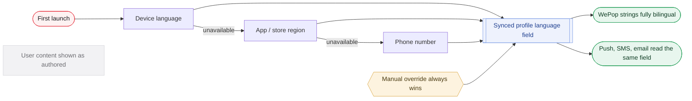

**What it is.** Korean-language support for the focus market, refined from device detection to a profile-level field.

**User flow.**

1. First-launch cascade: device language, then app/store region, then phone number. A manual override always wins.
2. Notifications (push, SMS, email) read the same profile field.
3. Every WePop-authored string ships fully bilingual; user-generated content renders as authored (on-demand translation deferred).
4. A distinct 'languages I speak' profile field is added, separate in name and storage from the display-language field, extending DEC-027 (DEC-052).

**Rules that govern it.**

- Mirrors DEC-012's cascade shape: one pattern, not two.
- Splitting WePop copy from UGC stops i18n silently expanding into content translation.

**Build notes for Deepak.**

- String externalization, a Korean locale, a language switcher. Deepak on the framework; Elvis on Korean copy.

**Open items.**

- Fallback for a WePop string with no Korean at ship (English fallback vs blocking launch).
- Whether the field re-reads device signals after initial set.

**Governing decisions.** DEC-027, DEC-029, DEC-052

**Elvis's design detail, sourced (10).**

- **[ELVIS DESIGN, resolves the page's open item]** The cascade is a one-time read, not an ongoing check: Elvis confirmed the app does not monitor the device language afterward; the profile field only changes via manual override in settings.  
  src: `internationalization-korea-2026-08-26.md > "Language, RESOLVED 2026-08-26 (refined further...)"`
- **[ELVIS DESIGN, resolves the page's open item]** Full bilingual coverage is committed for launch (Elvis confirmed directly), so the English-fallback-vs-block-launch question is closed; the "Give Feedback" channel is the backstop for anything that slips through QA.  
  src: `internationalization-korea-2026-08-26.md > "Translation coverage at launch, RESOLVED 2026-08-26"`
- **[ELVIS DESIGN]** Pre-account override: the Get Started screen carries a persistent language selector, top left, no confirmation toast (Elvis's explicit call for a persistent control rather than a one-time interruption); the cascade should resolve before the Get Started screen renders.  
  src: `internationalization-korea-2026-08-26.md > "Pre-account override, RESOLVED 2026-08-26"; onboarding-flow-2026-08-26.md step 1 and "Flags for Deepak"`
- **[ELVIS DESIGN]** "Give Feedback" is one entry in the profile menu covering three intents (report an issue, share feedback, send a comment), distinct from content-moderation reporting; submissions land in a dedicated Admin Portal table (not shared with the moderation queue) using existing Admin Portal access; a submission needs at minimum a type, free text, and probably device/app-version context; status workflow unspecified.  
  src: `internationalization-korea-2026-08-26.md > "Feedback and issue reporting, RESOLVED" and "Triage, RESOLVED" and "Flags for Deepak"`
- **[ELVIS DESIGN]** Timezone defaults from the device OS timezone API (dynamic, no stored home-country concept) with a manual settings-level override, confirmed by Elvis.  
  src: `internationalization-korea-2026-08-26.md > "Timezone, RESOLVED 2026-08-26"`
- **[ELVIS DESIGN]** No single "is this user in Korea" flag anywhere in the system: timezone from device, language from the profile field, PASS eligibility from the phone's carrier code, payment options from the org's billing setup.  
  src: `internationalization-korea-2026-08-26.md > "Determining Korea vs elsewhere, RESOLVED 2026-08-26" > "Net result"`
- **[ELVIS DESIGN]** Payment method options shown are a property of the org's billing details and payment instrument on file, not the viewer's location.  
  src: `internationalization-korea-2026-08-26.md > "Payment method options, RESOLVED"`
- **[ELVIS DESIGN, flag]** The existing HOTSHEET moderation staffing gap now needs explicit Korean-language moderation capability; "this compounds the existing blocker, it does not replace it".  
  src: `internationalization-korea-2026-08-26.md > "Moderation, flagged"`
- **[ELVIS DESIGN, noted]** Modern text embeddings are generally multilingual and should give reasonable cross-language matching without UGC translation; to be tested, not assumed.  
  src: `internationalization-korea-2026-08-26.md > "Multilingual embeddings, noted"`
- **[ELVIS DESIGN]** Categories taxonomy labels are paired EN/KO at the node level; neither language is source of truth, parity is schema-enforced (T-1: exactly 2 label rows per active subcategory, CI check plus admin-write validation); Korean labels owned by WePop's KR ops/localization reviewer (name withheld from docs at Elvis's request).  
  src: `categories-taxonomy-2026-08-27.md > "1.1 What changed in v2.0" row 5, "11.2 Invariants", "11.4 Localization ownership"`

### 4.24 A/B testing and experimentation

**Phase 1** · Platform

> **In plain terms.** The team wants to be able to test two versions of something (a screen, a wording, a ranking tweak) with different groups of users and measure which works better, built in early rather than bolted on later. Whether this makes phase 1 depends on how hard it is to build.

**What it is.** An experimentation capability complementing the day-one interaction logging.

**User flow.**

1. Assign users to buckets (A vs B), ship a change to one group, and measure the effect on design, usability and algorithm changes.

**Rules that govern it.**

- As a startup the post-launch goal is to learn fast; embed experimentation early.

**Build notes for Deepak.**

- A bucketing layer plus event instrumentation.
- Phase-1 candidate; exact phase set by build difficulty (Deepak); tracked as proposed until confirmed.

**Open items.**

- Phase confirmation pending a build-difficulty assessment.

**Governing decisions.** DEC-028, DEC-020

**Elvis's design detail, sourced (4).**

- **[ELVIS DESIGN]** Moments spec: product events must ship with P0 so BO-1/BO-4 have a pre-Moments baseline; named events include moment_composer_opened{door}, moment_published{kind, media_count, has_text, visibility_choice, effective_cap, seconds_since_event_end}, moment_viewed{surface, position}, moment_forward_door_tapped{destination_type}, moment_reported{reason}, media_upload_failed{stage, error}.  
  src: `WePop_Moments_Reflections_BRD_EngSpec_v0.9.md > "13. Observability & analytics"`
- **[ELVIS DESIGN]** Proposed targets [D], measured against a matched control: BO-1 D7 return rate +8pp for users who posted or viewed a moment; BO-2 at least 20% of verified attendees publish within 48h; BO-3 at least 35% of completed events with 3+ attendees carry a moment; BO-4 empty-state feed sessions down 50%; BO-7 media cost under ₩150 per MAU per month.  
  src: `WePop_Moments_Reflections_BRD_EngSpec_v0.9.md > "3. Business objectives & success metrics"`
- **[ELVIS DESIGN]** The Interested-tap gate on idea summaries is retained deliberately with instrumentation so it can be revisited on data; time-to-undo is called out as the only signal separating a curiosity tap from real interest.  
  src: `handoff-spec-v0.9-intake-2026-08-29.md > "Item H"`
- **[DECIDED DEC-018]** The individual tier's ship trigger is real phase-1 usage data, and the feedback weights, display threshold, media caps and quota numbers all carry the same "revisit once real usage exists" caveat, which is the data the experimentation layer is meant to produce.  
  src: `freemium-model-2026-08-19.md > "Tier structure: RESOLVED"; handoff-spec-v0.9-intake-2026-08-29.md > "Why 0.4 rather than 0.5"`

### Elvis-designed modules, not yet decisions

The modules below come from design documents Elvis wrote in his workspace. Each is grounded only in his file and carries its source on every line. None has landed as a DEC; where one conflicts with a landed decision it is flagged rather than treated as scope.

### 4.25 Sign-up and onboarding sequence

**Phase 1** · Elvis design · **Elvis design, no DEC yet**

> **In plain terms.** The full sign-up journey laid out step by step: everyone starts on the same Get Started screen, whether they came from a friend's invite, a club's invite, one of the founder's launch invites or the waitlist, and ends up either on the home feed or at the event that invited them.

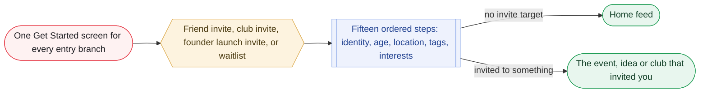

_Elvis design, assembled from DEC-011, 012, 016, 019, 005, 024, 026, 027; not itself a decision._

**What it is.** The end-to-end onboarding flow assembled in one place for the first time, confirmed with Elvis 2026-08-26. All entry branches share one Get Started screen with a language selector and an optional invite toast, then a single account-creation sequence; only the landing destination differs.

**User flow.**

1. Get Started screen: language selector top left, log in for existing users, invite toast for deep-linked invites (individual, org, or founder seed), waitlist capture for organic arrivals.
2. 1 Language: detected once from device language, then app/Play Store region, then phone number; no confirmation toast; app renders in the detected language from the first screen.
3. 2 Auth: Kakao, Apple, or Google plus always-required phone; Kakao-verified phone skips OTP; Korean numbers use PASS (DEC-026).
4. 3 Age gate: self-declared birthdate, country locked via the DEC-012 cascade, placed immediately after auth as a hard gate.
5. 4 Name (single flexible field), 5 Username (auto-generate plus taken-name suggestions), 6 Location (city-level per DEC-016 in this doc; revised to the neighborhood map picker by DEC-031).
6. 7 Profile photo (optional; initials on a color if skipped), 8 Gender (optional), 9 Languages spoken and proficiency (optional, multiple).
7. 10 Personality tags (optional, multiple, searchable, extensible), 11 Categories and subcategories (optional, multi-select, up to 5 subcategories from at most 3 categories at onboarding per this doc; note categories-taxonomy-2026-08-27.md gives the profile limit as 8 from 5, see open item).
8. 12 Campus affiliation (optional; school-email code or "suggest a school"), 13 Cohort computation (invisible), 14 Device permissions review (explanatory only), 15 Done.
9. Landing: invited users land on the event, idea, or org that invited them; promoted-waitlist and founder-seed users land on the home feed.

**Rules that govern it.**

- Optional email, optional password, and the profile description do not block or lengthen onboarding; they live in profile settings with periodic nudges.
- No separate onboarding path for a promoted waitlist user, confirmed by Elvis explicitly.
- The device permissions screen never triggers native OS dialogs; native prompts stay tied to first contextual use (DEC-016 pattern generalized).
- Language proficiency and display language are separate fields; personality tags and categories are separate taxonomies.

**Build notes for Deepak.**

- Branch logic at entry for four invite paths funnelling into one sequence; toast sourced from the invite record; founder seed needs its own invite-record shape.
- Username needs an auto-generate algorithm and a taken-username suggestion algorithm (logic unspecified).
- Campus affiliation needs an email-verification-code flow plus a "suggest a school" workflow (review queue or auto-add unspecified); cohort must degrade gracefully when skipped.
- Profile-completion nudge: a scheduled job checking email, password, and description, sending through the existing notification pipeline as one notification type, stopping once filled.
- Language cascade must run before any UI renders, ideally before Get Started shows.

**Open items.**

- Founder seed invite copy (ux-copy pass once built).
- Nudge cadence ("every so often"), decay, dismiss/snooze.
- Discrepancy between docs on the onboarding selection limit: onboarding-flow says "up to 5 subcategories from at most 3 categories here at onboarding, matching the 'user profile' row"; categories-taxonomy's table gives User profile as 5 categories / 8 subcategories and Event/Idea as 3 / 5. Not reconciled in either file.

**Status, in Elvis's file.** DECIDED DEC-052 (onboarding sequence adopted; profile completion moved out of onboarding). Assembles DEC-011, DEC-012, DEC-016, DEC-019, DEC-005, DEC-024, DEC-026, DEC-027. The optional-password relocation is the held DEC-011 amendment, filed but not yet landed. Phase, as stated: 1.

**Sources per line.**

- (flow) Get Started screen: language selector top left, log in for existing users, invite toast for deep-linked invites (individual, org, or founder seed), waitlist capture for organic arrivals.  
  src: `onboarding-flow-2026-08-26.md > "Entry point, RESOLVED 2026-08-26"`
- (flow) 1 Language: detected once from device language, then app/Play Store region, then phone number; no confirmation toast; app renders in the detected language from the first screen.  
  src: `onboarding-flow-2026-08-26.md > step 1`
- (flow) 2 Auth: Kakao, Apple, or Google plus always-required phone; Kakao-verified phone skips OTP; Korean numbers use PASS (DEC-026).  
  src: `onboarding-flow-2026-08-26.md > step 2`
- (flow) 3 Age gate: self-declared birthdate, country locked via the DEC-012 cascade, placed immediately after auth as a hard gate.  
  src: `onboarding-flow-2026-08-26.md > step 3`
- (flow) 4 Name (single flexible field), 5 Username (auto-generate plus taken-name suggestions), 6 Location (city-level per DEC-016 in this doc; revised to the neighborhood map picker by DEC-031).  
  src: `onboarding-flow-2026-08-26.md > steps 4 to 6`
- (flow) 7 Profile photo (optional; initials on a color if skipped), 8 Gender (optional), 9 Languages spoken and proficiency (optional, multiple).  
  src: `onboarding-flow-2026-08-26.md > steps 7 to 9`
- (flow) 10 Personality tags (optional, multiple, searchable, extensible), 11 Categories and subcategories (optional, multi-select, up to 5 subcategories from at most 3 categories at onboarding per this doc; note categories-taxonomy-2026-08-27.md gives the profile limit as 8 from 5, see open item).  
  src: `onboarding-flow-2026-08-26.md > steps 10 and 11`
- (flow) 12 Campus affiliation (optional; school-email code or "suggest a school"), 13 Cohort computation (invisible), 14 Device permissions review (explanatory only), 15 Done.  
  src: `onboarding-flow-2026-08-26.md > steps 12 to 15`
- (flow) Landing: invited users land on the event, idea, or org that invited them; promoted-waitlist and founder-seed users land on the home feed.  
  src: `onboarding-flow-2026-08-26.md > "Landing destination, RESOLVED 2026-08-26"`
- (rules) Optional email, optional password, and the profile description do not block or lengthen onboarding; they live in profile settings with periodic nudges.  
  src: `onboarding-flow-2026-08-26.md > "Profile completion, moved out of onboarding"`
- (rules) No separate onboarding path for a promoted waitlist user, confirmed by Elvis explicitly.  
  src: `onboarding-flow-2026-08-26.md > "Entry point" > "Not invited"`
- (rules) The device permissions screen never triggers native OS dialogs; native prompts stay tied to first contextual use (DEC-016 pattern generalized).  
  src: `onboarding-flow-2026-08-26.md > step 14`
- (rules) Language proficiency and display language are separate fields; personality tags and categories are separate taxonomies.  
  src: `onboarding-flow-2026-08-26.md > steps 9 and 11`
- (build) Branch logic at entry for four invite paths funnelling into one sequence; toast sourced from the invite record; founder seed needs its own invite-record shape.  
  src: `onboarding-flow-2026-08-26.md > "Flags for Deepak"`
- (build) Username needs an auto-generate algorithm and a taken-username suggestion algorithm (logic unspecified).  
  src: `onboarding-flow-2026-08-26.md > "Flags for Deepak"`
- (build) Campus affiliation needs an email-verification-code flow plus a "suggest a school" workflow (review queue or auto-add unspecified); cohort must degrade gracefully when skipped.  
  src: `onboarding-flow-2026-08-26.md > "Flags for Deepak"`
- (build) Profile-completion nudge: a scheduled job checking email, password, and description, sending through the existing notification pipeline as one notification type, stopping once filled.  
  src: `onboarding-flow-2026-08-26.md > "Flags for Deepak"`
- (build) Language cascade must run before any UI renders, ideally before Get Started shows.  
  src: `onboarding-flow-2026-08-26.md > "Flags for Deepak"`
- (open) Founder seed invite copy (ux-copy pass once built).  
  src: `onboarding-flow-2026-08-26.md > "Not yet decided"`
- (open) Nudge cadence ("every so often"), decay, dismiss/snooze.  
  src: `onboarding-flow-2026-08-26.md > "Not yet decided"`
- (open) Discrepancy between docs on the onboarding selection limit: onboarding-flow says "up to 5 subcategories from at most 3 categories here at onboarding, matching the 'user profile' row"; categories-taxonomy's table gives User profile as 5 categories / 8 subcategories and Event/Idea as 3 / 5. Not reconciled in either file.  
  src: `onboarding-flow-2026-08-26.md > step 11; categories-taxonomy-2026-08-27.md > "6.2 Selection rules"`

### 4.26 Event location map picker and location polls

**Phase 1.5** · Elvis design · **Elvis design, no DEC yet**

> **In plain terms.** How the map picker itself behaves: one map component used in three places, where how far you zoom in sets how precise the location is, and where groups can vote on a location while the host makes the final call.

**What it is.** Captures the picker design Elvis described fresh on 2026-08-27, replacing the never-written "O2 interaction detail" carried since the 2026-08-17 walkthrough.

**User flow.**

1. Picker mode: full-screen map, search bar, current-location recenter icon; search for a place, or pan/zoom and tap.
2. Pan and zoom before tapping sets the captured scale: a specific store/building/address when zoomed in, a whole neighborhood when zoomed out.
3. The tapped point is reverse-geocoded to a canonical ID, centroid or boundary reference, and display name at the resolved tier (POI/address, neighborhood, or whatever the zoom supports).
4. Optional per-location comment on every capture: main location, each schedule stop, each poll option.
5. Location poll: the creator adds multiple location options through the identical picker-plus-comment flow; attendees vote; the host manually confirms the final location after voting, the top-voted option does not auto-adopt.
6. Browse mode (Explore): same plumbing, live-viewport content overlay, not a point-selection flow.

**Rules that govern it.**

- No minimum precision floor for Events or Ideas; Elvis's correction: "an event's top-level location is not necessarily its meeting point" (bar crawl, explore-this-area-together).
- Recentering is not a capture; only the subsequent tap or search selection is.
- Voting surfaces group preference; the host is not required to follow it, keeping a human in the loop for a decision QR check-in and findability depend on.

**Build notes for Deepak.**

- One core map component with at least two modes (picker, browse) rather than three integrations.
- Zoom-to-precision thresholds are a starting proposal, tunable, dependent on the provider.
- If dual-provider: provider chosen once per map session from the current-location country signal (Naver for Korea, Google otherwise), no live swap, no wrapper layer; provider-agnostic canonical ID as primary key with provider place IDs secondary.
- Precedent: react-maps-loader (open source) wraps Google and Naver in one codebase; China (Baidu/Amap, Airbnb cited) is the documented analog but a harder case; no named company publishes a Google-plus-Naver-for-Korea write-up.

**Open items.**

- Where poll creation lives in the creation flow (a toggle instead of a single location, "most likely, not confirmed"); min/max number of options; whether votes are changeable and what closes the poll; whether votes are anonymous.
- Map provider decision (stay Google with degraded Korea precision, or a Korea branch on Naver/Kakao); Naver/Kakao API eligibility for a non-Korean business.

**Status, in Elvis's file.** DECIDED DEC-054 (event-location map picker extends DEC-003; location poll scoped). The Korea map-provider call (Google vs Naver/Kakao) is open on the HOTSHEET. Phase, as stated: 1 / 1.5 review list item #6; location poll phase unstated.

**Sources per line.**

- (flow) Picker mode: full-screen map, search bar, current-location recenter icon; search for a place, or pan/zoom and tap.  
  src: `event-location-map-picker-2026-08-27.md > "Three surfaces, one component"`
- (flow) Pan and zoom before tapping sets the captured scale: a specific store/building/address when zoomed in, a whole neighborhood when zoomed out.  
  src: `event-location-map-picker-2026-08-27.md > "Zoom determines precision"`
- (flow) The tapped point is reverse-geocoded to a canonical ID, centroid or boundary reference, and display name at the resolved tier (POI/address, neighborhood, or whatever the zoom supports).  
  src: `event-location-map-picker-2026-08-27.md > "Mechanism, technical detail"`
- (flow) Optional per-location comment on every capture: main location, each schedule stop, each poll option.  
  src: `event-location-map-picker-2026-08-27.md > "Optional per-location comment"`
- (flow) Location poll: the creator adds multiple location options through the identical picker-plus-comment flow; attendees vote; the host manually confirms the final location after voting, the top-voted option does not auto-adopt.  
  src: `event-location-map-picker-2026-08-27.md > "Location poll, newly scoped 2026-08-27"`
- (flow) Browse mode (Explore): same plumbing, live-viewport content overlay, not a point-selection flow.  
  src: `event-location-map-picker-2026-08-27.md > "Three surfaces, one component"`
- (rules) No minimum precision floor for Events or Ideas; Elvis's correction: "an event's top-level location is not necessarily its meeting point" (bar crawl, explore-this-area-together).  
  src: `event-location-map-picker-2026-08-27.md > "Zoom determines precision"`
- (rules) Recentering is not a capture; only the subsequent tap or search selection is.  
  src: `event-location-map-picker-2026-08-27.md > "Mechanism, technical detail"`
- (rules) Voting surfaces group preference; the host is not required to follow it, keeping a human in the loop for a decision QR check-in and findability depend on.  
  src: `event-location-map-picker-2026-08-27.md > "Location poll" > "Resolution"`
- (build) One core map component with at least two modes (picker, browse) rather than three integrations.  
  src: `event-location-map-picker-2026-08-27.md > "Three surfaces, one component"`
- (build) Zoom-to-precision thresholds are a starting proposal, tunable, dependent on the provider.  
  src: `event-location-map-picker-2026-08-27.md > "Mechanism, technical detail"`
- (build) If dual-provider: provider chosen once per map session from the current-location country signal (Naver for Korea, Google otherwise), no live swap, no wrapper layer; provider-agnostic canonical ID as primary key with provider place IDs secondary.  
  src: `event-location-map-picker-2026-08-27.md > "Dual Google/Naver feasibility"`
- (build) Precedent: react-maps-loader (open source) wraps Google and Naver in one codebase; China (Baidu/Amap, Airbnb cited) is the documented analog but a harder case; no named company publishes a Google-plus-Naver-for-Korea write-up.  
  src: `event-location-map-picker-2026-08-27.md > "Precedent for dual-provider"`
- (open) Where poll creation lives in the creation flow (a toggle instead of a single location, "most likely, not confirmed"); min/max number of options; whether votes are changeable and what closes the poll; whether votes are anonymous.  
  src: `event-location-map-picker-2026-08-27.md > "Location poll" > "Not yet decided"`
- (open) Map provider decision (stay Google with degraded Korea precision, or a Korea branch on Naver/Kakao); Naver/Kakao API eligibility for a non-Korean business.  
  src: `event-location-map-picker-2026-08-27.md > "Map provider" and "Real unresolved question"`

### 4.27 Categories and subcategories taxonomy (v2.0)

**Phase unstated** · Elvis design · **Elvis design, no DEC yet**

> **In plain terms.** The list of categories and subcategories (nine categories, 85 subcategories) that events, ideas and interests are filed under, with matching Korean and English labels, which you browse rather than search.

**What it is.** The user-facing taxonomy for events, ideas, and interest profiles, with a color token system, picker interaction, data schema, and the backend tag layer that is DEC-020's "hidden internal keyword layer" made concrete.

**User flow.**

1. Category grid: 9 tiles (emoji + label + color) in a fixed order: Music, Food, Arts / Sports, Learning, Community / Nightlife, Travel, Other. Order is load-bearing so Arts cyan/Travel teal and Community red/Nightlife pink never sit adjacent.
2. Subcategory screen: that category's nodes as a wrapped chip grid; only Learning & Career shows group headers (형식 / Format, 분야 / Field).
3. Selecting a subcategory auto-selects its parent; deselecting the last subcategory deselects the category; a category can never be selected with zero subcategories.
4. Back to grid: selected categories show a count badge; the user enters another category or finishes.
5. Limit reached: disable unselected chips with a quiet inline explanation ("최대 5개까지 선택할 수 있어요"), no error toast.
6. Other: zero subcategories; instead a single optional free-text field on the creation form ("한 줄로 설명해 주세요") outside the taxonomy, read by the AI for backend tag assignment; every Other selection is logged with that description.
7. Category counts: Music 8, Food & Drink 12, Arts & Culture 8, Sports & Fitness 12, Learning & Career 14, Community & Causes 12, Nightlife & Entertainment 11, Travel & Outdoors 8, Other 0.

**Rules that govern it.**

- Browse-only, no search, no type-ahead in the selection flow.
- Limits: Event/Idea max 3 categories / 5 subcategories; User profile max 5 categories / 8 subcategories; enforced in the UI and validated server-side (T-5).
- Cross-listing: max 2 parents per node, exactly one is_primary, admin/config only. Seven cross-listed nodes: bowling_billiards, hiking_trekking, photography, food_crawl, language_exchange, club_recruiting, camping. Attribution shows the door the user walked through; matching uses the full parent set.
- Boundary rulings BR-1 to BR-5 ("Motivation decides, not surface activity"): dance, cultural events, workshops, outdoors, charity.
- Color is reinforcement never identification; each category has three tokens (-base, -surface, -text) because base hues like #EA580C are ~3.4:1 on white and fail WCAG AA for body text; brand-palette conformance explicitly waived; colors stored as config on the category record.

**Build notes for Deepak.**

- Schema: categories, subcategory_groups, subcategories, subcategory_parents, category_labels, subcategory_labels, event_subcategories, user_interest_subcategories (each assignment row stores entry_category_slug).
- Invariants T-1 to T-7: exactly 2 label rows per active node and category; 1 to 2 parents with exactly one primary; entry category must be a valid parent; server-side limits; slugs immutable once live; deactivation never deletion.
- Backend tag layer is backend-only: rules engine (e.g. Music AND start > 22:00 AND capacity < 50 yields intimate-late-night), LLM inference over title + description (recovers format:study and domain:finance), and behavioral tags (trending, sells-out-fast, frequently-saved, new-host). Same mechanism as DEC-020's hidden keyword layer; point Deepak at both files.
- Promotion path for Other-review graduates and for travel_companion's eventual return: insert node plus both labels plus parents, backfill event_subcategories, ship.
- Adaptation changes: travel_companion removed (needed verified attendance history, host reputation floor, safety interstitial); casino & poker night removed in v2.0 (도박죄 exposure); TX-5 add "gambling" to moderation blocklist.
- Success metric: Other selection rate should trend below 3% of events; sustained above that is a coverage bug. Monthly Other review deferred, not a pre-launch task (TX-6).

**Open items.**

- TX-2 Korean label naturalness sweep of all 85 + 9 labels (KR ops/localization reviewer); TX-3 dark-mode color triplets; TX-4 verify Learning & Career's 14 nodes + 2 headers on a 375pt viewport.
- Known accepted tradeoff: overlapping nodes fragment browse filters past roughly 10k events; "Do not 'fix' it by pruning nodes."

**Status, in Elvis's file.** DECIDED DEC-051 (categories and taxonomy v2.0 adopted: eight top-level categories plus Other, 85 subcategories). Gives DEC-020's hidden keyword layer real content. Phase, as stated: unstated (content behind onboarding step 11 and event/idea creation).

**Sources per line.**

- (flow) Category grid: 9 tiles (emoji + label + color) in a fixed order: Music, Food, Arts / Sports, Learning, Community / Nightlife, Travel, Other. Order is load-bearing so Arts cyan/Travel teal and Community red/Nightlife pink never sit adjacent.  
  src: `categories-taxonomy-2026-08-27.md > "6.1 Flow" and "6.3 Category grid order"`
- (flow) Subcategory screen: that category's nodes as a wrapped chip grid; only Learning & Career shows group headers (형식 / Format, 분야 / Field).  
  src: `categories-taxonomy-2026-08-27.md > "6.1 Flow" and "Learning & Career"`
- (flow) Selecting a subcategory auto-selects its parent; deselecting the last subcategory deselects the category; a category can never be selected with zero subcategories.  
  src: `categories-taxonomy-2026-08-27.md > "6.2 Selection rules"`
- (flow) Back to grid: selected categories show a count badge; the user enters another category or finishes.  
  src: `categories-taxonomy-2026-08-27.md > "6.1 Flow"`
- (flow) Limit reached: disable unselected chips with a quiet inline explanation ("최대 5개까지 선택할 수 있어요"), no error toast.  
  src: `categories-taxonomy-2026-08-27.md > "6.2 Selection rules"`
- (flow) Other: zero subcategories; instead a single optional free-text field on the creation form ("한 줄로 설명해 주세요") outside the taxonomy, read by the AI for backend tag assignment; every Other selection is logged with that description.  
  src: `categories-taxonomy-2026-08-27.md > "10. Other / 기타"`
- (flow) Category counts: Music 8, Food & Drink 12, Arts & Culture 8, Sports & Fitness 12, Learning & Career 14, Community & Causes 12, Nightlife & Entertainment 11, Travel & Outdoors 8, Other 0.  
  src: `categories-taxonomy-2026-08-27.md > "3. Category overview"`
- (rules) Browse-only, no search, no type-ahead in the selection flow.  
  src: `categories-taxonomy-2026-08-27.md > "6. Picker interaction"`
- (rules) Limits: Event/Idea max 3 categories / 5 subcategories; User profile max 5 categories / 8 subcategories; enforced in the UI and validated server-side (T-5).  
  src: `categories-taxonomy-2026-08-27.md > "6.2 Selection rules" table and "11.2 Invariants"`
- (rules) Cross-listing: max 2 parents per node, exactly one is_primary, admin/config only. Seven cross-listed nodes: bowling_billiards, hiking_trekking, photography, food_crawl, language_exchange, club_recruiting, camping. Attribution shows the door the user walked through; matching uses the full parent set.  
  src: `categories-taxonomy-2026-08-27.md > "5.1 Rules", "5.2 Map", "5.3 Attribution vs. matching"`
- (rules) Boundary rulings BR-1 to BR-5 ("Motivation decides, not surface activity"): dance, cultural events, workshops, outdoors, charity.  
  src: `categories-taxonomy-2026-08-27.md > "7. Boundary rulings"`
- (rules) Color is reinforcement never identification; each category has three tokens (-base, -surface, -text) because base hues like #EA580C are ~3.4:1 on white and fail WCAG AA for body text; brand-palette conformance explicitly waived; colors stored as config on the category record.  
  src: `categories-taxonomy-2026-08-27.md > "8. Color system"`
- (build) Schema: categories, subcategory_groups, subcategories, subcategory_parents, category_labels, subcategory_labels, event_subcategories, user_interest_subcategories (each assignment row stores entry_category_slug).  
  src: `categories-taxonomy-2026-08-27.md > "11.1 Schema"`
- (build) Invariants T-1 to T-7: exactly 2 label rows per active node and category; 1 to 2 parents with exactly one primary; entry category must be a valid parent; server-side limits; slugs immutable once live; deactivation never deletion.  
  src: `categories-taxonomy-2026-08-27.md > "11.2 Invariants"`
- (build) Backend tag layer is backend-only: rules engine (e.g. Music AND start > 22:00 AND capacity < 50 yields intimate-late-night), LLM inference over title + description (recovers format:study and domain:finance), and behavioral tags (trending, sells-out-fast, frequently-saved, new-host). Same mechanism as DEC-020's hidden keyword layer; point Deepak at both files.  
  src: `categories-taxonomy-2026-08-27.md > "9. Backend tag layer"`
- (build) Promotion path for Other-review graduates and for travel_companion's eventual return: insert node plus both labels plus parents, backfill event_subcategories, ship.  
  src: `categories-taxonomy-2026-08-27.md > "11.3 Promotion path"`
- (build) Adaptation changes: travel_companion removed (needed verified attendance history, host reputation floor, safety interstitial); casino & poker night removed in v2.0 (도박죄 exposure); TX-5 add "gambling" to moderation blocklist.  
  src: `categories-taxonomy-2026-08-27.md > header adaptation note, "1.1 What changed", "12. Open items"`
- (build) Success metric: Other selection rate should trend below 3% of events; sustained above that is a coverage bug. Monthly Other review deferred, not a pre-launch task (TX-6).  
  src: `categories-taxonomy-2026-08-27.md > "10. Other" and "12. Open items"`
- (open) TX-2 Korean label naturalness sweep of all 85 + 9 labels (KR ops/localization reviewer); TX-3 dark-mode color triplets; TX-4 verify Learning & Career's 14 nodes + 2 headers on a 375pt viewport.  
  src: `categories-taxonomy-2026-08-27.md > "12. Open items"`
- (open) Known accepted tradeoff: overlapping nodes fragment browse filters past roughly 10k events; "Do not 'fix' it by pruning nodes."  
  src: `categories-taxonomy-2026-08-27.md > "2.1 On mutual exclusivity"`

### 4.28 Personality tags catalog

**Phase unstated** · Elvis design · **Elvis design, no DEC yet**

> **In plain terms.** The starting set of personality tags, organised into three groups: the 16 MBTI types, three social-energy options, and an open-ended set of general-vibe tags that users can grow.

**What it is.** Organizes DEC-005's flat searchable list into named sections for the first time, choosing social energy and general vibe from four candidates (zodiac, social energy, general vibe, Enneagram).

**User flow.**

1. Section 1 MBTI: 16 four-letter types with nicknames (INTJ the Architect through ESFP the Entertainer), self-reported, not a quiz.
2. Section 2 Social energy: Extrovert, Introvert, Ambivert; chosen because it is Elvis's own driving example for the group-composition signal (an extrovert-skewed group being a difficult fit for one introvert).
3. Section 3 General vibe: 18 seed self-descriptors, searchable, users can add their own; kept to disposition and social style, not activities.
4. All three feed the personality-mix compatibility signal (DEC-023) and the MBTI icebreaker game.

**Rules that govern it.**

- MBTI and social energy are closed sets with no "add your own" affordance; only general vibe is user-extensible.
- General vibe excludes activities/hobbies because the categories step already covers them.

**Build notes for Deepak.**

- Data model must distinguish closed-taxonomy tags from open ones; MBTI stays queryable as its own field.
- User-added general-vibe tags need moderation/review, not designed here.

**Open items.**

- Single-select vs multi-select per section; the 37-vs-"10-20" count confirmation; zodiac/Enneagram later; display order and whether MBTI nicknames are launch copy.

**Status, in Elvis's file.** DECIDED DEC-057 (personality-tags catalog restructures DEC-005 into MBTI, social energy, and general-vibe sections). Phase, as stated: unstated (content for onboarding step 10).

**Sources per line.**

- (flow) Section 1 MBTI: 16 four-letter types with nicknames (INTJ the Architect through ESFP the Entertainer), self-reported, not a quiz.  
  src: `personality-tags-catalog-2026-08-27.md > "Section 1"`
- (flow) Section 2 Social energy: Extrovert, Introvert, Ambivert; chosen because it is Elvis's own driving example for the group-composition signal (an extrovert-skewed group being a difficult fit for one introvert).  
  src: `personality-tags-catalog-2026-08-27.md > "Section 2"`
- (flow) Section 3 General vibe: 18 seed self-descriptors, searchable, users can add their own; kept to disposition and social style, not activities.  
  src: `personality-tags-catalog-2026-08-27.md > "Section 3"`
- (flow) All three feed the personality-mix compatibility signal (DEC-023) and the MBTI icebreaker game.  
  src: `personality-tags-catalog-2026-08-27.md > "Flags for Deepak"`
- (rules) MBTI and social energy are closed sets with no "add your own" affordance; only general vibe is user-extensible.  
  src: `personality-tags-catalog-2026-08-27.md > "Flags for Deepak"`
- (rules) General vibe excludes activities/hobbies because the categories step already covers them.  
  src: `personality-tags-catalog-2026-08-27.md > "Section 3"`
- (build) Data model must distinguish closed-taxonomy tags from open ones; MBTI stays queryable as its own field.  
  src: `personality-tags-catalog-2026-08-27.md > "Flags for Deepak"`
- (build) User-added general-vibe tags need moderation/review, not designed here.  
  src: `personality-tags-catalog-2026-08-27.md > "Flags for Deepak"`
- (open) Single-select vs multi-select per section; the 37-vs-"10-20" count confirmation; zodiac/Enneagram later; display order and whether MBTI nicknames are launch copy.  
  src: `personality-tags-catalog-2026-08-27.md > "Not yet decided"`

### 4.29 Org invites

**Phase 1** · Elvis design · **Elvis design, no DEC yet**

> **In plain terms.** Clubs and organisations can invite people to join the organisation itself, without needing an event or idea, as a limited exception to invite-only; only club admins can do this in phase 1.

**What it is.** An org admin can invite someone to join the org itself with no event or idea required, drawing credibility from organizational identity; the invitee lands on the org's discussion board.

**User flow.**

1. Phase 1: only an org's admin(s) can send org invites; no member-suggestion or review-queue machinery at launch.
2. The invite shows who (the admin's name) and what (the org's name and identity), e.g. "Minjun, president of Seoul Hiking Club, invited you to join their club on WePop."
3. Invitee lands on the shared Get Started screen with a toast carrying that context, then joins or logs in.
4. On join, members get access to an org discussion board, same pattern as event/idea boards (text, photos, replies, reactions per DEC-009/DEC-013).
5. Later phase (direction only): org settings gain an invite policy of admin-only (default), member-suggests/admin-reviews (declined suggestions never reach the invitee), or open to all members.

**Rules that govern it.**

- Individual person-to-person invites stay event/idea-tied; org invites are a second distinct type, "a deliberate, scoped exception to the invite-first invariant, not a general loosening of it."
- Residual spam risk acknowledged: an admin could paste a large contact list; narrowed by admin-only sending and by launching org accounts with university clubs first; revisit when promotional/business org accounts are designed.

**Build notes for Deepak.**

- Second invite type: org-issued, no event/idea reference, admin-only sender in phase 1; the record carries inviter identity and org identity for display.
- Cohort: org-invited members are already covered by DEC-019's "membership in a university-flagged Org profile" signal, no new logic.
- Reuse the event/group chat mechanism for the org board; exact reuse-vs-new-instance shape deferred to the org-accounts pass.

**Open items.**

- Full org discussion-board design (permissions, moderation, same or distinct thread mechanism) deferred to a dedicated organizational-accounts pass; invite copy/UI (org logo, admin photo) for a ux-copy pass.

**Status, in Elvis's file.** DECIDED DEC-050 (founder-seed invite and invite-first invariant exceptions) and DEC-066 (org-membership model). Membership mechanics are set by the org-membership module below. Phase, as stated: 1 (admin-only); configurable invite policy later phase.

**Sources per line.**

- (flow) Phase 1: only an org's admin(s) can send org invites; no member-suggestion or review-queue machinery at launch.  
  src: `org-invites-2026-08-26.md > "Who can send an org invite"`
- (flow) The invite shows who (the admin's name) and what (the org's name and identity), e.g. "Minjun, president of Seoul Hiking Club, invited you to join their club on WePop."  
  src: `org-invites-2026-08-26.md > "Invite credibility"`
- (flow) Invitee lands on the shared Get Started screen with a toast carrying that context, then joins or logs in.  
  src: `org-invites-2026-08-26.md > "Not yet decided" last bullet; onboarding-flow-2026-08-26.md > "Entry point" > "Org-invited"`
- (flow) On join, members get access to an org discussion board, same pattern as event/idea boards (text, photos, replies, reactions per DEC-009/DEC-013).  
  src: `org-invites-2026-08-26.md > "Landing experience"`
- (flow) Later phase (direction only): org settings gain an invite policy of admin-only (default), member-suggests/admin-reviews (declined suggestions never reach the invitee), or open to all members.  
  src: `org-invites-2026-08-26.md > "Who can send an org invite" > "Later phase"`
- (rules) Individual person-to-person invites stay event/idea-tied; org invites are a second distinct type, "a deliberate, scoped exception to the invite-first invariant, not a general loosening of it."  
  src: `org-invites-2026-08-26.md > "Invite type"`
- (rules) Residual spam risk acknowledged: an admin could paste a large contact list; narrowed by admin-only sending and by launching org accounts with university clubs first; revisit when promotional/business org accounts are designed.  
  src: `org-invites-2026-08-26.md > "Invite type" > "Residual risk"`
- (build) Second invite type: org-issued, no event/idea reference, admin-only sender in phase 1; the record carries inviter identity and org identity for display.  
  src: `org-invites-2026-08-26.md > "Flags for Deepak"`
- (build) Cohort: org-invited members are already covered by DEC-019's "membership in a university-flagged Org profile" signal, no new logic.  
  src: `org-invites-2026-08-26.md > "Flags for Deepak"`
- (build) Reuse the event/group chat mechanism for the org board; exact reuse-vs-new-instance shape deferred to the org-accounts pass.  
  src: `org-invites-2026-08-26.md > "Flags for Deepak"`
- (open) Full org discussion-board design (permissions, moderation, same or distinct thread mechanism) deferred to a dedicated organizational-accounts pass; invite copy/UI (org logo, admin photo) for a ux-copy pass.  
  src: `org-invites-2026-08-26.md > "Not yet decided"`

### 4.30 Private accounts

**Phase 1** · Elvis design · **Elvis design, no DEC yet**

> **In plain terms.** A private account hides your whole profile (moments, past events, upcoming plans) from anyone who is not an approved follower, and following you becomes a request you accept or decline. A non-mutual sees only your name, username, cover and background photo, while approved mutual followers see everything. DEC-048 pulled this into phase 1, and you stay findable by name and username.

```mermaid
flowchart LR
  M30_f(["Someone taps Follow on a private account"])
  M30_req{{"Pending follow-request; owner accepts or declines"}}
  M30_ok(["Approved follower sees the full profile: Moments, events attended, upcoming RSVPs"])
  M30_no["Non-mutual sees only name, username, cover and background photo"]
  M30_f --> M30_req
  M30_req -->|"accept"| M30_ok
  M30_req -->|"decline or pending"| M30_no
  classDef start fill:#fef2f2,stroke:#E63946,color:#17181d;
  classDef fin fill:#e8f6ee,stroke:#1f9d55,color:#0f3d24;
  classDef decision fill:#fdf3df,stroke:#d9a441,color:#4a3a10;
  classDef system fill:#eef2fd,stroke:#7f9fe6,color:#1e3f8f;
  classDef warn fill:#fff5f5,stroke:#C42E3A,color:#7a1f28;
  classDef muted fill:#f2f2f4,stroke:#d5d6db,color:#6b6b70;
  class M30_f start;
  class M30_req decision;
  class M30_ok fin;
  class M30_no muted;
```

_Pulled into phase 1 by DEC-048. The account stays findable by name and username; composes with Moment visibility, most-restrictive-wins (DEC-065)._

**What it is.** Elvis pulled private accounts from deferred (DEC-015, conflict-review item 4) into phase 1; the file scopes what "private" gates and the follow-request/approval flow it requires.

**User flow.**

1. A private account restricts moments, events attended, and upcoming RSVPs to approved followers, not moments only.
2. A follow attempt creates a pending request; the owner accepts or declines each; only accepted followers see restricted content.
3. Notifications in both directions: new request arrived; request accepted.
4. Assumed, not confirmed with Elvis: public by default with private as an opt-in settings toggle; existing followers grandfathered when switching to private.

**Rules that govern it.**

- A private account is not a private event: the user can still host or attend public events; only the profile view is gated. Stated as an interpretation flagged for confirmation, not something Elvis said explicitly.
- Composes with DEC-015 most-restrictive-wins; the DEC-006/DEC-017 pre-join attendee logic needs a consistency review once built, not assumed correct.

**Build notes for Deepak.**

- Follow-request state (pending, accepted, declined) distinct from a boolean follow; an approval queue/inbox; notification hooks both ways.
- Whole-profile visibility check (moments, event history, upcoming RSVPs) gated on approved-follower status, composed with DEC-015 logic, not a parallel system.
- Discovery surfaces (DEC-020) need an explicit answer on whether private status changes what non-followers see there.

**Open items.**

- What a stranger sees on a private profile (full stub page vs more minimal); whether private status affects feed/Explore; exact approval-queue UX; whether declining notifies the requester or fails silently.

**Status, in Elvis's file.** DECIDED DEC-048 (private accounts pulled into phase 1, reversing DEC-015's deferral). Phase, as stated: 1.

**Sources per line.**

- (flow) A private account restricts moments, events attended, and upcoming RSVPs to approved followers, not moments only.  
  src: `private-accounts-2026-08-26.md > "What's gated"`
- (flow) A follow attempt creates a pending request; the owner accepts or declines each; only accepted followers see restricted content.  
  src: `private-accounts-2026-08-26.md > "Follow-request and approval"`
- (flow) Notifications in both directions: new request arrived; request accepted.  
  src: `private-accounts-2026-08-26.md > "Follow-request and approval"`
- (flow) Assumed, not confirmed with Elvis: public by default with private as an opt-in settings toggle; existing followers grandfathered when switching to private.  
  src: `private-accounts-2026-08-26.md > "Default state and existing followers, assumed, flagged for confirmation"`
- (rules) A private account is not a private event: the user can still host or attend public events; only the profile view is gated. Stated as an interpretation flagged for confirmation, not something Elvis said explicitly.  
  src: `private-accounts-2026-08-26.md > "What's gated" > "Scope boundary"`
- (rules) Composes with DEC-015 most-restrictive-wins; the DEC-006/DEC-017 pre-join attendee logic needs a consistency review once built, not assumed correct.  
  src: `private-accounts-2026-08-26.md > "Interaction with existing visibility rules"`
- (build) Follow-request state (pending, accepted, declined) distinct from a boolean follow; an approval queue/inbox; notification hooks both ways.  
  src: `private-accounts-2026-08-26.md > "Flags for Deepak"`
- (build) Whole-profile visibility check (moments, event history, upcoming RSVPs) gated on approved-follower status, composed with DEC-015 logic, not a parallel system.  
  src: `private-accounts-2026-08-26.md > "Flags for Deepak"`
- (build) Discovery surfaces (DEC-020) need an explicit answer on whether private status changes what non-followers see there.  
  src: `private-accounts-2026-08-26.md > "Flags for Deepak"`
- (open) What a stranger sees on a private profile (full stub page vs more minimal); whether private status affects feed/Explore; exact approval-queue UX; whether declining notifies the requester or fails silently.  
  src: `private-accounts-2026-08-26.md > "Not yet decided"`

### 4.31 Shake-to-create gesture

**Phase 1** · Elvis design · **Elvis design, no DEC yet**

> **In plain terms.** Shake your phone while the app is open and the create screen slides up from the bottom, a shortcut to the same flow the + button opens. It is turned off automatically while you are typing and can be disabled in settings.

**What it is.** A secondary physical-gesture entry point into the same creation flow as the primary "+" entry, with suppression during active input, an open-only behavior, and a settings off switch.

**User flow.**

1. Shake while WePop is foregrounded; the identical creation flow (event-vs-idea choice and whatever follows) opens as a bottom tray. No separate quick-create variant.
2. Suppressed when a text field is focused, a form or modal is open, or the user is in a call, video, or camera view; the creation flow itself being open is the leading suppression state (Elvis explicitly confirmed).
3. Shake again while the tray is open: nothing happens; the listener re-arms only when the creation flow is dismissed or completed, regardless of what opened it.
4. Settings toggle to disable; default is on.

**Rules that govern it.**

- The gesture is open-only, never a toggle; it must never close or dismiss the creation flow.
- Foreground-only: no background listening, no extra battery cost when the app is not in use.

**Build notes for Deepak.**

- Accelerometer/motion listener (iOS motion events, Android SensorManager) torn down or paused on background; suppression check against current UI state before acting on a detected shake.
- Settings toggle must fully disable the listener when off, not just hide the tray.
- Recommend tagging shake-triggered opens distinctly from primary-button opens in the DEC-020 interaction-logging pipeline.
- Sensitivity threshold needs real on-device tuning, "not a value guessed in a doc".

**Open items.**

- Exact sensitivity; the exhaustive list of suppressing "active input" states (DM/chat screens, map view); whether to teach it via the tips/guides system (recommended, not confirmed with Elvis); whether shake logs as its own interaction event.

**Status, in Elvis's file.** DECIDED DEC-053 (shake-to-create gesture, phase 1). Phase, as stated: 1.

**Sources per line.**

- (flow) Shake while WePop is foregrounded; the identical creation flow (event-vs-idea choice and whatever follows) opens as a bottom tray. No separate quick-create variant.  
  src: `shake-to-create-2026-08-26.md > "Target flow"`
- (flow) Suppressed when a text field is focused, a form or modal is open, or the user is in a call, video, or camera view; the creation flow itself being open is the leading suppression state (Elvis explicitly confirmed).  
  src: `shake-to-create-2026-08-26.md > "Suppression"`
- (flow) Shake again while the tray is open: nothing happens; the listener re-arms only when the creation flow is dismissed or completed, regardless of what opened it.  
  src: `shake-to-create-2026-08-26.md > "Suppression" > "Open-only behavior"`
- (flow) Settings toggle to disable; default is on.  
  src: `shake-to-create-2026-08-26.md > "Settings toggle"`
- (rules) The gesture is open-only, never a toggle; it must never close or dismiss the creation flow.  
  src: `shake-to-create-2026-08-26.md > "Open-only behavior"`
- (rules) Foreground-only: no background listening, no extra battery cost when the app is not in use.  
  src: `shake-to-create-2026-08-26.md > "Technical considerations"`
- (build) Accelerometer/motion listener (iOS motion events, Android SensorManager) torn down or paused on background; suppression check against current UI state before acting on a detected shake.  
  src: `shake-to-create-2026-08-26.md > "Flags for Deepak"`
- (build) Settings toggle must fully disable the listener when off, not just hide the tray.  
  src: `shake-to-create-2026-08-26.md > "Flags for Deepak"`
- (build) Recommend tagging shake-triggered opens distinctly from primary-button opens in the DEC-020 interaction-logging pipeline.  
  src: `shake-to-create-2026-08-26.md > "Flags for Deepak"`
- (build) Sensitivity threshold needs real on-device tuning, "not a value guessed in a doc".  
  src: `shake-to-create-2026-08-26.md > "Technical considerations"`
- (open) Exact sensitivity; the exhaustive list of suppressing "active input" states (DM/chat screens, map view); whether to teach it via the tips/guides system (recommended, not confirmed with Elvis); whether shake logs as its own interaction event.  
  src: `shake-to-create-2026-08-26.md > "Not yet decided"`

### 4.32 Org membership and org-flagged content

**Phase 1** · Elvis design · **Elvis design, no DEC yet**

> **In plain terms.** How organisations work: you always have one personal account, and an organisation is a page you run or belong to, not a second login. Following an org and being a member of it are different things, and membership is either request-and-approve or invite-only. When a member makes an event or idea for the org it still shows the person's name as host, but it also appears on the org's page and counts toward the org's numbers, and an admin can remove that flag but cannot see a private event's contents.

**What it is.** The org-membership model, resolved 2026-09-02: a persona model was worked through and withdrawn in favour of one individual account, with an org as a page a user administers or belongs to. Membership (request-and-approve or invite-only) is distinct from following, and content a member creates for the org is org-flagged but still hosted and attributed to the individual.

**User flow.**

1. A user has one individual account; an org is a page they may create and administer or belong to. Admins switch into the org account to reach analytics and management surfaces, while members never switch and stay in their personal account.
2. Membership and following are two distinct relations: anyone may follow, while membership is granted by request-and-approve (the default) or invite-only at the admin's choice per org, and grants the org's discussion board, member-only content, and the Create as Member button when enabled.
3. The org admin controls whether members may create events and ideas for the org; when enabled a Create as Member button on the org profile org-flags the content, and the ordinary create flow offers the same choice as a second door, listing only orgs where the user actually holds permission.
4. Org-flagged content is still hosted and attributed to the individual who created it, not to the org; the flag makes it appear on the org page and count in the org's analytics but does not display the org as host and does not restrict the audience.
5. An org admin gets general information about an org-flagged event plus the basic counts the org is entitled to; if they did not join it they see neither its details nor its Moments, and receive no read elevation.
6. An admin may detach the org flag from an event or idea without ever having had access to its content, removing it from the org page and the org's analytics; detaching a past event moves that slice of analytics history.

**Rules that govern it.**

- The org's privacy setting shields members and member-only content, never the org's existence: a private org still appears in search by name.
- The org profile shows an aggregate rating derived from its org-flagged events, while the individual host keeps their own rating unchanged from DEC-045 to DEC-047; both exist.
- A persona model was worked through and withdrawn: it solved a business-account problem student orgs do not have and cost a linkage that must never be inferable from recommendations or mutual-contact counts, plus a ban model scoped across identities.

**Build notes for Deepak.**

- An event carries a nullable org reference set at creation and org analytics filters on it; there is no second account table and nothing to propagate.
- Org admins receive no elevated read path on the event object, so existing visibility checks already produce the correct result and no admin bypass should be added; the analytics pipeline reads counts only and must not join to event details, Moment content or author identity.
- The create-permission setting is per org and must filter the create flow's picker rather than merely hide it; org rating is derived at read time rather than stored.

**Open items.**

- Whether an org admin needs any moderation power beyond detaching, given they cannot see a members-only event's details.
- Whether an org's analytics distinguish counts on member-only events from public ones.
- Whether a suspended member's org-flagged upcoming events are auto-detached or left for an admin.

**Status, in Elvis's file.** DECIDED DEC-066 (one account rather than personas; membership versus following; org-flagged content). Companion to DEC-050 and DEC-065. Phase, as stated: 1.

**Sources per line.**

- (flow) A user has one individual account; an org is a page they may create and administer or belong to. Admins switch into the org account to reach analytics and management surfaces, while members never switch and stay in their personal account.  
  src: `org-membership-2026-09-02.md > "One account, RESOLVED 2026-09-02"`
- (flow) Membership and following are two distinct relations: anyone may follow, while membership is granted by request-and-approve (the default) or invite-only at the admin's choice per org, and grants the org's discussion board, member-only content, and the Create as Member button when enabled.  
  src: `org-membership-2026-09-02.md > "Membership is distinct from following, RESOLVED 2026-09-02"`
- (flow) The org admin controls whether members may create events and ideas for the org; when enabled a Create as Member button on the org profile org-flags the content, and the ordinary create flow offers the same choice as a second door, listing only orgs where the user actually holds permission.  
  src: `org-membership-2026-09-02.md > "Creating content for an org, RESOLVED 2026-09-02"`
- (flow) Org-flagged content is still hosted and attributed to the individual who created it, not to the org; the flag makes it appear on the org page and count in the org's analytics but does not display the org as host and does not restrict the audience.  
  src: `org-membership-2026-09-02.md > "The event is not created under the org's name, RESOLVED 2026-09-02"`
- (flow) An org admin gets general information about an org-flagged event plus the basic counts the org is entitled to; if they did not join it they see neither its details nor its Moments, and receive no read elevation.  
  src: `org-membership-2026-09-02.md > "Org admin access: no elevation, RESOLVED 2026-09-02"`
- (flow) An admin may detach the org flag from an event or idea without ever having had access to its content, removing it from the org page and the org's analytics; detaching a past event moves that slice of analytics history.  
  src: `org-membership-2026-09-02.md > "The detach lever, RESOLVED 2026-09-02"`
- (rules) The org's privacy setting shields members and member-only content, never the org's existence: a private org still appears in search by name.  
  src: `org-membership-2026-09-02.md > "Membership is distinct from following, RESOLVED 2026-09-02"`
- (rules) The org profile shows an aggregate rating derived from its org-flagged events, while the individual host keeps their own rating unchanged from DEC-045 to DEC-047; both exist.  
  src: `org-membership-2026-09-02.md > "Ratings, RESOLVED 2026-09-02"`
- (rules) A persona model was worked through and withdrawn: it solved a business-account problem student orgs do not have and cost a linkage that must never be inferable from recommendations or mutual-contact counts, plus a ban model scoped across identities.  
  src: `org-membership-2026-09-02.md > "The persona model was considered and withdrawn"`
- (build) An event carries a nullable org reference set at creation and org analytics filters on it; there is no second account table and nothing to propagate.  
  src: `org-membership-2026-09-02.md > "Flags for Deepak"`
- (build) Org admins receive no elevated read path on the event object, so existing visibility checks already produce the correct result and no admin bypass should be added; the analytics pipeline reads counts only and must not join to event details, Moment content or author identity.  
  src: `org-membership-2026-09-02.md > "Flags for Deepak"`
- (build) The create-permission setting is per org and must filter the create flow's picker rather than merely hide it; org rating is derived at read time rather than stored.  
  src: `org-membership-2026-09-02.md > "Flags for Deepak"`
- (open) Whether an org admin needs any moderation power beyond detaching, given they cannot see a members-only event's details.  
  src: `org-membership-2026-09-02.md > "Not decided here"`
- (open) Whether an org's analytics distinguish counts on member-only events from public ones.  
  src: `org-membership-2026-09-02.md > "Not decided here"`
- (open) Whether a suspended member's org-flagged upcoming events are auto-detached or left for an admin.  
  src: `org-membership-2026-09-02.md > "Not decided here"`

---

## 5. Cross-cutting principles and invariants

- **Meetup, not dating.** Pre-join, only mutuals plus aggregates, never the full attendee list. Gender is never shown to attendees pre-join and never on a per-person selection row (I-13). (DEC-006, DEC-035)
- **Most-restrictive-visibility wins.** Applied across moments and series whenever visibility settings combine. (DEC-015)
- **Consequential actions are never silent.** Poll resolutions and every event or idea change notify the people affected. (DEC-042)
- **No paid ranking or discovery boost.** Monetization never buys visibility; it quota-gates expression and insight-gates analytics. (DEC-018)
- **No in-app AI image or video.** The only AI a user touches is text prompt-to-create for an event or idea. (DEC-007)
- **Accountability cannot be laundered.** Ratings survive event deletion and host detachment; enforcement survives account deletion. (DEC-043, DEC-044)
- **Anti-gaming location.** The precise tapped point is never persisted; post-onboarding home edits are current-location only, which also protects the Explore gate. (DEC-031, DEC-032)
- **Server-side is the authority.** Follow-state, block exclusion, the Explore gate and completed-event immutability are enforced server-side, never by hiding a control. (DEC-017, DEC-037, DEC-032, DEC-043)
- **Config over hardcode.** Per-country age thresholds and feedback weights live in config tables so a policy change is an edit, not a migration. (DEC-012, DEC-034)
- **Invariant registry.** The handoff spec cites I-6 to I-20; adopting a maintained registry into CLAUDE.md, with I-12 re-scoped so it does not forbid host ratings, is TASK-041. (TASK-041)

---

## 6. Data-model notes

- Event carries scheduled_end (multi-day), a seven-status state machine (handoff spec section 3; planning, live, completed and deleted among them, with a 60-day planning expiry) with actor-split deletion, and a nullable recurring_group_id. Schedule stops store an explicit date.
- Recurring group is linked Event instances sharing recurring_group_id; Event Series is a separate many-to-many join table. The two memberships never share a key.
- Ratings carry a denormalized host reference (event_name, event_date, org_name copied at creation) so they survive their source event; the host aggregate is never a live-row join. Feedback rows carry method and verified_at; weights are read-time config.
- Media rows carry storage_tier and expires_at; a scheduled job demotes free-tier media at 6 months; thumbnails persist; a restore-from-cold path serves retrospective surfaces.
- Cohort is a computed value (university-affiliated or not), not a stored entity: a retrieval filter and a ranking weight computed per user from profile signals.
- Home location is a canonical neighborhood ID plus centroid plus country code; the precise point is discarded. The age-gate country, the home-location country and the Explore current-country are three distinct fields.
- Block state and positive-tap history are the only per-user-pair reads at ranking time; no negative peer table exists.
- Ban list is a hashed lookup (phone hash plus device/environment signals, CI for Korea), not a roster. Enforcement records persist past account deletion; reputation does not.
- Reports use one generic model (target type, target id, reason code, reporter, note) feeding a single queue; idempotent; auto-hide on the double condition; brigade_suspected flag.
- Tombstones are one shared mechanism for deleted-event anchors on moments and deleted-idea backlinks on events.

---

## 7. Legal, privacy and compliance

- **Blocking legal gates (HOTSHEET, 2026-08-31).** Korea 위치정보법 registration (위치기반서비스사업 신고 to the KCC) for the geofenced printed-poster check-in, blocking before P0 (R5; clean radius-drop fallback exists), though DEC-046 likely defers the trigger with attendee self-scan, pending DLG confirmation. The CSAM preserve-and-report runbook (TASK-039). Statutory 정보통신망법 / 임시조치 takedown duties that attach from day one.
- **Pending counsel (DLG Law).** The age-gate mechanism and travel jurisdiction (DEC-012, R1); minors handling and PIPA under-14 guardian consent; PIPA personal-data basis; Korea PASS real-name verification and CI/DI handling (DEC-026) and the redacted-ID human-review verification path (DEC-055); payments KYC and tax (1.5); the host-accountability retention model and whether a 부정이용 ban list survives an erasure request (DEC-044).
- **The legal register L-1 to L-12, never yet routed.** To go to DLG as a single consult (TASK-040), with L-3 (위치정보법) as P0 and L-8 (under-14 consent) folded into the age/location consult. L-1 peer affinity as personal data; L-2 gender purpose limitation; L-4 EXIF/GPS stripping; L-5/L-11 takedown and 임시조치; L-6/L-7 subscription and IAP; L-9 FSC 선불전자지급수단; L-10 retention and deletion.
- **Open (design / ops).** Behavioral-inference disclosure in the privacy policy (DEC-020); Free Now safety details; media-of-people moderation; the moderation launch blocker; the retention policy (now DEC-039).
- **Mitigated (design covers it, verify in build).** OTP/email recovery (DEC-011); anti-stalking visibility (DEC-006/017/035); calendar minimization (DEC-013); attendee-contact-export exclusion and reimbursement invoicing (DEC-018).

---

## 8. Risk register

- **R1 - Cross-jurisdiction age verification** (Medium x High, owner Aakash, ACTIVE). Locking the DEC-012 logic before counsel could ship a non-compliant flow. Mitigation: consult before locking; keep provisional.
- **R2 - Solo-founder blind spot** (Medium x Medium, owner Aakash, ACTIVE). Elvis designs alone; calls may go unchallenged. Mitigation: Aakash and Deepak give structured critique.
- **R3 - OTP/SMS deliverability by geography** (Low x Medium, owner Aakash, ACTIVE). Blocked without an in-region business. Email magic-link now covers recovery; check regional messaging rules before a new market.
- **R4 - Single-reviewer moderation** (Medium x High, owner Elvis, ACTIVE). One reviewer across eleven target types and five surfaces: no cover for sleep/travel/illness, no independent appeals, growth may outpace hiring. Mitigation: the designed load reducers plus the four day-one metrics as the hiring trigger.
- **R5 - 위치정보법 registration exposure** (Medium x High, owner Aakash, ACTIVE). The printed-poster check-in geofence constrains scans to a location radius, which is location-data collection and may require 위치기반서비스사업 신고 to the KCC before it can ship in Korea. Near-term likelihood is expected to drop on DEC-046, since phase-1 check-in reverses to host-scans-attendee and the poster geofence defers with attendee self-scan, so phase 1 no longer collects the triggering location data. Mitigation: route to DLG before the geofence ships, re-rate once DLG confirms; a clean radius-drop fallback exists. Check-in now gates nothing (DEC-045/046).

---

## 9. Open items and decisions still pending

- Moderation: the admin queue, urgent alerts and guideline (TASK-034); the CSAM preserve-and-report runbook (TASK-039).
- Legal: the L-1 to L-12 consult (TASK-040); the age/location consult (TASK-013, R1); 위치정보법 for check-in likely deferred by DEC-046, pending DLG confirmation (R5).
- Media: org-paid Moment video length (DEC-018 never set it); the media-retention window (six vs twelve months, DEC-039), whose effect is deferred by the launch free trial (DEC-063); the three DEC-039 refinements (restore-from-cold Wrapped path, a general retrospective-surface capability, a 1080px mid-tier); whether org analytics distinguish Moment counts on member-only vs public events (DEC-065).
- Accountability / org: DEC-044's cooldown, ban-list retention, org-creation account age, transfer tenure and propagation-automation questions; whether an org admin needs moderation power beyond detaching, and whether a suspended member's org-flagged upcoming events auto-detach (DEC-066).
- Discovery: behavioral-inference disclosure in the privacy policy; cohort softening is now a manual call decided later, no auto logic in phase 1 (DEC-059).
- Free Now: the concrete location-rounding method; the rest resolved as a deferred feature (individuals only, free, creator-set duration, per-neighborhood rooms; DEC-061).
- Ideas: whether an archived idea can be un-archived and whether commenting on one is allowed (Elvis research); the auto-archive window conflict (DEC-040's 90 days vs DEC-060's roughly six months, 90 days standing until Elvis confirms).
- Identity / auth: the held DEC-011 amendment adding an optional post-signup password (filed via DEC-052, not yet landed); username-change login continuity, multi-device sessions and the customer-service recovery workflow (DEC-049); the redacted-ID human-review queue and its PIPA basis (DEC-055).
- Profile: whether MBTI and social energy are single-select while general vibe is multi-select (DEC-057).
- Payments: the commercial-structure channel and PROJECT_STRATEGY rewrite (TASK-037); the ticketing build scope and Korea non-Stripe path (TASK-036); the extended free-trial length (DEC-063).
- Map provider: the Korea map provider (Google vs Naver/Kakao) is now a decision because the zoom-precision picker depends on provider POI quality (DEC-054, HOTSHEET).
- Housekeeping: the CLAUDE.md section 8 invite-first exceptions for founder-seed and org membership (DEC-050); refresh the product overview and compliance register to the post-DEC-066 state.

---

## 10. Governance: how the record works

- **Ownership.** Aakash owns the shared record, the merge, hotsheet, dashboard, financials and final approval of client-facing material. Elvis owns design docs and is the client-side approver. Deepak owns technical design and code in the separate code repos. Everyone else proposes; only the merger writes shared/.
- **The merge (run-merge).** The one skill that writes shared/ directly. It lands clean proposals into DECISIONS, HOTSHEET and friends, parks same-topic conflicts in MERGE-REVIEW, and empties the landed proposed-*.md files. Never runs git.
- **Decisions are the source of truth.** shared/DECISIONS.md wins over every derived doc. Superseded decisions are never deleted; they are marked SUPERSEDED with a pointer and a change-history note.
- **The board.** shared/TASK-BOARD.md is the data; board-render.py regenerates the internal board and the public docs/ board. Going live needs a human commit and push.
- **Derived views.** PROJECT_INDEX (grounding), PROJECT_TRACKER (one-screen roll-up), the scope matrix, product overview and compliance register are regenerated from the source of truth, never hand-authored divergently.
- **House rules.** No em-dashes anywhere; governance values are ALLOW / BLOCK / ESCALATE, never DENY.

### How a change travels through the record

```mermaid
flowchart LR
  subgraph govL0["People propose"]
    direction TB
    gov_el(["Elvis: design docs and proposals in his workspace"])
    gov_dp(["Deepak: technical proposals"])
  end
  subgraph govL1["The merge"]
    direction TB
    gov_rm[["run-merge (Aakash): lands clean proposals, parks conflicts in MERGE-REVIEW"]]
  end
  subgraph govL2["Source of truth"]
    direction TB
    gov_dec(["shared/DECISIONS.md (wins over everything)"])
    gov_hot(["HOTSHEET: blockers, risks"])
    gov_board(["TASK-BOARD (task-board skill; others suggest, not propose)"])
  end
  subgraph govL3["Published views"]
    direction TB
    gov_ref[["This reference (data.js + build.py)"]]
    gov_dash[["Delivery dashboard (board-render.py)"]]
  end
  subgraph govL4["Published"]
    direction TB
    gov_docs["docs/ on GitHub Pages, client-safe; a human pushes in GitHub Desktop"]
  end
  gov_el --> gov_rm
  gov_dp --> gov_rm
  gov_rm --> gov_dec
  gov_rm --> gov_hot
  gov_dec --> gov_ref
  gov_hot --> gov_ref
  gov_board --> gov_dash
  gov_ref --> gov_docs
  gov_dash --> gov_docs
  classDef start fill:#fef2f2,stroke:#E63946,color:#17181d;
  classDef fin fill:#e8f6ee,stroke:#1f9d55,color:#0f3d24;
  classDef decision fill:#fdf3df,stroke:#d9a441,color:#4a3a10;
  classDef system fill:#eef2fd,stroke:#7f9fe6,color:#1e3f8f;
  classDef warn fill:#fff5f5,stroke:#C42E3A,color:#7a1f28;
  classDef muted fill:#f2f2f4,stroke:#d5d6db,color:#6b6b70;
  class gov_el start;
  class gov_dp start;
  class gov_rm system;
  class gov_dec fin;
  class gov_hot fin;
  class gov_board fin;
  class gov_ref system;
  class gov_dash system;
  class gov_docs muted;
```

_Nothing here runs git. Superseded decisions are never deleted._

---

## 11. Decision index and records

Verbatim from `shared/DECISIONS.md`. Superseded decisions are never deleted; they keep a pointer to their replacement.

### DEC-001: Central GitHub repo as source of truth plus Cowork PM harness
**Date:** 2026-08-17 · **Status:** ACTIVE · **Participants:** Aakash, Elvis

**Decision:** Wepop coordination runs off one central GitHub repo as the single source of truth, with a Cowork PM harness on top. Elvis shares his GitHub ID, Aakash creates the repo, sends the invite, and runs a short setup call.

**Reasoning:** Removes back-and-forth document sharing and gives both sides a common, versioned source of truth.

**Impact:** Elvis pushes design and doc updates to the repo; Aakash pulls and maintains the PM record and status there.

### DEC-002: Age gating tied to country legal age (SUPERSEDED)
**Date:** 2026-08-17 · **Status:** SUPERSEDED (by DEC-012, 2026-08-26) · **Participants:** Aakash, Elvis, Deepak

**Change history:** 2026-08-26 - superseded by DEC-012. The country-tied-legal-age principle is carried forward; the mechanism (triggering location permission early) is replaced by a self-declared birthdate plus a store-region country cascade with no forced GPS prompt. DEC-012 remains provisional pending legal counsel (TASK-013).

**Decision:** Age eligibility is tied to the user's country legal age. If the entered age is under a threshold (around 19), the app triggers location permission early, checks the country's legal age, and blocks under-age users with a message that names the country.

**Reasoning:** Legal age differs by country (US 18, Korea 19, Germany 16). Checking against the country avoids letting through under-age users while keeping the block early rather than after a long flow. Focus markets are Korea and the US.

**Impact:** Registration gains an early conditional location and age check. Provisional: the exact logic (passive vs active location capture, travel-jurisdiction handling) is pending legal counsel before implementation is locked. See the risk register in HOTSHEET.md (R1).

### DEC-003: Event location picker uses Google-Maps-style select
**Date:** 2026-08-17 · **Status:** ACTIVE · **Participants:** Aakash, Elvis, Deepak

**Decision:** The map picker uses a Google-Maps-style model (search plus tap a place, showing the place name) rather than the Uber-style fixed center-pin, with zoom, a free-text address field, and an optional per-event note for the exact unit. Profile location captures only the general city.

**Reasoning:** Events need a human-readable named place, not raw latitude and longitude. The center-pin model suits precise pickup points (Uber) but reads poorly for "let's meet at this park". Profiles do not need a home's exact coordinates.

**Impact:** One map interaction pattern across the app for places; text-address plus note covers exact-unit cases. One picker interaction detail is still to be finalized by Elvis and Deepak.

### DEC-004: Auth - OTP required, optional password, biometrics if feasible (SUPERSEDED)
**Date:** 2026-08-17 · **Status:** SUPERSEDED (by DEC-011, 2026-08-26) · **Participants:** Aakash, Elvis

**Change history:** 2026-08-26 - superseded by DEC-011. Phone verification for every account is carried forward; provider-supplied verified phone (Kakao/Korea only) may now satisfy verification, the optional password is deferred to a later phase, and email magic-link becomes the recovery channel.

**Decision:** Phone OTP verification is required to verify every user. An optional password is also offered, and biometric login is added if feasible.

**Reasoning:** OTP alone cannot cover a lost or blocked phone or a reset. A password is a fallback where SMS/OTP is regionally blocked (for example when the sending business is not registered in that region) and enables password reset.

**Impact:** Signup always verifies the phone via OTP; users may additionally set a password; biometric login is a nice-to-have.

### DEC-005: Replace MBTI with an extensible tag list
**Date:** 2026-08-17 · **Status:** ACTIVE · **Participants:** Aakash, Elvis

**Decision:** The personality field is an extensible list of tags (MBTI values included as tags) rather than an MBTI selector. Show the top 10-20 common tags, make them searchable, and let users add their own.

**Reasoning:** A growing tag database is richer for the recommendation and event-matching algorithm than a fixed MBTI type.

**Impact:** Onboarding shows a searchable, user-extendable tag picker feeding matching.

### DEC-006: Anti-stalking visibility model
**Date:** 2026-08-17 · **Status:** ACTIVE · **Participants:** Aakash, Elvis, Deepak

**Decision:** Before a user joins an event or idea, show only mutual friends' attendance plus aggregate signals (people near your age, area, and interests), not the full attendee list. Lock fuller info until the user joins or marks interested. Show mutuals' profile pictures only.

**Reasoning:** Keeps Wepop a meetup app rather than a stalking or dating app, reduces liability, and pushes users toward the activity rather than judging attendees by looks.

**Impact:** Event and idea detail views gate the attendee list and richer info behind joining; only mutuals' pictures appear pre-join. Whether to show gender and photos at all is still open and not settled by this decision.

### DEC-007: No in-app AI image or video generation for now
**Date:** 2026-08-17 · **Status:** ACTIVE · **Participants:** Aakash, Elvis, Deepak

**Decision:** The app does not generate AI images or video for users. The only AI the user interacts with is text prompt-to-create for an idea or event.

**Reasoning:** Current AI images read as low-quality and off-brand for a real-world meetup app, and skipping generation saves on token cost.

**Impact:** Users upload their own photos; no in-app image or video generation is built for this phase.

### DEC-008: Salvage and build on the existing Wepop code
**Date:** 2026-08-17 · **Status:** ACTIVE · **Participants:** Aakash, Elvis, Deepak

**Decision:** Reuse and salvage the existing Wepop codebase and build on top of it with AI rather than rebuilding from scratch.

**Reasoning:** Reduces the timeline and gets features sorted faster.

**Impact:** Design decisions should account for what the legacy code already supports. How much is reused vs rebuilt is still being assessed.

### DEC-009: Phase-1 scope boundaries (SUPERSEDED)
**Date:** 2026-08-17 · **Status:** SUPERSEDED (by DEC-013, 2026-08-26) · **Participants:** Aakash, Elvis

**Change history:** 2026-08-26 - superseded by DEC-013 for chat and calendar only. The idea "close to new joiners" toggle (built, not exposed) and no-media-on-ideas provisions are carried forward unchanged; DM and user-created group chats move into phase 1 and the calendar is split (phase 1 busy-time ingestion plus manual add-to-calendar; full in-app calendar to phase 1.5).

**Decision:** For phase 1: build the idea "close to new joiners" toggle but do not expose it; defer the calendar view and device calendar (Google / iCal) integration to a later phase; ship event and group chat first, with DM and user-created group chats later if they cannot be done one-shot with AI, and no audio or video chat (text only); no media upload on ideas (photos go in the discussion board).

**Reasoning:** A new app needs more joiners not fewer, so a "close" toggle is premature to expose. The deferred items are lower priority than core flows and reduce phase-1 build scope.

**Impact:** Sets a clear phase-1 line for design and build.

### DEC-010: Payments and monetization phasing
**Date:** 2026-08-24 · **Status:** ACTIVE · **Participants:** Aakash, Elvis

**Decision:** Payments (event ticketing with a platform fee, and a gated premium-feature tier) are architected into the Phase 1 codebase as toggle-able, gated provisions but not wired live until the end of Phase 1 ("Phase 1.5"). Wepop uses Programination's existing Stripe account rather than a new one.

**Reasoning:** Getting the core Phase 1 structure to a demo-ready state for investors takes the primary seat; baking payment provisions in from the start makes enabling them later a toggle rather than a rebuild, and AI-assisted build makes the payments piece fast to complete once the structure is solid.

**Impact:** Phase 1 build carries payment provisions (gated, not live). Payments become a Phase 1.5 milestone. Elvis reflects the payments vision in the docs now. No new Stripe account needed. The detailed ticketing build (and whether it is phase 1 at all) is a separate dedicated conversation (see DEC-018). Relates to DEC-009, DEC-018.

### DEC-011: Auth model - social login plus phone, password deferred
**Date:** 2026-08-19 · **Status:** ACTIVE · **Participants:** Elvis (design), Aakash (merger)

**Decision:** Social login (Kakao, Apple, Google) may create or sign in an account, but a phone number is always required. If the provider supplies a verified phone (Kakao only, under a business-reviewed scope, Korea-only in practice) that satisfies verification; otherwise the app runs its own phone OTP. Password is deferred to a later phase, with email magic-link or emailed code as the recovery channel and biometrics for day-to-day re-login.

**Reasoning:** A password is a fallback channel, not a security upgrade, and phone OTP is stronger; an optional post-signup password has very low adoption so it would not exist for the user who needs it; email is already collected from every account, so an email link covers 100 percent of accounts with no added onboarding step; the Kakao skip narrows rather than removes OTP (the full flow still ships for every provider).

**Impact:** Every account still has a verified phone. CLAUDE.md section 8 invariant changes from "Phone OTP verifies every user; optional password and biometrics are additive" to phone-verified accounts with OTP as default and provider-supplied verification as the exception. Revisit trigger: add a password when support data shows a real recovery gap or on entering a market where SMS is genuinely blocked. Supersedes DEC-004. Source: `workspaces/elvis/conflict-review-2026-08-19.md` item 2.

### DEC-012: Age gate and country determination mechanism
**Date:** 2026-08-19 · **Status:** ACTIVE (provisional, pending legal counsel per TASK-013) · **Participants:** Elvis (design), Aakash (merger)

**Decision:** Age is a self-declared birthdate typed once and locked at signup (correctable only via support, ToS ban if falsified), with no ID verification in phase 1. Country is determined once at registration via a fallback cascade (app store region first, then device location only if already granted, then phone number country code) and set permanently, never re-checked as the user travels. Per-country age thresholds live in a config table, not hardcoded in a screen.

**Reasoning:** Matches the industry norm (self-declared birthdate against a per-country minimum-age table, no forced GPS prompt, which is the most-declined onboarding step); the invite-first model is a real structural mitigation the comparison apps lack; a config table turns a legal answer from counsel into a config change rather than a design revision.

**Impact:** Registration gains no forced early location prompt. Supersedes DEC-002; the country-tied-age principle is preserved but its "trigger location permission early" mechanism is replaced. Stays provisional until TASK-013 closes with counsel. Signal-conflict handling (store region vs phone code) and the store-region APIs (StoreKit, Play Billing) are flagged to TASK-013 and Deepak. Source: `workspaces/elvis/conflict-review-2026-08-19.md` item 3.

### DEC-013: Phase-1 chat and calendar scope
**Date:** 2026-08-19 · **Status:** ACTIVE · **Participants:** Elvis (design), Aakash (merger)

**Decision:** DM and user-created group chats are pulled fully into phase 1 (text only, no audio or video chat). The calendar is split: phase 1 gets read-only device busy-time ingestion (start/end times only, everything else discarded) plus a manual per-event "add to my calendar" write; the full in-app calendar view (month/list) is deferred to phase 1.5.

**Reasoning:** Chat is core to the product experience, not primarily a build-difficulty call; the two phase-1 calendar pieces improve recommendations and convenience without an in-app calendar UI; contextual (not forced) calendar-read permission is consistent with the location stance in DEC-016.

**Impact:** Largest scope addition of the conflict-review set. Live messaging is infrastructure (delivery, presence, push) and adds a third moderation surface. Supersedes DEC-009 for chat and calendar only; DEC-009's "close to new joiners" toggle and no-media-on-ideas provisions carry forward unchanged. Source: `workspaces/elvis/conflict-review-2026-08-19.md` item 6.

### DEC-014: Post-event feedback (ratings and reviews)
**Date:** 2026-08-19 · **Status:** ACTIVE · **Participants:** Elvis (design), Aakash (merger)

**Change history:** 2026-08-31 - amended (DEC-045): the star scale is 1 to 5, not 0 to 5, and an unrated field is NULL rather than 0. Eligibility for the flow is joined plus event completed (DEC-034 as corrected by DEC-045), no longer checked-in.

**Decision:** After an event, checked-in attendees see a three-step feedback flow, every field optional and every step skippable: (1) rate the event 0-5 stars plus optional anonymous text with an everyone/host-only visibility toggle defaulting to everyone, (2) rate the host 0-5 plus a comment and give other attendees a thumbs up/down, all anonymous, (3) add moments. Attendee thumbs are an internal recommendation signal only, never shown to anyone.

**Reasoning:** Resolves the draft conflict (Phase 1 Brief ships ratings, Moments spec v0.9 bans them) in favor of ratings, while keeping attendee peer-rating inside the DEC-006 reasoning by never surfacing it. Steps 1 and 2 feed host reputation and the recommendation engine.

**Impact:** QR check-in becomes REQUIRED for phase 1 (it gates feedback, ratings, and recommendations, not only moments). Moderation becomes a launch blocker (anonymous public-by-default text needs day-one removal). Low check-in rate becomes a product risk. Moments spec loses its ratings ban; Phase 1 Brief rating/Reviews screens are reworked to this flow. Small open item: whether 0 is a real star value or means unrated. Relates to DEC-006, DEC-015. Source: `workspaces/elvis/conflict-review-2026-08-19.md` item 1.

### DEC-015: Moments content and visibility model
**Date:** 2026-08-19 · **Status:** ACTIVE · **Participants:** Elvis (design), Aakash (merger)

**Decision:** A moment is one post per user per event (never a paid lever). Moments visible beyond the owner support reactions, comments, and share (all in for phase 1). A moment inherits the visibility of its event by default; the owner can override an individual moment to private; the most-restrictive setting always wins. Private accounts are deferred. Video is in phase 1 at 720p H.264, roughly 3 Mbps, a flat 15-second cap and a flat 10-media-item cap for everyone (server-side transcode of every upload required).

**Reasoning:** Resolves the draft conflict (comments and video in vs out) toward an Instagram-like model for shared moments while preserving the memory-keeping tone for private ones; the most-restrictive-wins rule is adopted as a general principle so it scales as more visibility settings are added; flat caps because the individual premium unlock is deferred (DEC-018).

**Impact:** Public moment comments are a second moderation surface (on top of anonymous host-rating comments). Video cost (transcode, storage, bandwidth) enters phase 1 scope, overriding the Moments spec deferral. Recommend consolidating the scattered visibility rules into one visibility-model spec. The 10-item cap is where the individual premium tier's 20-item allowance attaches later. Relates to DEC-006, DEC-007, DEC-014, DEC-018. Source: `workspaces/elvis/conflict-review-2026-08-19.md` items 4 and 5.

### DEC-016: Location at registration
**Date:** 2026-08-24 · **Status:** ACTIVE · **Participants:** Aakash, Elvis

**Change history:** 2026-08-28 - refined (DEC-031): input reuses the DEC-003 map picker at neighborhood-scale granularity (not a typed city field), reverse-geocoded to a canonical neighborhood ID with the precise tapped point discarded and never persisted; post-onboarding edits are current-location (GPS) only; the stored value is a default anchor, with live GPS preferred when granted and never persisted.

**Decision:** Registration requires a general city-level location that is typed or selected from a list/search (not a device permission grant). Device GPS permission stays optional and is requested contextually (never at registration), with a plain explanation that recommendations are only city-level accurate without it and an in-app nudge re-surfaced whenever the user hits a value point that benefits from precise location.

**Reasoning:** Satisfies the "required" half of the original push without reopening DEC-012's no-forced-GPS-prompt decision, since nothing OS-level is requested; the contextual nudge respects OS re-prompt limits (deep-link to Settings once the OS will not re-trigger its dialog).

**Impact:** Resolves open question O1 (was on the HOTSHEET Needs Attention). City-level location (for discovery) is kept deliberately distinct from the age-gate country signal (for legal compliance); the two are not merged, and the city field is not added to DEC-012's country cascade. Relates to DEC-012, DEC-003. Source: `workspaces/elvis/conflict-review-2026-08-19.md` item 7.

### DEC-017: Pre-join visibility of gender and photos
**Date:** 2026-08-24 · **Status:** ACTIVE · **Participants:** Elvis (design), Aakash (merger)

**Decision:** In an event's pre-join attendee view, gender is shown only as an aggregate ratio (for example "roughly 60% women, 40% men") with no individual attribution, and individual attendee photos are not shown except between two people who mutually follow each other (both directions); a one-way follow never unlocks this.

**Reasoning:** Extends DEC-006 to two data types weighed on their own after it was written; the protected risk is a stranger learning that a specific person will be at a specific place and time by browsing an event page, so a one-way follow must not unlock it (a trivial surveillance vector), while a mutual follow is reciprocal by construction.

**Impact:** Deepak must check follow-state bidirectionally when rendering a pre-join attendee list, not just whether the browser follows the attendee. Governs the pre-join attendee list specifically, not general profile-photo visibility (accounts are public in phase 1 per DEC-015). Extends DEC-006. Source: `workspaces/elvis/conflict-review-2026-08-19.md` item 8.

### DEC-018: Freemium model and commercial structure
**Date:** 2026-08-24 · **Status:** ACTIVE · **Participants:** Elvis (design), Aakash (financials owner)

**Change history:** 2026-08-28 - extended (DEC-032, DEC-033): an Explore cross-country content-detail gate was added as an individual-premium lift (reviewed by the financials owner and cleared against the paid ranking/discovery-boost lockout as differing in kind, since it never touches ranking within a user's own market); apply-to-join screening-question quota set at 3 free / 10 individual-paid.

**Decision:** Two premium tiers on separate timelines: an individual tier at $3.99/month or $36/year (30s video, 20 media items per moment, own-content engagement analytics) whose ship timing is HELD until phase-1 usage data exists, and an organization tier at $19.99/month or $199/year (per-organization billing, 7-day trial) proceeding now, split so per-event operational numbers stay free and aggregate rollups/trends/export are paid. Gating follows a three-bucket rule (never gate marketplace actions, quota-gate personal expression, insight-gate analytics). Paid ranking/discovery boost is explicitly locked out. Attendee media caps are 10 free / 20 individual-paid / 50 at org-paid events (most-generous-wins). Media retention is 12 months. Price against realistic usage with a manual safety valve for extreme-usage orgs.

**Reasoning:** Willingness to pay differs by roughly an order of magnitude between a casual individual host and an org that needs data to justify budget; a paid boost would cut against the fairness/anti-stalking moat; retention (not the sticker price) is the real cost lever, grounded in a Cloudflare R2/AWS cost model.

**Impact:** Establishes Wepop's commercial structure (PROJECT_STRATEGY.md "Commercial structure" was marked to-fill). Infra recommendation flagged to Deepak (R2 over S3+CloudFront, self-hosted 720p transcode over Cloudflare Stream). Grandfathering left open. GOVERNANCE: financials-owner (Aakash) territory and CLAUDE.md section 6 defines no proposed-project-strategy channel; the corresponding PROJECT_STRATEGY.md commercial-structure rewrite is deferred until that channel is defined. Relates to DEC-010, DEC-015. Source: `workspaces/elvis/freemium-model-2026-08-19.md`.

### DEC-019: Community segmentation (cohorts)
**Date:** 2026-08-25 · **Status:** ACTIVE · **Participants:** Elvis (design), Aakash (merger)

**Change history:** 2026-08-26 - refined (2026-08-26 team sync): content from users you follow is exempt from the launch cohort hard retrieval filter and is instead surfaced/ranked via social proximity, rather than excluded for being in a different cohort. Deepak: the retrieval query unions the cohort set with content from followed users.

**Change history:** 2026-08-28 - revised (DEC-030): cohort key simplified from `(city, age/life-stage bucket)` to a single binary value (university-affiliated or not); location removed from the cohort formula; the per-city manual density review becomes one global call. Deepak: hold any per-city density-review interface work built against the old per-city shape.

**Decision:** Users are grouped into cohorts defined as (city, age/life-stage bucket), computed independently per user from their own profile (no inheritance from an inviter). University-affiliated users (verified by any of self-declared student status, school email domain, or membership in a university-flagged Org profile) are pulled into their own (city, university-affiliated) cohort at launch, one per city regardless of school. At launch cohort match is a hard retrieval filter (a candidate outside the cohort is excluded before ranking), relaxing per city via a manual PM-reviewed density call, at which point cohort is intended to soften back into a weighted ranking signal.

**Reasoning:** Solves the cold-start cohort problem (a college student and a 40-something joining the same city should not be pooled with no structure) without separate servers or data partitioning; one unified data platform underneath, restricted only by what a retrieval query returns; mirrors Facebook's per-network cold start and merge.

**Impact:** No new data-model entity by itself; becomes a signal/filter on the recommendation layer (DEC-020). Deepak flags: cohort computed from profile signals, university check first; hard filter in the retrieval query at launch; per-market school-domain lists and an Org "university-affiliated" flag; a lightweight manual per-city review process. Open (HOTSHEET): whether cohort softens to a ranking signal, and who owns the density call. Relates to DEC-020, DEC-005, DEC-006. Source: `workspaces/elvis/community-segmentation-2026-08-25.md`.

### DEC-020: Recommendation algorithm architecture
**Date:** 2026-08-25 · **Status:** ACTIVE · **Participants:** Elvis (design), Aakash (merger)

**Change history:** 2026-08-26 - clarified (2026-08-26 team sync): a followed user's events bypass the DEC-019 cohort filter and are pulled into the candidate set via the social-proximity signal (w6), so a connection surfaces out-of-cohort content instead of hiding it.

**Decision:** Home feed and Explore run a two-stage pipeline (cheap retrieval then weighted ranking), rule-based at launch (no learned model, since there is no engagement history) but architected so a learned ranker can slot into the ranking stage later. Explore splits into an unranked, viewport-bounded map view and a fully-ranked list view. Ranking uses a normalized weighted sum over launch-available signals (tag/keyword overlap, cohort, recency, geo, popularity, social proximity, new-host boost, group-composition fit) with a deliberate new-host fairness boost. Keyword extraction from titles/descriptions and an evolving per-user interest profile feed the tag signal. A hidden internal keyword layer (admin-visible) spans ideas/events/moments/users. Interaction logging ships day one. One global weight formula at launch, learned per-user weights a later phase.

**Reasoning:** Pure collaborative filtering is not viable at launch (cold start), so the honest starting point is content-based and rule-driven; the two-stage split and day-one logging make a later ML upgrade an extension rather than a rebuild; the new-host boost counters a rich-get-richer popularity loop.

**Impact:** Defines how discovery works. Cohort (DEC-019) is a retrieval hard filter at launch, becoming ranking weight w2 once a city softens. Behavioral inference typically needs general privacy-policy disclosure (flag to todos #4 / legal). Deepak flags: retrieval-before-ranking, logging pipeline, low-history indicator, featured flag for Sunday Deck, shared scoring function across surfaces, keyword-extraction step, internal-keyword storage + admin view, live viewport query. Relates to DEC-019, DEC-023, DEC-005, DEC-003, DEC-006. Source: `workspaces/elvis/recommendation-algorithm-2026-08-25.md`.

### DEC-021: Recurring events (build target phase 1.5)
**Date:** 2026-08-25 · **Status:** ACTIVE · **Participants:** Elvis (design), Aakash (merger)

**Decision:** A recurring event is modeled as separate, fully linked Event instances sharing a recurring-group ID (not one multi-date Event object). Edit, delete, and join/interest use a uniform Google-Calendar-style "this occurrence / this and following" choice ("following" relative to the edited occurrence). Occurrences are batch-generated from a host-set pattern plus an end date or count (re-run to extend). Joining "this and all future" is a snapshot of occurrences that exist at that moment, not a standing subscription (members are notified and opt in when a group is extended). Both individual and org hosts can create them. "Series pages" fall out as an instance-embedded list of the other occurrences, with no master hub page.

**Reasoning:** Separate instances keep every per-event decision already made (ratings, QR check-in, media caps, DEC-006 pre-join, org track record) working unchanged and fit DEC-008 (salvage) better than teaching every screen that an Event can mean several things; batch generation covers the real case (a semester-long club meetup) without an iCalendar-style rule engine; the snapshot join respects ongoing consent.

**Impact:** Build targeted for phase 1.5. Deepak flags: a nullable recurring_group_id plus occurrence ordering; a batch-generation tool; an extend-notification hook; one shared "this/following" UI pattern across delete/edit/join; recurring-group membership is distinct from Event Series membership (separate keys). Relates to DEC-022, DEC-008. Source: `workspaces/elvis/recurring-events-2026-08-25.md`.

### DEC-022: Event Series (build target phase 1.5)
**Date:** 2026-08-25 · **Status:** ACTIVE · **Participants:** Elvis (design), Aakash (merger)

**Decision:** An Event Series is a host-created master hub page (cover, title, description, tags) that is not itself joinable but can be liked/shared/discussed, to which the host attaches events over time. It is closer to an Idea than to a recurring event (a hub with attached events, but with a locked add-permission). Curation is self-only (only the host or approved co-hosts attach their own events); an event may belong to multiple series; a private event attached to a public series follows most-restrictive-wins. Approved co-hosts are pulled forward to ship alongside Series.

**Reasoning:** Groups events that share a theme rather than a repeating template (a touring act, a multi-venue weekend); self-curation avoids a separate cross-host consent system and keeps the private-event visibility rule simple; co-hosts is a real prerequisite permission for "who can add events to a series."

**Impact:** Build targeted for phase 1.5, bundled with recurring events and co-hosts. Revises DEC-024 (co-hosts is no longer purely later-phase). Deepak flags: Series membership is a many-to-many join table (distinct from recurring_group_id); per-viewer render-time visibility checks; distinct UI badges for recurring-group vs series membership. Detaching (assumed to only remove the link) to be confirmed. Relates to DEC-021, DEC-024. Source: `workspaces/elvis/event-series-2026-08-25.md`.

### DEC-023: Group dynamics as recommendation factors
**Date:** 2026-08-25 · **Status:** ACTIVE · **Participants:** Elvis (design), Aakash (merger)

**Decision:** Who else is attending feeds the recommender via three sub-mechanisms: an avoid signal (if a user consistently rates another user low, events that person attends are down-weighted, not excluded; an explicit block down-weights substantially more but is still not a hard exclusion), look-alike host affinity (parked, needs real scale), and group personality-mix compatibility (a ranking signal only at launch, no host-facing surface). All are ranking inputs, not a separate system.

**Reasoning:** A great event can be a poor experience because of who else is there, so scoring only an event's own attributes misses this (the group-recommender-systems subfield); soft penalties respect that a rating pattern is a signal, not a certainty.

**Impact:** Depends on two features that do not yet exist and are not designed here: a general user-blocking capability and an attendee-level (thumbs up/down) post-event feedback mechanism. Both are real prerequisites, flagged to the HOTSHEET for their own scoping passes, not assumed into existence. Deepak flags: per-user-pair rating/block history checked at ranking time; cached aggregate personality-tag composition per event. Relates to DEC-020, DEC-014, DEC-005. Source: `workspaces/elvis/group-dynamics-2026-08-25.md`.

### DEC-024: Phase triage of undiscussed drafted surfaces
**Date:** 2026-08-24 · **Status:** ACTIVE · **Participants:** Elvis (design), Aakash (merger)

**Decision:** Of the drafted surfaces never discussed at the walkthrough, phase 1 gets waitlist auto-promote with a claim window, org ownership transfer, and a public-facing org history/track-record module; later phases get apply-to-join with host questions, Sunday Deck (needs event density), annual (not semester) Wrapped, and P1.2 memories resurfacing. QR check-in was already confirmed required (DEC-014); co-hosts, originally deferred here, are pulled forward to ship with Event Series (DEC-022).

**Reasoning:** The phase-1 items complete mechanics that already exist as core scope (waitlist) or are structurally required for the target market (club officer turnover makes org ownership transfer non-optional); the later items depend on history or density a new account will not have.

**Impact:** Sets phase placement for these surfaces on the scope matrix. Co-host placement is revised by DEC-022. Source: `workspaces/elvis/conflict-review-2026-08-19.md` item 9.

### DEC-025: New-feature scoping batch (12-item intake)
**Date:** 2026-08-25 · **Status:** ACTIVE · **Participants:** Elvis (design), Aakash (merger)

**Decision:** From the 12-item batch, five are scoped for phase 1: event schedule/itinerary (ordered stops reusing the DEC-003 map picker, visibility inherits the event); live stories (a separate ephemeral 24-hour content type, RSVP not check-in to post, poster-chosen audience from four tiers defaulting to most restrictive); Free Now (real-time availability plus location-pinned rooms, rounded location, aggregate-first with identities on reciprocal join, room creation gated on account standing, moderation a required baseline); event icebreakers (phase 1 = a host-authored up-to-3-question read-only game, check-in gated; tag-matching and scavenger game later); tips/guides (contextual info icon plus a static guide, targeted by situation/status not personality, copy written later). The remaining seven (ticketing/fees, gamification/virtual goods, supporters marketplace, event music, ads/promoted listings, mascot/avatars, web version) are grouped into dedicated future threads, not designed now.

**Reasoning:** Contained features are worth locking now; the two higher-risk real-time features (live stories, Free Now) get priority precisely because of their safety profile, grounded in documented failure patterns of comparable location/real-time products; the deferred seven are each their own product pillar.

**Impact:** Populates the scope matrix with phase placements and owners. Open flags (Free Now account-standing threshold/duration/archival/org rooms, live-stories vs the org media cap, event-model multi-day date-range support) go to the HOTSHEET and to Deepak. Relates to DEC-003, DEC-006, DEC-010, DEC-018. Source: `workspaces/elvis/feature-backlog-2026-08-25.md` and the five per-feature files.

### DEC-026: Korea PASS authentication (Korea-specific verification)
**Date:** 2026-08-26 · **Status:** ACTIVE · **Participants:** Elvis (design), Aakash (merger)

**Decision:** For Korean carrier phone numbers, identity is verified via PASS (the common Korean carrier real-name authentication, government-linked, which returns success/fail plus identity and age); non-Korean numbers continue on the standard phone OTP path (Twilio-style) per DEC-011. A freelancer may be engaged for the Korea-specific integration.

**Reasoning:** Korean carrier numbers are government-linked, so PASS is the common, expected verification method in Korea and returns verified age/identity that a self-declared birthdate does not; it also tends to be cheaper than SMS OTP in-region. Detecting a Korean number and routing to PASS keeps one global flow with a Korea branch.

**Impact:** Adds a Korea-market verification branch to auth. Extends DEC-011 (a provider that can satisfy verification, Korea-only). Refines DEC-012 for Korea: Korean users get verified age via PASS rather than self-declared birthdate, strengthening the age gate for that market (PIPA and CI/DI data-handling implications; see the compliance register). Non-Korea markets unchanged. Deepak to research PASS. Directional per Elvis ("we'll probably adopt that"); confirm before build. Source: 2026-08-26 team sync; `workspaces/elvis/internationalization-korea-2026-08-26.md`.

### DEC-027: Localization and Korean language
**Date:** 2026-08-26 · **Status:** ACTIVE · **Participants:** Elvis (design), Aakash (merger)

**Change history:** 2026-08-28 - refined (DEC-029): language is a synced profile field with a first-launch detection cascade (device language, then app/store region, then phone number) and a manual override that always wins; notifications (push, SMS, email) follow this field; WePop-authored strings ship fully bilingual while user-generated content renders as authored (on-demand translation deferred).

**Decision:** The app detects the device language on launch and serves the Korean-language version to Korean-language devices, with the user able to switch language manually.

**Reasoning:** Korea is a focus launch market; a Korean-language experience is expected there, and device-language detection with a manual override is the standard localization pattern.

**Impact:** Adds internationalization (i18n) as phase-1 scope: string externalization, a Korean locale, and a language switcher. Flag for Deepak on the i18n framework and for Elvis on Korean copy. Source: 2026-08-26 team sync; `workspaces/elvis/internationalization-korea-2026-08-26.md`.

### DEC-028: A/B testing and experimentation framework
**Date:** 2026-08-26 · **Status:** ACTIVE · **Participants:** Elvis (design), Aakash (merger)

**Decision:** Build an A/B experimentation capability early: assign users to buckets (group A vs group B), ship a change to one group, and measure the effect, applied to design, usability, and algorithm changes. Exact phase is set by build difficulty, targeted as early as feasible.

**Reasoning:** As a startup the post-launch goal is to learn fast what works; embedding experimentation early (rather than retrofitting it) lets design, usability, and recommendation changes be measured against a control instead of guessed.

**Impact:** Adds an experimentation/bucketing layer and event instrumentation, complementing the day-one interaction logging in DEC-020. Phase-1 candidate, unconfirmed pending a build-difficulty assessment (Deepak); tracked as proposed on the scope matrix until phase is confirmed. Source: 2026-08-26 team sync.

### DEC-029: Language preference storage, detection cascade, and i18n scope split
**Date:** 2026-08-26 · **Status:** ACTIVE · **Participants:** Elvis (design), Aakash (merger)

**Decision:** Language is a synced profile field, not a device-only setting. Its initial value comes from a first-launch fallback cascade (device language setting, then app/Play Store region if that is unavailable or ambiguous, then phone number as a last resort), mirroring DEC-012's age/country cascade shape; a manual override in profile settings always wins. Notifications (push, SMS, email) read this same profile field rather than the device/OS locale independently. Scope is split explicitly: every WePop-authored string ships fully bilingual selected by this field, while user-generated content (event titles/descriptions, moment captions, chat) renders as authored with no translation pipeline at launch (on-demand UGC translation deferred to a later phase).

**Reasoning:** DEC-027 set device-detection-plus-manual-switch but did not set the storage model, the initial-detection order, or notification behavior. A synced profile field avoids a lost-language-setting complaint on a new device or reinstall, and reusing the DEC-012 cascade keeps one pattern rather than inventing a second. Splitting WePop-copy from UGC scope stops the i18n requirement from silently expanding into content translation, which was deliberately deferred.

**Impact:** Adds a profile-level language field and a first-launch cascade to auth/onboarding alongside DEC-012's cascade; the notification pipeline reads the field rather than inferring locale independently. Refines DEC-027 (does not change its core detect-plus-switch design). Relates to DEC-027, DEC-012. Source: `workspaces/elvis/internationalization-korea-2026-08-26.md`.

**Change history:** 2026-09-02 - the two items previously flagged "Open, not resolved here" were stale; both are resolved in the source file. Full bilingual coverage is committed at launch, so there is no missing-string fallback to decide, and the language field is a one-time read at account setup, not re-checked as device signals change, matching DEC-012. Reconciled by the merger. Source: `workspaces/elvis/internationalization-korea-2026-08-26.md`.

### DEC-030: Cohort formula simplified to student-vs-not (location removed)
**Date:** 2026-08-27 · **Status:** ACTIVE · **Participants:** Elvis (design), Aakash (merger)

**Decision:** DEC-019's cohort key changes from `(city, age/life-stage bucket)` to a single binary value, university-affiliated or not, computed the same way everywhere rather than per-location. Location is removed from the cohort formula entirely. DEC-020's retrieval-stage geographic relevance (a distance radius for the home feed, the live map viewport for Explore) is unaffected and was never a city hard-match to begin with.

**Reasoning:** Elvis's design call while reviewing the home-location-at-registration flow: in practice the phase-1 cohort does its real work on the student/not-student split, not the geographic one. DEC-019's cold-start reasoning (a college student and a 40-something joining the same city should not be pooled with no structure) was protecting against the age/life-stage collision specifically; location riding along in the same key was never the load-bearing part.

**Impact:** DEC-019's per-city manual density review loses its per-location dimension along with location leaving the formula; that review becomes a single global call instead of a city-by-city PM decision. Simpler to own, at the cost of the ability to soften the filter in one dense city ahead of others. The retrieval-filter mechanism, the university three-signal check (self-declared, school email domain, Org membership), and DEC-020's radius/viewport geographic relevance are all unchanged in mechanism. Deepak hold: if any per-city density-review interface work has started against the old per-city shape, hold it pending this change. Revises DEC-019; interacts with DEC-020 and DEC-031. Source: `workspaces/elvis/city-location-registration-2026-08-27.md`.

### DEC-031: Home-location input mechanism, neighborhood granularity, and mutability
**Date:** 2026-08-27 · **Status:** ACTIVE · **Participants:** Elvis (design), Aakash (merger)

**Decision:** Four changes to DEC-016, which set policy only (required, city-level, no forced GPS). (1) Input reuses the DEC-003 event-location map picker (search plus tap), not a typed/autocomplete city field, unrestricted (anywhere in the world) at onboarding only. (2) Granularity is revised down from city to neighborhood-scale (roughly dong-level in Korea, a neighborhood/postal-code-sized area elsewhere, comparable to a US zip code); the confirmed map point is reverse-geocoded to a canonical neighborhood ID, that area's centroid, and its country code, and the precise tapped coordinate is discarded and never persisted (consistent with DEC-006/DEC-017 anti-stalking), with a fallback chain (neighborhood, then postal code, then city) for markets without a clean neighborhood tier. (3) After onboarding, home location can only be updated by granting device location permission and selecting current location (a live GPS read that becomes the new stored value through the same reverse-geocode-and-discard flow); the unrestricted picker does not reopen for a later edit. There is deliberately no fallback for a user who never grants location permission (Elvis's explicit call against a support-ticket path); that user has no way to update their home location. (4) The stored home location is only the default anchor for home feed and Explore: when device GPS permission is granted, live current location is used instead, pulled on-demand per screen load (not continuous background tracking) and never persisted, with a manual refresh action on the home feed.

**Reasoning:** Reusing DEC-003's picker avoids building a second location-selection UI. City-level granularity was revised to neighborhood after Elvis caught that a city-wide bucket would starve DEC-020's `geo_distance` ranking of real precision. Restricting post-onboarding edits to a GPS-confirmed current-location read (rather than reopening the free picker) is deliberate anti-gaming design: it closes the loophole where a user could otherwise defeat the country-based Explore gate (DEC-032) by dropping a pin wherever they want free access. Preferring live GPS over the stored default when granted exercises DEC-016's contextual-permission path; keeping the GPS read ephemeral keeps this consistent with why the stored default was deliberately kept coarse.

**Impact:** Location input needs a canonical neighborhood-level ID, centroid, and country code underneath the display string, which becomes the anchor for DEC-020's retrieval radius and `geo_distance` ranking (a gap DEC-020 did not specify before). A geocoding fallback chain is needed for markets without a clean neighborhood tier. Every home-feed or Explore retrieval call now needs request-time anchor resolution (live GPS if granted, else stored default) plus a fallback for GPS read failures so a feed load never hard-fails on a location error. Open, not resolved here: whether Explore needs its own manual refresh distinct from the home feed's, and whether a GPS-granted user can opt back into the coarser stored default. Refines DEC-016; reuses DEC-003; interacts with DEC-030 and DEC-032. Source: `workspaces/elvis/city-location-registration-2026-08-27.md`.

### DEC-032: Explore content gated by country, individual-premium lift
**Date:** 2026-08-27 · **Status:** ACTIVE · **Participants:** Elvis (design), Aakash (financials owner)

**Decision:** Explore's map and search stay fully unrestricted for everyone (no gating on panning or searching anywhere in the world). What is gated is content detail: for a free user, events in a country other than their current-location country (live GPS if granted, else the stored home-location default per DEC-031) render as an aggregate teaser only (a clustered count with no pin-level or listing detail); events in the same country as current location render in full. Individual-tier premium (DEC-018) lifts this gate entirely. Stated use case: browsing another country's events before a trip there.

**Reasoning:** Reuses the "aggregate visible, individual detail gated" pattern from DEC-006/DEC-017 rather than inventing a new mechanic. Gating content detail rather than the map interaction itself avoids the map reading as broken. Country-level (not a distance radius) matches the trip-planning use case and avoids per-market boundary-data inconsistency. The gate compares against current location, so a GPS-confirmed user physically present in another country sees it in full; the flip side (a traveling free user loses full access to home-country content unless they disable GPS) is a deliberate, examined consequence of that single rule. Governance: DEC-018 explicitly locks out paid ranking/discovery boost; this gate was reviewed against that rule and cleared by the financials owner (Aakash) as differing in kind, since it never touches ranking or visibility within a user's own market, only access to a non-competing market they do not live in.

**Impact:** Requires a distinct country field separate from DEC-012's locked legal-compliance country (different purpose, different mutability, must not be conflated in the data model). Server-side enforcement is the actual gate; the client map is never the authority. Depends on DEC-031's mutability restriction (current-location-only post-onboarding edits) to prevent a free user from defeating the gate by re-picking a foreign home location. Extends DEC-018; distinct from DEC-012; interacts with DEC-031. Source: `workspaces/elvis/city-location-registration-2026-08-27.md`.

### DEC-033: Apply-to-join screening question quota by tier
**Date:** 2026-08-27 · **Status:** ACTIVE · **Participants:** Elvis (design), Aakash (financials owner)

**Decision:** A host using apply-to-join can write up to 3 screening questions for free; individual-tier premium (DEC-018) raises that to 10.

**Reasoning:** Matches the tier-scaling shape DEC-018 set for Moments (10 free / 20 individual-paid / 50 org-paid media items), a quota that scales with tier rather than a feature blocked outright for free users. A full free-tier block was considered and rejected: apply-to-join questions are how a host screens who gets into their event, and blocking that outright for free hosts edges toward gating a marketplace-adjacent capability (screening/curation), which DEC-018's own three-bucket rule prohibits. A small free quota keeps the capability available to everyone; more questions for finer screening is a difference of degree, in the quota-gate bucket DEC-018 already permits.

**Reasoning cont.:** Exact numbers (3, 10) are a starting point, not data-backed, the same caveat DEC-018's own media caps carried at first.

**Impact:** Needs a tier-check on question count at event creation/edit for apply-to-join hosts. Depends on apply-to-join itself, which DEC-024 placed in a later phase and whose phase-1.5 placement and design proposal is still unmerged; this quota rides along with that feature's own merger rather than needing separate build sequencing. Extends DEC-018; depends on the (still unmerged) apply-to-join placement. Source: `workspaces/elvis/paid-tier-features-2026-08-27.md`.

### DEC-034: Peer feedback positive-only, no bulk-follow, check-in decoupled to a badge plus a scoring weight
**Date:** 2026-08-29 · **Status:** ACTIVE · **Participants:** Elvis (design), Aakash (merger)

**Change history:** 2026-08-31 - partially superseded (DEC-045): the verification badge and the 1.0/0.4 scoring weight are withdrawn in full, the public-average display gate becomes 3 ratings (not 3 verified) with unweighted Bayesian smoothing, and stars run 1 to 5 with unrated stored as NULL. The merge and Elvis's same-day revision crossed (merged 15:02, revised 18:52); nobody's error. The positive-only peer tap, the bulk-follow removal, and the decoupling of check-in from feedback and Moment eligibility stand.

**Decision:** DEC-014's 0-5 star ratings on events and hosts are retained exactly as merged, including the optional anonymous text and its everyone/host-only visibility toggle, and their feed into host reputation. Three amendments. (1) Attendee-to-attendee thumbs up/down is replaced by a single positive-only tap; no negative peer record is created anywhere, and no negative peer table exists in the schema. (2) The "follow all" affordance is removed; individual follow taps only, nothing pre-selected. (3) Check-in is no longer a gate on feedback or on Moment authorship. A user who joined an event that completed may do both. Check-in instead grants a visible verification badge (on Moments per the existing 참석 인증 badge, and now also on feedback) and an invisible scoring weight: verified feedback is weighted 1.0, unverified feedback (joined and completed but never checked in, or self-attested and unresolved at the 7-day auto-close) is weighted 0.4. A host or org public star average does not display until at least 3 verified ratings exist, showing event count and rating count only below that threshold. The internal recommendation signal reads the same weighted rows through a Bayesian smoothing toward the global mean, R = (C·m + Σwᵢrᵢ) / (C + Σwᵢ) with C = 5.

**Reasoning:** Bulk-follow destroys follow as a recommendation signal, which DEC-020 weights as social proximity (w6); a one-tap bulk action makes that weight meaningless. Removing thumbs-down reflects Elvis's stated principle that the product should focus on what to recommend rather than what not to recommend. Decoupling check-in removes it as a single point of failure for the entire evergreen content layer: a host who forgets to run check-in should cost their attendees a badge, not their memories. The weights exist because decoupling reintroduces a real integrity risk that DEC-014's hard gate was quietly handling, namely that a user who RSVP'd and never attended can now rate. At 0.4 it takes two and a half unverified ratings to outweigh one verified one: unverified feedback genuinely counts, which it must since launch check-in rates will be low, but a cluster of no-shows cannot move a host's score against the people who turned up. The minimum-verified display gate has direct precedent in DEC-018's min-sample gating for org analytics. The smoothing constant protects DEC-020's deliberate new-host fairness boost, which a single early 2-star rating would otherwise undo immediately.

**Impact:** Supersedes DEC-014's attendee thumbs up/down provision and its "QR check-in becomes REQUIRED" impact clause. QR check-in remains phase-1 scope but is no longer load-bearing for feedback, ratings, or recommendations; the scope-matrix row's "Load-bearing for ratings, reputation, recommendations, moments" note needs correcting. DEC-023's avoid signal loses its data source as a direct consequence, handled in DEC-036. Deepak flags: store `method` and `verified_at` on the feedback row, mirroring the attendance schema; compute the weight at read time from a config table rather than baking 0.4 into a materialized aggregate, so retuning is a config change rather than a backfill. A verification badge on anonymous feedback discloses attendance status and not identity, so it coexists with DEC-014's anonymity option. The weights (1.0 / 0.4), the display threshold (3), and the smoothing constant (C = 5) are starting points and not data-backed; revisit once real usage exists.

**Relates to / Supersedes:** Amends DEC-014. Interacts with DEC-020 (social-proximity weight and new-host boost) and DEC-018 (min-sample precedent). Forces DEC-036. Source: `workspaces/elvis/handoff-spec-v0.9-intake-2026-08-29.md` items A and B.

### DEC-035: Gender removed from the attendee-facing pre-join aggregate; host aggregate retained
**Date:** 2026-08-29 · **Status:** ACTIVE · **Participants:** Elvis (design), Aakash (merger)

**Decision:** Gender is not shown to attendees pre-join in any form, including the aggregate ratio DEC-017 established. Hosts continue to see an aggregate on the event details page and in analytics. Gender never appears on a per-person row in any accept/decline or selection UI. DEC-017's separate provision on individual attendee photos is untouched: photos remain visible pre-join only between two users who mutually follow each other in both directions, and a one-way follow never unlocks them.

**Reasoning:** An aggregate ratio on a small event is re-identifiable in practice, which DEC-017's original reasoning did not weigh. The per-row prohibition addresses a different and sharper problem: the same data that informs planning becomes a selection mechanism when it sits inside an accept/decline UI at the moment a yes/no is made about a specific person, and it recreates on the supply side exactly the sorting DEC-006 and DEC-017 exist to prevent on the demand side, with the added harm of silent rejection with no feedback and no recourse. Hosts with a genuine balance requirement declare it at creation and it is enforced at join eligibility, so nobody applies and is quietly rejected.

**Impact:** Partially supersedes DEC-017 (the gender-aggregate provision only; the photo provision stands). Extends DEC-006. Introduces a new invariant I-13: gender is never displayed on a per-person row in any accept/decline or selection UI. Deepak flag: the pre-join aggregate composition payload drops its gender field for attendee-facing requests but retains it for host-facing ones, so this is a per-audience response shape rather than a stored-data change. Gender remains optional at signup and purpose-limited to host aggregate planning, a stated-purpose requirement under PIPA already flagged as legal register L-2.

**Relates to / Supersedes:** Partially supersedes DEC-017. Extends DEC-006. Source: `workspaces/elvis/handoff-spec-v0.9-intake-2026-08-29.md` item C.

### DEC-036: Avoid signal becomes block-only; positive affinity added as the constructive half
**Date:** 2026-08-29 · **Status:** ACTIVE · **Participants:** Elvis (design), Aakash (merger)

**Decision:** DEC-023's avoid signal runs solely off an explicit block. The soft, inferred half ("if a user consistently rates another user low, down-weight events that person attends") is dropped rather than deferred, since the thumbs-down mechanism it depended on is being removed. Running it instead on the absence of a positive signal was considered and explicitly rejected. In its place, the positive peer tap feeds a positive affinity ranking signal: events attended by people this user has tapped "또 만나고 싶어요" on are boosted, sitting alongside DEC-020's existing social-proximity weight.

**Reasoning:** Elvis's stated principle, recorded because it is general: it matters more to focus on what to recommend than on what not to recommend. Absence-of-positive is also technically fragile as a proxy, since most attendee pairs at most events will never exchange an optional low-uptake tap, so absence is overwhelmingly noise rather than signal. Recording the rejection matters because absence-of-positive is the obvious repair a future reader will propose; it was examined and declined, not overlooked. Flipping the polarity means DEC-023 does not lose its attendee-level data source, it gains a usable one.

**Impact:** Amends DEC-023. Closes DEC-023's flagged dependency on an undesigned attendee-level feedback mechanism, in the positive direction only. Its other flagged dependency, a general user-blocking capability, is closed by DEC-037. Look-alike host affinity stays parked as DEC-023 already had it. Deepak flags: no per-user-pair negative rating history is needed or stored; block state and positive-tap history are the only per-pair reads at ranking time.

**Relates to / Supersedes:** Amends DEC-023. Consequence of DEC-034. Interacts with DEC-020. Source: `workspaces/elvis/handoff-spec-v0.9-intake-2026-08-29.md` item F.

### DEC-037: General user blocking confirmed as a phase-1 safety baseline
**Date:** 2026-08-29 · **Status:** ACTIVE · **Participants:** Elvis (design), Aakash (merger)

**Decision:** General user blocking is phase-1 scope, in the earliest build wave. A block is bidirectional and total: the blocked user's events, ideas, Moments, comments, and profile are mutually invisible across every surface, including home feed, Explore, and comment threads. The scope of the block is stated to the user at the moment they block, rather than left to be discovered.

**Reasoning:** The scope matrix already flagged this as "likely a phase-1 safety baseline, confirm," and DEC-023 depends on it existing. Bidirectionality is the same reasoning DEC-017 used for mutual follows: a one-directional block leaves the blocking user visible to the person they blocked, which inverts the protection. Stating the scope at block time is required because a user who believes a block is broader than it is will make safety decisions on a false premise.

**Impact:** Moves the scope-matrix row "General user-blocking capability" from later/proposed to phase 1, and resolves the corresponding entry in the matrix's "Unbacked / needs a decision" section. Closes one of DEC-023's two flagged prerequisites. Deepak flags: block state is checked at retrieval time on every content-bearing surface rather than filtered at render, and block is a hard exclusion here even though DEC-023 treats it as a heavy ranking penalty for the avoid signal; those are two different consumers of the same state and both are intended.

**Relates to / Supersedes:** Resolves a scope-matrix open question. Prerequisite for DEC-023 (via DEC-036). Source: `workspaces/elvis/handoff-spec-v0.9-intake-2026-08-29.md` item G.

### DEC-038: Event cover media caps, a surface distinct from Moment media
**Date:** 2026-08-29 · **Status:** ACTIVE · **Participants:** Elvis (design), Aakash (merger)

**Decision:** DEC-015's and DEC-018's Moment media caps stand unchanged (10 items free / 20 individual-paid / 50 at org-paid events, most-generous-wins, video 15s free and 30s paid, 720p H.264). Event cover media is a separate surface with its own caps: up to 5 items total, photos and videos in any mix, with video capped at 15s for free accounts and 30s for paid accounts of either type, individual or organization.

**Reasoning:** The 15s-free / 30s-paid split matches the split DEC-018 already established for Moment video, so one rule governs both surfaces rather than two. A 5-item cover is a cover, not a gallery; the Moment composer remains the place volume belongs, which keeps the single-uploader and single-moderation-queue architecture intact.

**Impact:** Adds a scope-matrix row for event cover media, which has no home today. Deepak flag: the per-clip technical ceiling of 50MB is compatible with these caps (30s at 720p and roughly 3 Mbps is about 11MB) and functions as an abuse and corruption guard rather than a product limit; client-side compression before upload is mandatory rather than an optimization.

**Open, not decided here:** whether to add a total-video-duration cap per Moment (the handoff spec recommends one; suggested starting values 150s free / 300s paid, examined but not confirmed by Elvis), and the org-paid Moment video length, which DEC-018 never set (recommendation is 30s for most-generous-wins consistency, not decided). A proposed app-wide cut to 5-10s free / 20s paid clip caps was reviewed on cost grounds and rejected; 15s stays the floor.

**Relates to / Supersedes:** Extends DEC-015 and DEC-018 rather than superseding either. Source: `workspaces/elvis/handoff-spec-v0.9-intake-2026-08-29.md` item E.

### DEC-039: Media retention becomes a tiered paid differentiator, active at launch
**Date:** 2026-08-29 · **Status:** ACTIVE · **Participants:** Elvis (design), Aakash (financials owner)

**Decision:** DEC-018's flat "media retention is 12 months" becomes a tiered policy that is active at launch rather than deferred. Nothing is ever deleted. Past the retention boundary, free-tier media moves to cheaper storage and the user sees a thumbnail plus a download of the original; paid accounts, individual and organization, keep full-resolution access indefinitely. Two advance warnings (T-14 days and T-3 days) precede any tier change, each carrying a bulk-download affordance; silent degradation is not acceptable. Thumbnails persist indefinitely at roughly 400px longest edge so no conversation develops holes. The preservation path is device download and explicitly not copy-to-Moment. `storage_tier` and `expires_at` ship on the media row with a scheduled job. The retention threshold is 6 months, between the handoff spec's 90 days and DEC-018's 12 months: it covers the semester a memory was made in plus the break after it, and roughly halves the steady-state storage assumption behind DEC-018's pricing. Retrospective surfaces (annual Wrapped, and P1.2 memories resurfacing) restore their selected items from cold storage and serve them at full quality.

**Reasoning:** Elvis's stated goal is that retention create real value for paid individual and paid org accounts, which DEC-018's flat everyone-archives model does not and the tiered model does. Turning it on at launch rather than shipping unlimited retention and revisiting later avoids setting an expectation that is expensive to walk back and avoids unbounded storage growth against a price that was never modeled for it.

**Impact:** Revises DEC-018's retention provision. Financials (Aakash): this moves the cost math favorably, since DEC-018's $6.15 realistic and $24.60 extreme monthly org figures assumed 12 months of full-resolution media held online for everyone; under this policy free-tier media leaves hot storage at the boundary while paid-tier media stays hot indefinitely, so net effect depends on the paid/free mix within an org. The bounded shape DEC-018 priced against is preserved; worth a re-check of the DEC-018 org cost model before ship. Deepak flag: cold-storage retrieval has real latency and needs a designed loading state.

**Open, not decided here:** three implementation refinements recommended but not yet confirmed by Elvis (build the Wrapped full-quality path as restore-from-cold rather than exemption-from-demotion; build it once as a general "retrospective surface requests full quality" capability so P1.2 memories resurfacing reuses it; introduce a mid-resolution ~1080px tier as what free users see full-screen past the boundary rather than the ~400px thumbnail). Also open: whether retention scope is per-uploader or per-room (handoff open item O-3); nothing at launch depends on it.

**Relates to / Supersedes:** Revises DEC-018. Interacts with DEC-024 (Wrapped, memories resurfacing). Source: `workspaces/elvis/handoff-spec-v0.9-intake-2026-08-29.md` item D.

### DEC-040: Ideas lifecycle: pause new joins, auto-archive on inactivity, deletion, detachment, tombstone
**Date:** 2026-08-30 · **Status:** ACTIVE · **Participants:** Elvis (design), Aakash (merger)

**Decision:** Ideas gain a defined lifecycle, which they did not previously have (the handoff spec's §3 status machine covers Events only). Five parts. (1) DEC-009's "close to new joiners" toggle is confirmed as a membership freeze, not a shutdown: the existing group keeps full access and only new joins stop. It is reversible, is renamed "Pause new joins" (state "New joins paused", outsider-facing "This idea isn't taking new people right now"), and ships visible and usable in phase 1, superseding DEC-009's "do not expose" provision. (2) An idea with no activity for 90 days is archived automatically by the system: visible, read-only, with links and spawned-event backlinks surviving. Activity means another user's Interested tap, a Discussion comment, or a spawned event; views do not count. There is no reason string on an idea archive, correcting handoff spec §10, because reasons belong to Events (cancellation, where §3.2 already requires a written non-empty reason). (3) A creator may delete an idea outright only while no one else has interacted with it, using that same interaction test; the motivating case is created-by-mistake, so this path is friction-free and needs no review routing. (4) Once interaction exists the idea cannot be deleted, but the creator may detach themselves; a detached idea becomes system-owned in phase 1, actionable only by admins. (5) An idea removed by moderation leaves its inspired events standing where those events are themselves fine, with the backlink replaced by an "Idea removed" tombstone. Spawning an event never archives or closes an idea.

**Reasoning:** Elvis's framing is that an Idea is closer to a subreddit than to a post: it gathers conversation around a topic and has a life of its own beyond its creator. The two-mechanic split (pause vs archive) is grounded in the 2026-08-17 walkthrough, where the toggle's purpose was protective of an active conversation rather than an ending of it. "Pause" was chosen over "Close" and "Lock" because reversibility is the semantic that separates it from archive; "Lock" was rejected as misleading. 90 days rather than the events' 60 because ideas are slower-burning by design. Views are excluded from the interaction test deliberately, so a single passive viewer cannot permanently block a creator from deleting their own mistyped draft. Detached ideas become system-owned rather than transferring ownership, because handing an idea to a user who never asked for it is worse than having no owner.

**Impact:** Gives Ideas their first defined lifecycle and closes a real accumulation gap. Deepak flags: one tombstone mechanism should serve both the deleted-event anchor on Moments (§3.5) and the deleted-idea backlink; ideas need `archived_at` plus a last-activity timestamp and an inert scheduled sweep, shipped now so retuning the threshold is a config change; the interaction test is one shared predicate used by both delete-eligibility and archive-activity; a system-owned idea needs a real ownerless state, not a null creator every read path defends against. Records the deliberate distinction from an Event Series (DEC-022): both are hubs with events attached over time; the difference is permission, a Series has a locked add-permission while an Idea is open to anyone inspired.

**Open, not decided here:** whether an archived idea can be un-archived; whether a detached idea can regain an owner; whether archived ideas surface in Explore or only by direct link; whether interested users are notified when an idea is paused or archived; a host-initiated early archive is deliberately not included, cheap to add later.

**Relates to / Supersedes:** Supersedes DEC-009's surviving "do not expose" idea provision, closing phase-1/1.5 review item #7. Corrects handoff spec §10. Relates to DEC-022 and the §3.5 tombstone pattern. Source: `workspaces/elvis/ideas-lifecycle-2026-08-30.md`.

### DEC-041: Event schedule: multi-day confirmed, schedule allowed pre-confirmation, recurring propagation
**Date:** 2026-08-30 · **Status:** ACTIVE · **Participants:** Elvis (design), Aakash (merger)

**Decision:** Three resolutions completing the event schedule design. (1) The multi-day dependency flagged 2026-08-25 is closed: the Event model does support a start and end date that differ. The handoff spec ships `scheduled_end` on the Event row as "ship now" and states multi-day events are covered, and Elvis confirms the creation flow exposes it as an Airbnb-style calendar picker where a single day and a range are the same interaction. (2) A host may build a schedule on an event whose date or time is still unresolved (`planning` status, under poll); stops carry their times and bind to the date on confirmation. (3) Recurring events copy the full itinerary at batch generation with dates shifted per occurrence, a host may edit a single occurrence's itinerary, and the schedule participates in DEC-021's "this occurrence / this and following" choice rather than being copied once and left as independent rows.

**Reasoning:** On (1), nothing in DEC-001 through DEC-009 had established that an Event could span calendar days, so the 2026-08-25 design's multi-day branch was resting on an unverified assumption; two independent confirmations now close it. On (2), sketching the shape of a day is what a host does while rallying people; blocking the itinerary until a date poll resolves would make Plan Mode feel half-built for no protective benefit. On (3), copy-at-generation and propagate-on-edit look like one feature and are two, which is why it is stated explicitly.

**Impact:** Clears the scope-matrix note "multi-day depends on Event date-range (Deepak to confirm)" on the event schedule row. Deepak flags: the schedule must be part of the same this/following propagation path DEC-021 already requires for edit, delete, and join. Recommended and not yet confirmed by Elvis: store an explicit date on every stop including single-day events and derive the display rather than the storage, because §3.4 permits a host to extend a Live event at any time and an extension crossing midnight retroactively turns a single-day event into a two-day one; one column removes the class of bug. Elvis's calendar-picker design has not landed yet and this should be revisited against it.

**Relates to / Supersedes:** Refines DEC-025's event schedule provision. Depends on DEC-021 (recurring) and DEC-003 (map picker), both unchanged. Source: `workspaces/elvis/event-schedule-2026-08-25.md` (2026-08-30 update).

### DEC-042: Change notifications on events and ideas: what notifies, where it lands, who receives it
**Date:** 2026-08-30 · **Status:** ACTIVE · **Participants:** Elvis (design), Aakash (merger)

**Decision:** All changes to an event or an idea generate a notification. Event changes additionally post into the event's chat. Notifications batch per save, so one save produces one notification regardless of how many fields changed. The audience for an event change is three groups: joined attendees, waitlisted users (DEC-024), and users with a pending apply-to-join application (DEC-033). Followers and passive viewers are not notified. Idea changes notify their interested users; whether they also post into the idea's Discussion is deferred to a later phase. Completed events are not editable at all, so no change notifications arise after completion; admin-initiated removal of a completed event still notifies (see DEC-043).

**Reasoning:** The failure mode is concrete: someone who read an itinerary yesterday and is standing at the old meeting point is not refreshing the event page, so a silent change strands them. This satisfies I-14 (consequential actions are never silent) and rides on existing machinery, since §11 already establishes that poll resolution posts an announcement and §7.2's chat is announcement-only by default until T-24h. Per-save batching answers §7.3's warning that notification volume is a launch-level risk. The three-way audience matters because an attendees-only rule would miss the waitlisted user, who can be auto-promoted into an event whose date moved while they were waiting.

**Impact:** Establishes a general rule spanning events, ideas, and every sub-object including schedule stops, rather than leaving each feature to invent its own notification behavior. Deepak flags: notifications batch at the save boundary, not per field; the audience query for an event change unions three membership sets; a completed event must reject detail edits server-side. Interacts with §7.3's notification-grouping requirement.

**Open, not decided here:** whether pausing or archiving an idea counts as a change for notification purposes; both state transitions were designed 2026-08-30 but neither was named explicitly in this rule.

**Relates to / Supersedes:** Extends DEC-025 (event schedule); interacts with DEC-024 (waitlist auto-promote) and DEC-033 (apply-to-join). No supersession. Source: `workspaces/elvis/event-schedule-2026-08-25.md` (2026-08-30 update) and `workspaces/elvis/ideas-lifecycle-2026-08-30.md`.

### DEC-043: Completed events cannot be deleted or left by their host; detachment is a reviewed request
**Date:** 2026-08-30 · **Status:** ACTIVE · **Participants:** Elvis (design), Aakash (merger)

**Decision:** A host may not delete an event once it has completed. After completion, deletion is admin-only and arises from exactly two sources: moderation removal (an event found inappropriate after it ran) and a legal erasure request under PIPA. A host who wants to be unlinked from a completed event may request detachment, which is reviewed by an admin rather than taking effect immediately. Detail edits on a completed event are likewise prohibited. All three restrictions are enforced server-side, not by hiding the affordance. Ratings persist through both detachment and deletion: a detached host keeps the event's ratings on their record, and ratings survive even when the completed event carrying them is itself deleted.

**Reasoning:** Raised by Elvis asking why anyone would want to delete an event after it is over. Following that through found a real hole: handoff spec §3.2 permits `any -> deleted` for "host or admin" without distinguishing them, so a host could delete a completed event and with it that event's ratings, letting a host with a poor rating clean their record. That directly undermines DEC-014's host reputation and DEC-024's public org track-record module, which exists specifically as a cold-start trust signal; a trust signal its subject can selectively delete is not a trust signal. The same principle is already settled elsewhere (an idea creator cannot delete once others have engaged, DEC-040; §12.6 routes host takedown of a Moment to review). Detachment is stricter for events than for ideas because an event host carries ratings, attendance, and a public track record; self-serve detachment would reopen the laundering hole. Routing detachment through review lets an admin distinguish a legitimate request from an attempt to escape a rating history, reusing the §12.6 pattern.

**Impact:** Amends handoff spec §3.2's deletion transition, which must now split by actor: host-initiated deletion permitted only before completion, admin-only after. Detachment on a completed event becomes a request object entering the existing admin/moderation review queue, new scope with no current home on the scope matrix. Deepak flags: enforce the completion boundary server-side for deletion, detachment, and detail edits alike; a host's rating aggregate must not be computed by joining live event rows, since that makes event deletion silently destroy the ratings; ratings carry their own denormalized host reference and survive their source event, reusing the §3.5 pattern (denormalized `event_name`, `event_date`, `org_name` copied at creation). The §3.5 Moment tombstone behavior is unchanged and applies when an admin removes a completed event.

**Relates to / Supersedes:** Amends handoff spec §3.2. Protects DEC-014 (host reputation) and DEC-024 (public org track-record module). Consistent with DEC-040 and §12.6. Three further accountability loopholes (statutory erasure, account deletion and re-registration, disposable org accounts) are resolved in DEC-044. Source: `workspaces/elvis/event-schedule-2026-08-25.md` (2026-08-30 update).

### DEC-044: Host accountability: reputation and enforcement split, ban list, and closing the org loophole
**Date:** 2026-08-30 · **Status:** ACTIVE · **Participants:** Elvis (design), Aakash (merger)

**Decision:** Reputation and enforcement are separated as distinct objects with distinct retention. Reputation (host ratings, public track record) is personal data about the host and is deleted with the account. Enforcement (ban and suspension records) is fraud-prevention data and survives account deletion, retained under a disclosed 부정이용 방지 privacy-policy item. This follows Danggeun's model; their 0-1,000 Karrot Score is explicitly not adopted, and DEC-014's 0-5 star ratings stand. Re-registration after account deletion is allowed, subject to a cooldown and a ban-list check at signup. The ban list stores a hashed identifier (phone hash plus device and environment signals) rather than a readable roster, with CI (연계정보) from DEC-026's PASS flow as the strong key for Korean users. On organizations: enforcement propagates, so suspending an individual suspends the orgs they operate; admins can see every org a user operates; org creation is gated on standing (no active suspensions plus a minimum account age) rather than on a rating; and a suspended admin may transfer their admin role to another org member, subject to three qualifications (the target has standing, the target was a member before the suspension with a minimum tenure, and a suspension-triggered transfer is admin-reviewed rather than self-serve). A suspended individual loses org access entirely, not merely the admin title. A cap on org accounts per user and public display of a person's connected profiles were both considered and rejected.

**Reasoning:** The conflict between accountability and PIPA dissolves once reputation and enforcement stop being one object. PIPA Art. 36(1)'s deletion right carries only a narrow proviso (where another law specifies the data as a collection target), which does not reach "we want to keep it for accountability", so retained ratings are not defensible against an erasure request while a disclosed, purpose-limited abuse record is the route Korean platforms actually use. Danggeun demonstrates the pattern in this exact market: 매너온도 dies with the account while suspensions carry over. On the org loophole, the problem was never that multiple orgs exist but that no consequence flowed along the org-to-user traceability the recommendation work already requires; making enforcement propagate closes most of it with no new data model. Standing rather than rating as the creation gate avoids blocking brand-new university club officers, the launch market. The admin transfer exists because a 40-member club should not die for one officer's misconduct, and its three qualifications stop a bad actor planting an accomplice and keeping de facto control. Public profile linking was rejected because it fights DEC-006 and DEC-017 directly and creates a real deanonymization surface.

**Impact:** Establishes the accountability model spanning users, hosts, and orgs. Deepak flags: the ban list is a hashed lookup at signup, not a stored roster; suspension propagation walks the existing traceability link; suspension-triggered admin transfer is a distinct path from DEC-024's routine ownership transfer; a suspended user is removed from org access entirely; the deletion path must distinguish account deletion (ratings deleted) from event deletion (ratings survive, per DEC-043). Legal escalation for DLG via the proposed legal-register consult: whether a disclosed 부정이용 retention item supports a ban list surviving an erasure request and what period is defensible; whether hashing changes the analysis; CI handling obligations if CI becomes the ban-list key. Interacts with legal register L-1 and L-10.

**Open, not decided here:** the re-registration cooldown period (Danggeun uses 7 days); the ban-list retention period; minimum account age for org creation and minimum member tenure for a suspension-triggered transfer; whether suspension propagation is automatic or a per-org reviewer decision; whether an org suspended by propagation is restored automatically on a valid transfer or needs separate reinstatement.

**Relates to / Supersedes:** Extends DEC-024 (org ownership transfer, public track record) and DEC-026 (PASS/CI). Consistent with DEC-014 and with DEC-006/DEC-017. Source: `workspaces/elvis/host-accountability-2026-08-30.md`.

### DEC-045: Check-in badge and scoring weight withdrawn; stars 1 to 5; public average gates at 3 ratings
**Date:** 2026-08-31 · **Status:** ACTIVE · **Participants:** Elvis (design), Aakash (merger)

**Decision:** DEC-034's verification badge and feedback scoring weight are withdrawn in full. Check-in awards no 참석 인증 badge, carries no scoring weight, and gates nothing; it produces an operational record surfaced in analytics only. Anyone who joined an event through the app may give feedback and post a Moment once the event completes; that is the whole eligibility rule. Two protections replace the weighting, neither depending on check-in: a public star average displays once a host has 3 ratings (not 3 verified ratings), showing event count and rating count only below that; and the internal recommendation signal applies Bayesian smoothing toward the global mean, now unweighted, R = (C·m + Σrᵢ) / (C + n) with C = 5. Separately, stars run 1 to 5, not 0 to 5, and an unrated field is NULL rather than 0.

**Reasoning:** DEC-034 landed 2026-08-31 at 15:02 from the proposal as it stood when the merger reviewed it; work later the same day (items #9 and #10 of the phase-1/1.5 review) revised that proposal twice and then withdrew its central mechanism, committed at 18:52 after the merge. Nobody's error; this entry brings the decision log back into agreement with the working file. Three findings undid the weighting. (1) Check-in ceased to be universal (DEC-046): it runs only on ticketed events and on capacity-limited events whose host enables it, so at an open event nobody can be verified and every rating would weight 0.4 permanently, leaving a host who runs only open events with no public star average ever, including an org whose track record is a cold-start trust signal under DEC-024. (2) A three-state fix (verified / unverified / axis-not-applicable) solved that but introduced a perverse incentive: a host who turned check-in on would have some ratings discounted to 0.4 while a host with no check-in had all ratings at full weight, so the host who did more to verify attendance reached the display gate later. (3) The machinery was nearly inert at launch anyway, since ticketing is not live until phase 1.5 (DEC-010) and the individual paid tier is HELD (DEC-018), so it would have served org-tier capacity events and almost nothing else. On the star scale: a 0-star rating is not expressible in a star widget (tapping the first star yields 1, and not tapping is indistinguishable from skipping), DEC-014 makes every field skippable so a distinct sentinel for "did not answer" is required, and a 0 entering the average would count in the denominator and drag the numerator, penalising every host whose attendees skipped feedback.

**Accepted cost:** a user who joined and never attended is now indistinguishable from a real attendee when rating. Judged acceptable because the motive is thin at a free casual meetup, the 3-rating gate stops one person establishing a public number alone, smoothing absorbs a single outlier, and a host can report a rating from someone who was not there, making it a moderation rather than a scoring problem.

**Impact:** Supersedes DEC-034's badge and weighting provisions and its "0 to 5 stars" reading of DEC-014 (DEC-014 carries a matching change-history note). DEC-034's other provisions stand unchanged (positive-only peer tap, no bulk-follow, check-in decoupled from eligibility). Two `wepop-scope-matrix.md` rows need correcting, both currently describing the withdrawn model: the "Ratings + post-event feedback" row (verified 1.0 / unverified 0.4, gate at 3 verified) and the "QR check-in (verification badge + weight)" row, titled for a badge that is not shipping. Deepak flags: no weight column, no badge surfaces, aggregates recomputed from rows rather than accumulated, and `attendance(event_id, user_id, method, verified_at, approved_by)` stays a first-class transactional table so that reinstating weighting later is a config change plus a runnable backfill rather than a rebuild, which is the condition making this a deferral rather than a deletion.

**Relates to / Supersedes:** Supersedes DEC-034 in part; amends DEC-014's star scale. Prerequisite for DEC-046. Interacts with DEC-018 (min-sample precedent) and DEC-020 (new-host boost, which the smoothing protects). Source: `workspaces/elvis/ratings-checkin-2026-08-31.md`.

### DEC-046: Check-in reverses to host-scans-attendee, an operations tool on a defined subset of events; self-service mode deferred
**Date:** 2026-08-31 · **Status:** ACTIVE · **Participants:** Elvis (design), Aakash (merger)

**Decision:** Phase 1 follows the ticketing industry standard: the host scans the attendee, reversing handoff spec §4.2, where the host displays a rotating QR that attendees scan. Check-in produces an operational record only: it is recorded and surfaces in analytics, awards no badge, carries no scoring weight, and gates nothing. The 참석 인증 badge is removed and does not ship. Check-in is not universal: required on ticketed events; a host choice on capacity-limited events via a "Check-In Required" toggle shown when capacity is set, available to every host, free and paid; and not available in phase 1 on open events with neither ticketing nor capacity. What is paid is the analytics built on check-in data, not the ability to record it, inside DEC-018's existing split of per-event operational numbers free and aggregate rollups paid. Attendees scanning a displayed QR or typing a numeric code becomes self-service mode, deferred to a later phase, possibly paid. Attendance data is retained deliberately for later use: no-show and punctuality behaviour is tracked from launch, nothing acts on it in phase 1. Attendance is recorded as two independent axes, not one enum. Observed attendance exists only where check-in ran, with four states: attended (host-scanned or self-attested and host-approved), claimed-unconfirmed (self-attested, host never acted before §4.3's 7-day auto-close), no-show (joined, then nothing), and not tracked (the event ran no check-in, a property of the event rather than the person); neither "not tracked" nor "claimed, unconfirmed" may collapse into no-show. Self-reported intent exists on every event including those with no check-in: as the event approaches the attendee receives a notification, an in-app pop-up, and a button on the event detail page offering on my way / running late / cannot make it. Because check-in coverage in phase 1 is narrow while self-report reaches every event, self-report is the primary reliability source at launch and check-in the secondary one. The host check-in timestamp is recorded but is not an arrival time, since a host who batch-scans twenty minutes in makes everyone look late. Design rule attached to the data, holding from day one: declining in advance must not be scored like a silent no-show; the two states stay distinct in the data now or the choice is gone.

**Reasoning:** Staff scanning the attendee is universal in ticketing; the stated operational reason is throughput, the structural reason is enforcement: a gate must be able to deny entry, and denial only works if the venue controls the decision, since an attendee who scans their own phone has already walked in. WePop is committed to paid ticketing (DEC-010, TASK-036), so building the direction that supports enforcement now avoids inverting the whole attendance surface later. Check-in is not universal because a host of an open event may not want the hassle and should not have to. Reducing check-in to an operational record follows: once it is optional and rare, a badge and a scoring weight hanging off it created more problems than they solved (DEC-045), and check-in becomes honestly what it now is, the door at a ticketed event and a headcount at a capacity event. Self-service is deferred because it serves the low-stakes case that no longer needs it. Two problems were being conflated and are now separated: rating integrity (mitigation withdrawn as an accepted cost, DEC-045) and attendee reliability (a behavioural problem, significant in the event space, which the retained attendance data is for).

**Impact:** Corrects the scope-matrix row "QR check-in (required)" on two counts, since check-in is neither required of all events nor load-bearing. Dissolves a governance escalation that was about to be filed: paid-gating check-in brushed against DEC-018's "never gate marketplace actions" rule and I-16, because the attendee could never earn a badge purely because their host did not pay; with no badge there is no degradation and nothing to escalate. Likely de-blocks L-3: the 위치정보법 exposure attaches to the printed-poster mode, whose static token needs a location radius to resist forgery, and printed posters exist to support attendee self-scan; with self-scan deferred, the poster and its geofence defer with it and L-3 becomes a later-phase legal question rather than a gate before P0. Confirm with DLG rather than assuming (TASK-040; HOTSHEET entry kept Blocking until confirmed). Anti-forgery simplifies: once a host scans a person standing in front of them the host's own eyes are the strongest available control, so a static per-attendee credential suffices and the 60-second rotating QR is no longer needed; the handoff's rejection of SafeTix-class rotating attendee credentials still holds. The co-host `run_checkin` permission flag (§8.1) becomes more useful. Deepak flags: `attendance.method` stays an open discriminator (phase 1 adds a host-scan method, deferred self-service adds another later), nothing hard-codes the assumption that the attendee initiates, and an event carries a boolean for whether check-in runs. Naming correction preserved: the deferred mode is self-service, not offline, since it needs every attendee's device online; the genuinely offline-capable path is the ticketing one (host's device caches the roster before doors). Corrects the I-12 drafting error rather than requiring a carve-out: the 2026-08-29 replacement wording widened §13's "visible to anyone" to "whether visible or internal", which was not asked for and contradicts DEC-014's internal-only attendee signal. Reverted to the visibility scope, keeping the host carve-out: I-12 prohibits a persistent peer rating of a participant that is visible to anyone; internal signals are permitted, and making one visible or using it to gate event access is a separate decision requiring its own review. Retained no-show data then needs no exception. For the DLG register: a reliability score is personal data of the same character as L-1's peer affinity records and belongs in the same consult (TASK-040).

**Open, not decided here:** what "surfaces in analytics" means concretely (which surface, per-event or rollup); how and when no-show and punctuality data is eventually used, and whether any of it is surfaced to users; whether the claimed-but-unconfirmed state is visible to the attendee or the host is nudged to resolve the queue before auto-close; self-reported intent detail (individual host notification vs roster view, whether "running late" carries an estimate, attachment to a DEC-025 schedule stop). Documentation gap: self-reported intent exists in Elvis's design files but is defined nowhere in this repo; the work is documenting it, not designing it. Future direction, noted not designed: self-check-in on open events tied to a rewards mechanic (deferred gamification thread, DEC-025); geo-located arrival time, which would need its own privacy pass against DEC-016, DEC-012, and 위치정보법.

**Relates to / Supersedes:** Reverses handoff spec §4.2; reverts the 2026-08-29 I-12 wording to visibility-scoped (TASK-041). Depends on DEC-045. Relates to DEC-010 and TASK-036 (ticketing), DEC-024 (capacity and waitlist). Source: `workspaces/elvis/ratings-checkin-2026-08-31.md`.

### DEC-047: Feedback uniformly anonymous; 7-day edit and withdraw window; author-visible only in the profile
**Date:** 2026-08-31 · **Status:** ACTIVE · **Participants:** Elvis (design), Aakash (merger)

**Decision:** Post-event feedback is uniformly anonymous, with no option for a user to attach their name. A user may edit or withdraw their own feedback for 7 days after submitting it, measured from submission rather than from the event; after that, removal goes through moderation. A user can see all feedback they have given via a menu entry in their profile ("My feedback / 내가 남긴 후기") listing what they wrote, which event it was for, and whether the 7-day window is still open, with edit and withdraw living there.

**Reasoning:** Optional attribution would destroy anonymity for the people who used it: if most attendees sign and a few do not, the few are identifiable as the ones with something to hide, which on a ten-person event is close to naming them. It would also create pressure, since a host asking who said what puts everyone in a position where declining reads as hostile. Structurally, anonymity is doing the work that Airbnb needs double-blind simultaneous publication to do; WePop needs none of that machinery because a host cannot identify a rater, and optional attribution trades that away for nothing. The signed channel already exists and is the follow button, which DEC-014 deliberately places on the feedback screen separated from the rating controls. On the window: 7 days from submission rather than from the event, because Airbnb's edit window works only by being tied to a review period that closes, and §5.2 says WePop's feedback window never closes, so the same pattern would mean editable forever. Not indefinite, because ratings feed host reputation and the recommendation engine, so a rating that can change forever means the aggregate never stabilises and opens a coercion vector where a host pressures someone months later to revise a score. 7 days also matches the self-attest auto-resolve window in §4.3, giving the product one "we wait a week" period rather than two competing ones.

**Impact:** Deepak flags, one easy to build wrong first: weighted aggregates must be recomputed from rows rather than accumulated as a running sum, since an incremental aggregate is silently corrupted by the first edit or withdrawal. The "My feedback" screen is the only place the author-to-feedback link ever surfaces to a human: private to that user, never to a host, never in an admin UI that could leak it, never in an export; anonymity is doing structural work here and this linkage is the single point at which it could be undone. The screen slots into the profile three-tab restructure already scheduled in the handoff's P1.1 wave rather than being added separately.

**Open, not decided here:** whether an edited rating shows as edited to viewers or changes silently within the window; where feedback aggregates surface to the host and in what form.

**Relates to / Supersedes:** Extends DEC-014 and DEC-034 as corrected by DEC-045. Source: `workspaces/elvis/ratings-checkin-2026-08-31.md`.

### DEC-048: Amend DEC-015: private accounts pulled into phase 1 (Elvis confirmed 2026-09-02)
**Date:** 2026-09-02 · **Status:** ACTIVE · **Participants:** Elvis (design), Aakash (merger)

**Decision:** Private accounts ship in phase 1, reversing DEC-015's deferral. A private account restricts the whole profile (moments, events attended, upcoming RSVPs) to approved followers, not just moments. Following a private account creates a pending follow-request that the owner accepts or declines; only accepted followers see restricted content. Accounts are public by default with private an opt-in toggle; switching to private grandfathers existing followers, and only new follow attempts after the switch require approval. A private account is distinct from a private event: the account setting gates the profile view, not an event's own visibility. Composes with DEC-015's most-restrictive-wins rule.

**Reasoning:** Private accounts were deferred only because the follow-request/approval machinery was new scope; Elvis has decided that machinery is worth building for phase 1.

**Impact:** Amends DEC-015. Needs a follow-request state (pending/accepted/declined), an approval queue, and bidirectional notifications. Sub-items: what a stranger sees on a private profile and whether the user stays findable are answered by Elvis's 2026-09-02 Moments/org proposals (a non-mutual sees name, username, cover and background photo; mutual followers see the full profile including Moments; the account stays findable by name and username, not suppressed from search). Two remain open (agenda Q1): the approval-queue UX and whether declining a follow request notifies the requester. The pre-join anti-stalking logic (DEC-006/DEC-017) needs a consistency check against this.

**Relates to / Supersedes:** Amends DEC-015; interacts with DEC-006, DEC-017, DEC-020. Source: workspaces/elvis/private-accounts-2026-08-26.md; confirmed by Elvis on the 2026-09-02 call (comms/meeting-notes/2026-09-02_Wepop_open-questions-and-repo-migration.md).

### DEC-049: Auth login, session, and account-linking model
**Date:** 2026-09-02 · **Status:** ACTIVE · **Participants:** Elvis (design), Aakash (merger)

**Decision:** The returning-login and session layer, never previously decided, is set. Any valid credential (Kakao/Apple/Google, phone OTP, or username-or-email plus password when set) resolves to the user's one account, with the verified phone number as the account anchor. Biometric quick-unlock (Face ID / Touch ID / Android equivalent) gates an already-active session locally via the OS API and is not a server credential. The session is always active (Instagram-style), ending only on explicit logout or app deletion, via a secure long-lived refresh token. Account linking across providers is consent-based, not silent: a new-provider signup on an already-registered phone completes phone verification, logs the user into their existing account, then explicitly asks before adding the new provider as a credential.

**Reasoning:** Adding a password made the login/session side a real gap; Elvis resolved it to the consumer-social-app standard rather than inventing bespoke behavior.

**Impact:** Deepak flags: first-launch-after-install check to wipe a leftover iOS Keychain session, and a server-side revocation capability held in reserve. Open and parked: username-change login continuity, multi-device concurrent sessions, and the customer-service recovery workflow.

**Relates to / Supersedes:** Extends DEC-011; relates to DEC-026. Source: workspaces/elvis/auth-flow-2026-08-26.md (RESOLVED 2026-08-26, confirmed by Elvis).

### DEC-050: Founder-seed invite and the invite-first invariant exceptions
**Date:** 2026-09-02 · **Status:** ACTIVE · **Participants:** Elvis (design), Aakash (merger)

**Decision:** Records that two invite types are scoped exceptions to the invite-first invariant (CLAUDE.md section 8: invites always tie to a specific event or idea). (1) Founder-seed invites: at launch Elvis personally invites an initial batch of users with WePop itself as the inviter, no org and no event/idea, landing on the home feed. (2) Org membership grants are the second exception (a user joins the org itself, not an event/idea); their mechanics are set by Elvis's org-membership proposal (membership by request-and-approve or invite-only per org, distinct from following), which this defers to rather than re-deciding. The 2026-08-26 org-invite details remain valid and consistent: the invite shows inviter and org identity for credibility, and an invited member lands on the org discussion board. Individual person-to-person invites stay event/idea-tied and unchanged.

**Reasoning:** The invite-first rule exists to give the invitee a credible, non-spam reason to trust the invite; WePop's own identity (founder-seed) and an org's identity (membership) supply that credibility without an event.

**Impact:** Modifies the CLAUDE.md section 8 invariant, which needs the two exceptions recorded. Org-invite and membership mechanics are owned by Elvis's 2026-09-02 org-membership proposal; this proposal adds the founder-seed type and the invariant-exception framing only, to avoid duplicating that model.

**Relates to / Supersedes:** Scoped exception to CLAUDE.md section 8; defers org-membership mechanics to Elvis's 2026-09-02 org-membership proposal; relates to DEC-009, DEC-013, DEC-019, DEC-024. Source: workspaces/elvis/onboarding-flow-2026-08-26.md; workspaces/elvis/org-invites-2026-08-26.md; reconciled with Elvis's 2026-09-02 org-membership proposal (org-membership-2026-09-02.md).

### DEC-051: Categories and taxonomy v2.0 adopted
**Date:** 2026-09-02 · **Status:** ACTIVE · **Participants:** Elvis (design), Aakash (merger)

**Decision:** Adopt the v2.0 taxonomy: eight real top-level categories plus Other, 85 canonical subcategories, each node paired EN/KO under one canonical ID, colors respecified as 3-token sets (brand-palette AA conformance waived for small text). Selection limits are up to 5 subcategories from at most 3 categories for events, and up to 8 subcategories from at most 5 categories for profiles, enforced in the UI and validated server-side. Selecting a subcategory auto-selects its parent. "Other" is locked with zero user-submitted subcategories. "Casino & poker night" is removed for 도박죄 (gambling-offence) exposure. "travel_companion" is excluded from the initial set pending trust infrastructure, re-addable later via the Other-review promotion path.

**Reasoning:** Coverage over minimalism (every unfound node becomes a permanent hole in discovery data); the taxonomy gives concrete shape to DEC-020's previously-abstract internal keyword layer and to onboarding step 11.

**Impact:** Gives DEC-020's hidden keyword layer real content. Companion tasks: add gambling to the moderation blocklist (compliance) and a Korean-label review (owned by role, name withheld per Elvis). Backend needs a tag layer with canonical IDs and server-side limit validation.

**Relates to / Supersedes:** Gives shape to DEC-020; relates to DEC-005. Source: workspaces/elvis/categories-taxonomy-2026-08-27.md (adapted into repo 2026-08-27, confirmed with Elvis).

### DEC-052: Onboarding sequence adopted; profile completion moved out of onboarding
**Date:** 2026-09-02 · **Status:** ACTIVE · **Participants:** Elvis (design), Aakash (merger)

**Decision:** Adopt the assembled 15-step account-creation sequence as the build reference, with one Get Started entry screen for all branches (individual, org, founder-seed, promoted-waitlist) differing only in landing destination. Profile completion (optional email, optional password, profile description) moves out of the onboarding sequence into editable profile fields with periodic completion-nudge reminders. A distinct "languages I speak" profile field is added, separate in name and storage from the display-language field (DEC-027). Campus affiliation is optional, verified by school-email code with a suggest-a-school fallback. A device-permissions review screen presents location, notifications, camera, gallery, contacts, and calendar together as explanation only, firing no native OS dialogs (generalizing DEC-016's contextual-permission stance).

**Reasoning:** The full sequence had never been assembled; moving profile completion out keeps onboarding short and non-blocking.

**Impact:** The optional-password move is the same one in the DEC-011 amendment above. Cohort computation (DEC-019) must degrade gracefully to city plus age bucket when campus affiliation is skipped. Open/parked: nudge cadence and founder-seed invite copy.

**Relates to / Supersedes:** Assembles DEC-011, DEC-012, DEC-016, DEC-019, DEC-005, DEC-024, DEC-026, DEC-027; relates to the invite-model proposal. Source: workspaces/elvis/onboarding-flow-2026-08-26.md (RESOLVED 2026-08-26).

### DEC-053: Shake-to-create gesture (phase 1)
**Date:** 2026-09-02 · **Status:** ACTIVE · **Participants:** Elvis (design), Aakash (merger)

**Decision:** Shaking the phone while the app is foregrounded opens the standard creation flow in a bottom tray, a second entry point to the same flow as the primary create button (no separate quick-create variant). The gesture is suppressed during active input (focused text field, open form/modal, active call/video/camera), and the creation flow already being open is explicitly one of those suppression states. The gesture is open-only: it never closes anything, and the listener stays off while the creation flow is open, re-arming only on dismiss or completion. A settings toggle (default on) fully disables it.

**Reasoning:** A secondary physical entry point to creation; suppression and open-only behavior guard against the real false-positive risk (a phone in a bag or on rough transit).

**Impact:** Deepak flags: foreground-only motion listener torn down on background, on-device sensitivity tuning, distinct interaction-logging tag. Open/parked: exact suppression-state list, sensitivity threshold, whether it is taught via tips/guides.

**Relates to / Supersedes:** New phase-1 feature; relates to DEC-020 (interaction logging). Source: workspaces/elvis/shake-to-create-2026-08-26.md (RESOLVED 2026-08-26).

### DEC-054: Event-location map picker extends DEC-003; location poll scoped
**Date:** 2026-09-02 · **Status:** ACTIVE · **Participants:** Elvis (design), Aakash (merger)

**Decision:** One map-plus-search component serves three surfaces: event/idea location capture, a newly-scoped location poll (creator adds options, attendees vote, host confirms the final location after voting), and Explore's browse map. Zoom determines precision with no minimum floor: a tap zoomed in resolves to a POI/address, zoomed out to a neighborhood, extending DEC-003 (which implied always-specific capture). An event's top-level location need not be its exact meeting point; the host supplies the findable spot separately, so no precision floor is forced. Each capture stores a canonical ID, centroid/boundary, and display name at the resolved tier, plus DEC-003's optional per-location comment, applied uniformly across all three surfaces and event-schedule stops.

**Reasoning:** Reuses one component rather than three; Elvis's correction that an event's headline location is not its meeting point removes the need for a precision floor that QR check-in seemed to require.

**Impact:** Extends DEC-003; reuses across DEC-025 schedule stops. Zoom-to-precision thresholds are tunable, not locked, and depend on the map-provider decision (raised separately on the HOTSHEET). Location-poll sub-mechanics (min/max options, vote changeability, anonymity, close condition, placement in the create flow) are open and go to the meeting.

**Relates to / Supersedes:** Extends DEC-003; relates to DEC-025, TASK-016. Source: workspaces/elvis/event-location-map-picker-2026-08-27.md (RESOLVED 2026-08-27, confirmed by Elvis).

### DEC-055: Redacted-ID verification fallback (Korea); feedback channel; flexible name field
**Date:** 2026-09-02 · **Status:** ACTIVE · **Participants:** Elvis (design), Aakash (merger)

**Decision:** Three resolved items captured. (1) A Korea-based user without a Korean phone number gets a redacted-ID fallback (government photo ID, user self-redacts the ID number, name/DOB/photo/expiry visible, reviewed by a trained human, no facial recognition or biometrics), following Bumble's Korea flow, covering DEC-012's international-in-Korea and visiting cases without a Korean phone as a hard gate. (2) A single "Give Feedback" profile menu item (issues, general feedback, comments to WePop) lands in a distinct Admin Portal table, separate from the content-moderation queue and reusing existing Admin Portal access control. (3) The name field is a single flexible full-name field, not a Western first/last split, per Korean naming convention.

**Reasoning:** Each closes a real gap DEC-026 (which covered only PASS-for-Korean-numbers plus standard OTP) left open, without expanding scope.

**Impact:** Adds a human-review verification path (PIPA implications, its own review queue and tooling, open) and a feedback table. Extends DEC-026/DEC-012.

**Relates to / Supersedes:** Extends DEC-026, DEC-012. Source: workspaces/elvis/internationalization-korea-2026-08-26.md (RESOLVED 2026-08-26).

### DEC-056: Apply-to-join placed in phase 1.5
**Date:** 2026-09-02 · **Status:** ACTIVE · **Participants:** Elvis (design), Aakash (merger)

**Decision:** Apply-to-join (host screening questions on join) is placed in phase 1.5. This is the placement proposal that DEC-033 (the screening-question quota) explicitly depends on and that was lost in the 2026-08-28 queue-clear.

**Reasoning:** DEC-033 set the quota but references a phase placement that never landed, leaving a live decision resting on an unrecorded dependency.

**Impact:** Closes the DEC-033 dangling dependency. Scope-matrix apply-to-join row gets a confirmed phase.

**Relates to / Supersedes:** Completes a dependency of DEC-033; relates to DEC-024. Source: workspaces/elvis/session_log_2026-08-26_session2.md; DEC-033 (which notes the placement is still unmerged).

### DEC-057: Personality-tags catalog restructures DEC-005
**Date:** 2026-09-02 · **Status:** ACTIVE · **Participants:** Elvis (design), Aakash (merger)

**Decision:** DEC-005's flat "top 10-20 tags" picker is restructured into three named sections: MBTI (closed set, 16 values), social energy (closed set, 3 values), and general vibe/self-descriptors (open, searchable, user-addable, the section DEC-005's original design maps to). The self-reported nature and searchable/user-extensible behavior from DEC-005 are unchanged; only the flat list becomes sectioned, which supersedes the "10-20 tags" figure (MBTI alone is 16). Zodiac and Enneagram are considered and not included in the initial catalog.

**Reasoning:** Onboarding needs real seed content, and named sections make the picker scannable rather than one long list.

**Impact:** Refines DEC-005. Open and going to the meeting: whether MBTI and social energy are single-select while general vibe is multi-select, or all three allow multiple (onboarding step 10 says multiple at the step level, written before sections existed).

**Relates to / Supersedes:** Refines DEC-005. Source: workspaces/elvis/personality-tags-catalog-2026-08-27.md.

### DEC-058: Explore filters are free, not a paid tier
**Date:** 2026-09-02 · **Status:** ACTIVE · **Participants:** Elvis (design), Aakash (merger)

**Decision:** Standard Explore filters are free functionality, not a paid tier, applying DEC-018's "never gate marketplace/discovery actions" bucket. This confirms filters stay out of the individual premium tier.

**Reasoning:** Gating discovery filters would contradict DEC-018's rule that marketplace and discovery actions are never gated.

**Impact:** Confirms and applies DEC-018; a scope note so filters are not later mistaken for a paid lever.

**Relates to / Supersedes:** Applies DEC-018. Source: workspaces/elvis/paid-tier-features-2026-08-27.md (RESOLVED 2026-08-27, confirmed by Elvis).

### DEC-059: Cohort is a soft ranking signal, not a hard filter (amends DEC-019/DEC-020)
**Date:** 2026-09-02 · **Status:** ACTIVE · **Participants:** Elvis (design), Aakash (merger)

**Decision:** The cohort is a ranking signal, not a hard retrieval gate. Recommendations combine cohort, the user's direct network (people they follow, for example a parent or older sibling), and location/distance. Events from people in the user's network surface even when those people are outside the user's cohort. Location remains a hard constraint: far-away events are searchable but never recommended. There is no automatic density-based de-hardening logic in phase 1; whether to loosen the cohort emphasis further is a manual decision made later, and the naturally growing network is expected to address density on its own.

**Reasoning:** A student may invite older family members who then host events; hard-gating those out of the student's feed would be wrong once the two are connected. The follow graph should cut across cohorts.

**Impact:** Amends DEC-019 (hard retrieval filter at launch) and the retrieval framing in DEC-020; the previously flagged density-transition open item resolves to "manual, decided later, no auto logic." Deepak: cohort, network proximity, and geo_distance are ranking inputs, not a pre-filter that removes out-of-cohort events a network edge would have surfaced.

**Relates to / Supersedes:** Amends DEC-019, DEC-020; relates to DEC-030, DEC-031. Source: 2026-09-02 call (comms/meeting-notes/2026-09-02_Wepop_open-questions-and-repo-migration.md).

### DEC-060: Ideas lifecycle: ownerless survival, auto-archive, quiet
**Date:** 2026-09-02 · **Status:** ACTIVE · **Participants:** Elvis (design), Aakash (merger)

**Decision:** An idea survives with no owner once its creator leaves; there is no owner-takeover mechanism in phase 1 (deferred to a future phase, because a taker could hijack an active idea's topic). Archiving is automatic, driven by inactivity of roughly six months, not a user action. An archived idea is not recommended or shown in feed but stays reachable by direct link or save, and nothing is deleted. Interested users are not notified when an idea is archived; it happens quietly.

**Reasoning:** Ideas are meant to be independent of a single owner; notifying on a six-month-inactive archive would be noise. Starting a fresh idea is easier than reviving a dead one, so archived ideas leave the feed while staying reachable.

**Impact:** Answers three of DEC-040's open items (detached idea does not need a new owner in phase 1; archived ideas surface by direct link only, not in recommendations; no notify on archive). Two remain open, now Elvis research: whether an archived idea can be un-archived, and whether commenting on an archived idea is allowed (commenting would effectively revive it). Deepak: inactivity-driven archive sweep with an archived_at plus last-activity timestamp (already flagged under DEC-040). RECONCILE: DEC-040 sets the auto-archive window at 90 days while this decision says roughly six months (Elvis's phrasing on the 2026-09-02 call); the two conflict, so treat 90 days as the standing value until Elvis confirms the change.

**Relates to / Supersedes:** Answers open items in DEC-040; relates to DEC-042. Source: 2026-09-02 call (comms/meeting-notes/2026-09-02_Wepop_open-questions-and-repo-migration.md).

### DEC-061: Free Now design direction (deferred feature)
**Date:** 2026-09-02 · **Status:** ACTIVE · **Participants:** Elvis (design), Aakash (merger)

**Decision:** Free Now is not phase 1; this records its direction. Individuals only, not organizations. It is a free feature with no account-standing gate to create a room. The creator sets how long they are free when creating the room; a timer runs, and the room auto-closes at the end of that window and also on inactivity. Rooms are per-area chat rooms keyed to a location tier (a sub-city neighborhood, since a whole city is too large to meet across); a user marking themselves free with no theme joins their area's open room, or can set a theme and pin a meeting location.

**Reasoning:** Free Now is a sudden, short-lived "who wants to meet now" chat, not an event, so it should not require event search. Knowing how long someone is free is what makes it worth traveling to meet them, so duration must be asked (Aakash's point, accepted). The feature is more useful once there is a real free-user density, hence deferred.

**Impact:** Answers the DEC-025 Free Now open items (creation standing, duration cap, auto-archival, org-created rooms). Still a deferred feature; build later, possibly built-but-not-enabled.

**Relates to / Supersedes:** Answers open items in DEC-025. Source: 2026-09-02 call (comms/meeting-notes/2026-09-02_Wepop_open-questions-and-repo-migration.md).

### DEC-062: Live stories are ephemeral and uncapped (deferred feature)
**Date:** 2026-09-02 · **Status:** ACTIVE · **Participants:** Elvis (design), Aakash (merger)

**Decision:** Live stories are not phase 1; this records the direction. A live story is an ephemeral 24-hour post (Instagram-story style, in the moment, not live streaming), archived after 24 hours and then visible only to its owner. Live stories do not count against the organization 50-item media cap and are not capped in number for now.

**Reasoning:** A live story is not a durable upload and expires on its own, so a per-event or per-account count cap does not fit it. Live streaming proper is out of scope for cost and infrastructure reasons.

**Impact:** Answers the DEC-025 live-stories open item (separate allowance, uncapped, not counted against the org media cap). Deferred feature.

**Relates to / Supersedes:** Answers an open item in DEC-025. Source: 2026-09-02 call (comms/meeting-notes/2026-09-02_Wepop_open-questions-and-repo-migration.md).

### DEC-063: Extended paid-plan free trial at launch
**Date:** 2026-09-02 · **Status:** ACTIVE · **Participants:** Elvis (design), Aakash (merger)

**Decision:** At launch every user is given the paid plan for free as an extended trial (likely around six months, exact length to be set later), after which they choose to continue paid or move to the free tier. Paid-tier limits (including media retention downgrade) do not apply during the trial.

**Reasoning:** The product is new and the team wants users to experience paid features and give feedback before any gating bites; a long trial defers the retention and cap decisions past the launch window.

**Impact:** Defers the practical effect of the media-retention window (six vs twelve months, DEC-039) and other paid gates until the trial ends. Financials owner (Aakash) territory; interacts with DEC-018 and the retention window, which stays undecided.

**Relates to / Supersedes:** Relates to DEC-018, DEC-039. Source: 2026-09-02 call (comms/meeting-notes/2026-09-02_Wepop_open-questions-and-repo-migration.md).

### DEC-064: Multiple Moments per event; card anchor loses the badge; DEC-015's stale video and cap text
**Date:** 2026-09-02 · **Status:** ACTIVE · **Participants:** Elvis (design), Aakash (merger)

**Decision:** Three amendments to DEC-015. (1) **A user may post multiple Moments to a completed event**, replacing "one post per user per event". The motivation is structural rather than volumetric: a long event may warrant the afternoon and the evening as separate posts instead of a false choice about which half to keep. **There is no count limit on Moments.** A user may create as many as they want for an event; what is bounded is their total media across all of them, per the clarification below. The constraint is on volume of media rather than on number of posts, so someone who wants ten Moments of one photo each may have them. (2) **The Moment card's event anchor frame is three elements, not four.** Handoff spec §3.5 defines the anchor as structurally part of the Moment card and lists name, date, org and the attendance badge; DEC-045 withdrew that badge, so the component needs redesigning rather than shipping with an empty slot. (3) **DEC-015's text on video length and media caps is corrected**, having been overtaken twice: its "flat 15-second cap and flat 10-media-item cap for everyone" was written while the paid tier was deferred, and video is now 15 seconds free / 30 seconds paid at 720p H.264 on both Moments and event cover media, as DEC-038 already asserts as standing.

**Clarification carried with this, not a change:** DEC-018's media caps are enforced **per attendee per event**, summed across that attendee's Moments for the event, not per Moment. `freemium-model-2026-08-19.md` states them that way in as many words ("50 media items per attendee, per event") and gives the reason: per-user rather than a shared total, so every attendee independently gets their allowance regardless of how many others already posted, with no blocked-after-the-cap-fills dynamic. The cap only looked per-Moment because one Moment per event made the two the same object. **Recap grid: every Moment is its own tile.** No grouping by author. The tradeoff is accepted rather than overlooked and is recorded so it is not later filed as a bug: someone who posts eight Moments occupies roughly eight times the grid space of someone who posts one, and at a twenty-person event a single prolific poster can take a visible share of the recap page. Grouping by author was considered and rejected in favour of the simpler flat treatment.

**Reasoning:** On the caps, moving to per-Moment would be a departure from what is decided rather than a continuation, and it would remove any per-event bound: five Moments at ten items each is fifty items for a free user, running straight through DEC-018's tiering and DEC-039's retention economics, which model 8 to 30 items per attendee per event. Holding the cap per attendee per event is also what makes an unlimited post count safe, since the bound that matters is already enforced elsewhere and a second limit on post count would constrain nothing that the media cap does not. Comparable practice supports the per-attendee shape for this product specifically: Apple Shared Albums caps a shared album at 5,000 items **combined across all contributors**, with per-contributor limits acting only as anti-abuse rate limits, which works at 5,000 because nobody reaches it but would bite constantly at 10 or 20 or 50, letting an enthusiastic early poster consume the budget before other attendees get home. On the anchor frame, the denormalized fields are unaffected and this is worth stating so nobody "fixes" it: `event_name`, `event_date` and `org_name` are copied at creation so the card survives event deletion, and the badge was always derived at render time rather than stored.

**Impact:** Amends DEC-015 on three points. Deepak flags: media caps are enforced per attendee per event, summed across that attendee's Moments; the anchor component drops to three elements with no change to the denormalized fields or the tombstone path. The recap page grid previously never had to render more than one Moment per person and now does, as flat tiles with no author grouping.

**Relates to / Supersedes:** Amends DEC-015. Consistent with DEC-018 and DEC-038 (caps and video), DEC-039 (retention economics), and DEC-045 (badge withdrawal, which forces the anchor change).

**Source:** `workspaces/elvis/moments-2026-09-02.md`, phase-1/1.5 review item #11; amends DEC-015

### DEC-065: Moment visibility composes two gates; org scope is not a special case; comments; org analytics
**Date:** 2026-09-02 · **Status:** ACTIVE · **Participants:** Elvis (design), Aakash (merger)

**Decision:** **Moment visibility caps at its source event's audience, whatever that audience is.** A public event lets the author publish anywhere; a private event caps at that event's attendees; an org event restricted to members caps at that event's attendees, who are the members. One rule with three instances rather than three policies, which **closes handoff open item O-4** (organization-scoped Moment visibility) rather than deferring it. The Moment row still carries the source event's scope from day one. **Profile privacy and item visibility are two independent gates that compose, and both must pass.** A private profile shows only name, username, cover photo and background photo to non-mutuals, while mutual followers see the full profile including Moments; the Moment's own visibility is capped as above. Most-restrictive-wins across both. **Comments are governed by two orthogonal controls, and separating them removes a class of special case.** **Moment visibility** (only me / attendees / public) governs who can *see* the Moment and therefore who is able to comment at all. A separate **comments toggle** (on / off) governs whether comments are *displayed*: when off, only the author sees them and no new ones can be added. Consequences of keeping the two separate: visibility changes need no special handling, so an only-me Moment simply behaves normally (it has exactly one viewer, who is therefore the only possible commenter, and a note to self is harmless); **setting a public Moment to only-me does not hide its comments**, since nobody else can reach the Moment at all and the author continues to see them. Hiding is the toggle's job and only the toggle's job. The toggle **defaults on for public and attendees-only Moments**; off hides existing comments from everyone except the author and prevents new ones; on restores them and allows new ones. Copy at the point of turning it back on: **"Turning on comments will restore 8 comments."** Comments are never deleted by either control. **The toggle's state is stored on the Moment as its own field rather than derived from visibility**, since the two controls are fully orthogonal and deriving one from the other would silently discard a choice the author already made. Comments continue to inherit the Moment's visibility, so a commenter can never be seen by someone who cannot see the Moment. **Org analytics never include Moment content, and there is no org exception to the attendee cap.** An org event restricted to its attendees keeps its Moments capped to those attendees. **An org admin receives no elevation**: they see exactly what any user in their position would see, plus the counts the org is entitled to because the event carries its flag. An admin who did not join a members-only event sees general information and counts, meaning how many Moments, how many media items and how much engagement, and no content, meaning no images, no captions and no author names. An admin who did join sees the Moments the ordinary way through the event page, as any attendee would.

**Reasoning:** Both gates are needed because **a Moment is reachable from two places**, the author's profile and the event page. Someone who cannot see a private profile may still legitimately reach that person's Moment through an event they both attended, so profile privacy alone would wrongly hide it and item visibility alone would wrongly expose the profile. Meetup composes the same two gates the same way and is worth recording as precedent: a member can independently hide their group membership from their profile, while in a public group member details stay visible to outsiders regardless of that setting, so the item's context governs the item and the profile setting governs the profile. Meetup also keeps private groups **discoverable** in search, shielding membership data rather than the group's existence, which is the reason a private WePop profile should stay findable by name and username rather than becoming invisible. On comments, the handoff's "hidden entirely when private" line is tagged [D] (derived, never confirmed) and does not survive the two-control model: it conflates who may see a Moment with whether its comments are displayed, and once those are separate controls the private case needs no rule of its own. On org analytics, granting content access through the analytics surface would quietly make "capped to that event's attendees" untrue whenever an org hosts, because an admin who was not there would reach the content through a side door. Counts give the org the operational figure it is paying for without touching the cap, and the split matches DEC-018's own line between operational numbers and content. A stronger version giving admins full access to org-flagged events was considered and withdrawn, since honouring it would have required disclosing at join time and in the composer that club officers who did not attend can see attendees' photos.

**Impact:** Closes handoff open item O-4. Deepak flags: visibility checks compose two gates and must both be evaluated at render time, since the same Moment is reachable from a profile and from an event page by different viewers; the comment toggle is a stored field rather than a function of visibility; comment hiding is a visibility filter and never a delete, and restoring must bring back the original rows; the org analytics pipeline reads counts only and must not join to Moment content, including author identity. Org admins get no elevated read path, so no admin bypass should be written on the event object.

**Also filed here, since the handoff carries them but no decision does:** the Moment composer is the sole media intake path, with one uploader, one EXIF and GPS stripping pipeline and one moderation queue, and the Event Media tab and recap grid are filtered views with no upload of their own (§6.1); tagging requires opt-in consent as a request the tagged person accepts (§12.6); Moments never display a private venue's exact address (§12.6); host takedown is a request routed to review rather than an instant delete (§12.6); and a Moment under review is hidden from public surfaces with a neutral owner-facing status (§12.6). **What counts as an org event** is settled by the companion proposal below: an event is an org event when it was explicitly org-flagged at creation, not by virtue of who created it. That prevents a member's personal events from appearing in the dashboards of every org they belong to.

**Not resolved by this proposal:** whether an org's analytics distinguish Moment counts on member-only events from those on public events, or report them together.

**Relates to / Supersedes:** Extends DEC-015's most-restrictive-wins principle. Closes handoff O-4. Relates to DEC-006 and DEC-017 (the anti-stalking reasoning these gates serve), and to DEC-018 (the operational numbers versus content line that the org analytics rule follows).

**Source:** `workspaces/elvis/moments-2026-09-02.md`, phase-1/1.5 review item #11; closes handoff open item

### DEC-066: One account rather than personas; membership versus following; org-flagged content and what the
**Date:** 2026-09-02 · **Status:** ACTIVE · **Participants:** Elvis (design), Aakash (merger)

**Decision:** **A user has one individual account.** An org is a page they may create and administer, or belong to, never a second identity. Admins switch from their personal account into the org account to reach analytics and management surfaces, so the org account is an administration console; **members do not switch at all** and stay in their personal account. **Membership and following are two distinct relations.** Anyone may follow. Membership is granted by **request-and-approve (the default) or invite-only, at the admin's choice per org**, and it grants the org's discussion board, member-only content, and the "Create as Member" button when enabled. **The org's privacy setting shields members and member-only content, never the org's existence**: a private org still appears in search by name. **The org admin controls whether members may create events and ideas for the org.** When enabled, a **"Create as Member"** button exists on the org's profile and content created through it is **org-flagged**. The ordinary create flow offers the same choice as a second door, listing only orgs where the user actually holds permission. Content not created that way is an ordinary personal event or idea, absent from the org page and discoverable normally through search, home feed and the creator's profile. **Org-flagged content is still hosted and attributed to the individual who created it, not to the org.** The flag makes content appear on the org's page and count in the org's analytics. It does **not** display the org as host, and it does **not** restrict the audience, since audience scope stays the separate per-event control from item #11 and an org event open to the public is a normal thing a club wants. **An org admin gets general information about an org-flagged event, and if they did not join it they see neither its details nor its Moments.** Stated as implementation rather than policy: **the admin receives no elevation.** They see exactly what any user in their position would see, plus the basic counts the org is entitled to because the event carries its flag. A public event's page looks the same to an admin as to anyone; attendee-gated content stays gated; counts are the org's, never content. **An org admin may detach the org flag from an event or idea without ever having had access to its content**, which removes it from the org page and from the org's analytics. **The org profile shows an aggregate rating derived from its org-flagged events**, while the individual host keeps their own rating unchanged from DEC-045 to DEC-047; both exist. **A creator leaving the org triggers no host takeover**, since the event was always theirs: past events keep the flag so analytics history does not rewrite itself, and upcoming ones may be detached.

**Enforcement, restated for this model:** a **conduct sanction** (spam, no-shows, rudeness, low-grade policy violations) means the org removes the member and they keep using WePop, while a **safety ban** on a short **closed** list (violence or credible threats, sexual misconduct, CSAM, fraud, stalking or doxxing) suspends the account, with DEC-044's propagation carrying it to any org that person operates (corrected from DEC-041, a cross-reference typo; DEC-044 is the enforcement-propagation decision). The list is enumerated rather than left to reviewer discretion on severity.

**Reasoning:** A persona model was worked through and withdrawn. It solves a business-account problem student orgs do not have, and it costs a linkage that must never be inferable from recommendations or mutual-contact counts, a persistent mode with its own class of posting-to-the-wrong-account errors, a double-join problem on capacity-limited events, and a ban model scoped across identities. Withdrawing it also keeps DEC-041 to DEC-044 as written rather than extending them. Attribution to the individual reads better than org-as-host for an in-person product, since someone deciding whether to meet strangers wants a human name attached, and it keeps host accountability pointed at an account that can be sanctioned. Placing the create entry point on the org's own page means location supplies the context, removing any persistent global mode to lose track of. On admin access, a stronger version was drafted and withdrawn in which admins saw everything on an org-flagged event including its Moments, on the reasoning that a club must be able to moderate what appears under its name. It would have made item #11's attendee cap untrue whenever an org is involved, and honouring it would have required telling attendees at join time and again in the composer that club officers who did not attend can see their photos. Framing the result as no-elevation rather than as a carve-out also matters for implementation, since there is no special admin path to write and therefore none to get wrong. The accepted cost is that detach is the only moderation tool an admin holds over a member's event, which for student orgs is proportionate, with the create-permission toggle covering a member who should not be posting under the club's name at all. Membership defaults follow Meetup, which keeps private groups discoverable and shields membership data rather than the group, since invisible orgs cannot be found in order to be joined.

**Impact:** Answers what an org event is, which item #11's analytics rule depended on. Deepak flags: an event carries a nullable org reference set at creation and org analytics filters on it, with no second account table and nothing to propagate; the create-permission setting is per org and must filter the create flow's picker rather than merely hide it; org admins receive no elevated read path on the event object, so existing visibility checks already produce the correct result and no admin bypass should be added; the org's entitlement from the flag is counts only, and the analytics pipeline must not join to event details, Moment content or author identity; the detach lever mutates only the org reference and must neither require nor grant read access to content, and detaching a past event moves that slice of analytics history; org rating is derived at read time rather than stored; membership and following are separate relations; a private org stays indexed for search by name.

**Not resolved by this proposal:** whether an org admin needs any moderation power beyond detaching, given they cannot see a members-only event's details; whether org analytics distinguish counts on member-only events from public ones; and whether a suspended member's org-flagged upcoming events are auto-detached or left for an admin.

**Relates to / Supersedes:** Consistent with DEC-041 to DEC-044 (host accountability, suspension propagation, admin transfer) and DEC-045 to DEC-047 (host rating). Supplies the org-event definition the companion item #11 visibility proposal depends on. Extends DEC-018's operational-numbers-versus-content line.

**Source:** `workspaces/elvis/org-membership-2026-09-02.md`; arose from phase-1/1.5 review item #11

---

## 12. Glossary of Korean terms

- **PASS** - The common Korean carrier real-name authentication (government-linked); returns identity and age. Used for Korean carrier numbers (DEC-026).
- **CI (연계정보) / DI** - CI, connecting information: a stable per-person identifier from the PASS flow, the strong ban-list key because a phone number can be swapped but a CI cannot (DEC-044). DI is a separate PASS identifier; DEC-026 flags CI/DI data-handling implications together.
- **PIPA** - Korea's Personal Information Protection Act; governs personal-data collection and purpose limitation.
- **위치정보법** - The Location Information Act; may require 위치기반서비스사업 신고 (location-based service provider registration) with the KCC before shipping the check-in geofence (R5).
- **정보통신망법 / 임시조치** - The Network Act, which imposes illegal-content takedown and the temporary-measure procedure (blinding content pending assessment).
- **불법촬영물 / 전기통신사업법** - Illegal filming or non-consensual intimate imagery, and the Telecommunications Business Act that carries its obligations.
- **부정이용 방지** - Abuse prevention: the disclosed privacy-policy basis under which enforcement records are retained past account deletion (DEC-044).
- **또 만나고 싶어요** - "Want to meet again": the positive peer tap that replaced thumbs up/down (DEC-034, DEC-036).
- **참석 인증** - Attendance verification: the check-in badge shown on moments and feedback (DEC-034).
- **Danggeun / 매너온도** - The Korean neighborhood app (Karrot) and its manners-temperature score, cited as the model for splitting reputation from enforcement (DEC-044).

---

_Generated 2026-09-02. When this document and shared/DECISIONS.md disagree, DECISIONS.md wins._
